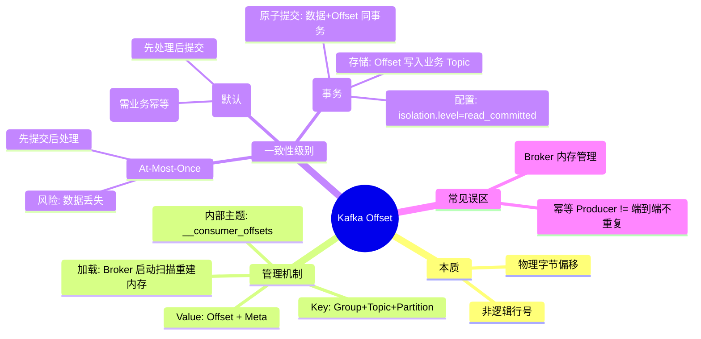

# Kafka Offset 全链路深度解析：存储、管理与一致性

> **摘要**：本文深入剖析 Kafka Consumer Offset 的本质、`__consumer_offsets` 内部主题的管理机制、幂等性 Producer 对消费语义的影响，以及基于事务的端到端 Exactly-Once 实现原理。  
> **标签**: #Kafka #Offset #分布式事务 #幂等性 #ExactlyOnce #系统设计  
> **创建时间**: 2026-02-25  
> **关联笔记**: [[Kafka 存储引擎原理]], [[Kafka 高可用架构]]

---

## 1. Offset 的本质与物理存储

### 1.1 核心定义

在 Kafka 中，**Offset (位移)** 并非简单的逻辑序号（“第 N 条”），而是**消息在 Partition 日志文件中的物理字节起始位置（Byte Offset）**。

- **单调递增**：在一个 Partition 内，Offset 从 0 开始严格递增。
- **不可变性**：消息删除或清理不会导致后续消息 Offset 重排，保证了寻址的稳定性。
- **提交含义**：Consumer 提交 `Offset = N`，表示 **“Offset < N 的消息已全部处理完成，下次请从 N 开始拉取”**。

### 1.2 为什么是字节偏移？

- **删除高效**：删除旧 Segment 无需重写后续文件的元数据。
- **定位精准**：结合 [[稀疏索引]] 机制，可通过二分查找快速映射到磁盘物理位置。

---

## 2. Offset 的管理机制：`__consumer_offsets`

Kafka 将 Consumer 的进度信息作为一个普通的 **Kafka 消息**，存储在一个特殊的内部主题中。

### 2.1 内部主题架构

- **Topic 名称**：`__consumer_offsets`
- **分区策略**：默认 50 个 Partition (`offsets.topic.num.partitions`)。
- **清理策略**：`cleanup.policy=compact` (日志压缩)，确保只保留每个 Key 的最新值。
- **副本机制**：多副本存储，保证高可用。

### 2.2 数据结构 (Key-Value)

每条 Offset 记录被序列化为一条标准消息：

|组成部分|内容结构|作用|
|:--|:--|:--|
|**Key**|`[GroupID] + [Topic] + [PartitionID]`|决定消息落入哪个 Partition，保证同一组对同一分区的更新有序。|
|**Value**|`{ Offset, Metadata, CommitTimestamp, ExpireTimestamp }`|具体的位移数值及元数据。|
|**Delete**|`Value = null`|当 Group 解散或显式删除时，发送 null 值，配合 Log Compaction 物理清除记录。|

### 2.3 提交与加载流程

#### **A. 提交流程 (Commit)**

1. **触发**：客户端自动 (`auto.commit`) 或手动 (`commitSync/Async`) 触发。
2. **寻找协调器**：发送 `FindCoordinatorRequest`，根据 `hash(GroupID) % 50` 找到负责该组的 **Group Coordinator** Broker。
3. **写入日志**：Coordinator 计算 Key 的 Hash，将 Offset 信息 Append 到 `__consumer_offsets` 对应 Partition 的 Log 中。
4. **响应**：等待 Leader 写入成功后返回 ACK。

#### **B. 加载流程 (Fetch on Rebalance)**

1. **加入组**：Consumer 重启或 Rebalance 后加入 Group。
2. **请求获取**：发送 `OffsetFetchRequest` 给 Coordinator。
3. **内存读取**：Coordinator **直接从 JVM 内存** (ConcurrentHashMap) 中返回最新 Offset。
    - _注：Broker 启动时会扫描 `__consumer_offsets` 所有日志，利用 Log Compaction 特性快速重建内存状态，无需依赖“上次的消费进度”。_

> [!WARNING] 常见陷阱  
> **Offset 过期**：若 Group 超过 `offsets.retention.minutes` (默认 7 天) 无活跃消费者，Offset 记录会被清除。重启后将视为新消费者，根据 `auto.offset.reset` 策略从头或从尾消费，可能导致**数据重放**。

---

## 3. 幂等性 (Idempotence) 与 Offset 的关系

很多开发者误以为开启 Producer 幂等性就能实现端到端不重复，这是一个误区。

### 3.1 幂等性 Producer 的作用域

- **配置**：`enable.idempotence=true`
- **机制**：Producer 携带 `PID` + `Sequence Number`。Broker 检测到重复请求直接去重，返回已分配的 Offset。
- **效果**：保证 **Broker 端存储的数据不重复**。

### 3.2 对 Offset 提交的影响

- **提交流程不变**：Consumer 依然独立向 `__consumer_offsets` 提交进度。
- **语义局限**：
    - 场景：Consumer 处理完消息 -> **宕机** -> 未提交 Offset。
    - 结果：重启后，Consumer 重新拉取该消息。虽然 Broker 里只存了一份数据，但 **Consumer 端依然会重复处理**。
- **结论**：仅开启幂等性 **无法** 解决 Consumer 端的重复消费问题。**业务层仍需实现幂等逻辑**（如数据库唯一键）。

---

## 5. 最佳实践与调优建议

### 5.1 选型指南

1. **大多数场景**：
    
    - 开启 Producer 幂等性 (`enable.idempotence=true`)。
    - 关闭自动提交 (`enable.auto.commit=false`)。
    - 业务逻辑处理后，手动同步提交 (`commitSync()`)。
    - **业务层**利用数据库唯一约束或去重表实现最终幂等。
    - _理由_：性能最好，架构简单，能满足 99% 的需求。
2. **金融/计费/严格统计场景**：
    
    - 使用 Kafka Transactions (`transactional.id` 配置)。
    - Consumer 设置 `isolation.level=read_committed`。
    - _理由_：框架级保证 Exactly-Once，代码侵入性低，但吞吐量略有下降。

### 5.2 运维监控

- **监控 `__consumer_offsets` Lag**：如果该主题积压，说明 Coordinator 写入压力大，会影响 Rebalance 速度。
- **监控 Under Replicated Partitions**：确保 `__consumer_offsets` 的副本健康，否则 Offset 丢失会导致大规模数据重放。
- **合理设置分区数**：集群初始化时，根据 Consumer Group 数量预估，适当调大 `offsets.topic.num.partitions` (如 100+)，避免热点。

---

## 6. 总结图谱

---

> **延伸阅读**:
> 
> - [[Kafka 事务协议源码分析]]
> - [[Kafka Streams 状态存储]]
> - [[分布式系统 CAP 理论在 Kafka 中的体现]]