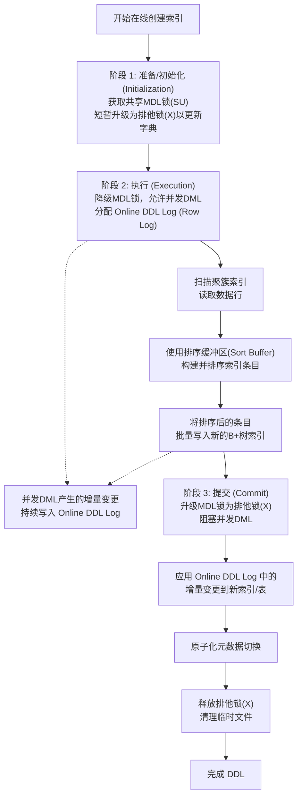

# MySQL 8 Online DDL 核心原理与实战指南

## 一、 引言：从阻塞到在线的演进

在早期的 MySQL 版本中，DDL (Data Definition Language) 操作（如 `ALTER TABLE`）曾是高危操作，因为它们会长时间锁定表，阻塞业务读写。为了解决这个问题，MySQL 的 DDL 机制经历了几次重大演进：

1.  **MySQL 5.6 (Online DDL 引入)**: 首次引入真正的 Online DDL，允许在执行大部分 DDL (`INPLACE` 算法) 的同时，并发执行 DML (`INSERT`, `UPDATE`, `DELETE`) 操作，极大地降低了对业务的影响。
2.  **MySQL 8.0 (原子 DDL 与 INSTANT DDL)**: MySQL 8 带来了革命性的进步，彻底移除了 `.frm` 等文件，实现了**基于数据字典的原子 DDL**。更重要的是引入了 **`ALGORITHM=INSTANT`**（极速 DDL），使得诸如添加列等操作可以瞬间完成，不涉及任何数据文件修改。

MySQL 8 建立了一套智能的算法选择优先级，力求以最高效、影响最小的方式完成 DDL：

1.  **`ALGORITHM=INSTANT` (首选)**: 只修改数据字典中的元数据，不触碰表数据文件。几乎瞬时完成，对业务无感知。（注：MySQL 8.0.12 支持在表尾追加列，8.0.29 支持在任意位置添加/删除列）。
2.  **`ALGORITHM=INPLACE` (次选)**: 在 InnoDB 引擎层内部完成，避免了 Server 层和引擎层之间大量的数据交互。大部分操作不需要拷贝全表数据（如添加普通索引），少部分操作需要重建表（如修改列类型、添加主键），但**全过程允许并发 DML**。
3.  **`ALGORITHM=COPY` (最后选择)**: 退化到最原始的算法，在 Server 层创建临时表，锁表并逐行拷贝数据。在 MySQL 8 中，只有极少数操作（如修改带有某些类型转换的列）才会用到。

---

## 二、 核心流程详解：`ALGORITHM=INPLACE`

`ALGORITHM=INPLACE` 是实现在线变更的核心机制。其核心思想是：**在后台构建新表或新索引的同时，将此期间发生的并发 DML 变更记录在临时日志中，最后再将这些变更应用到新结构上**。

整个过程分为三个阶段（以在线创建索引为例）：



### 阶段一：准备 (Initialization) - 极快
-   **操作**: 检查 DDL 的合法性，确定使用的算法（INSTANT / INPLACE / COPY）。在内存中创建新的表/索引结构定义。
-   **锁机制**: 客户端发起 DDL 时，首先获取共享的可升级元数据锁 (SU-MDL)。在这个阶段的尾声，会**短暂地将其升级为排他元数据锁 (X-MDL)**，用于在数据字典中做一些准备工作。

### 阶段二：执行 (Execution) - 耗时最长
-   **操作**:
    1.  **分配日志**: 分配 `Online DDL Log` (也叫 Row Log) 用于记录并发写入。
    2.  **降级锁**: 将 X-MDL **降级**回共享锁，此时表重新完全开放给业务进行 DML 操作。
    3.  **构建数据/索引**: 扫描原表主键，读取数据，并在内存 Sort Buffer 中排序后批量写入新的 B+ 树。
    4.  **记录并发**: 业务的增删改操作不仅修改原表，还会被 InnoDB 额外追加记录到 `Online DDL Log` 中。
-   **锁机制**: 持有共享锁，不阻塞 DML。

### 阶段三：提交 (Commit) - 极快，但容易被阻塞
-   **操作**:
    1.  **升级锁**: 再次将 MDL **升级为排他锁 (X-MDL)**，此时原表禁止写入（阻塞 DML）。
    2.  **重放日志**: 将 `Online DDL Log` 中记录的所有并发变更应用到新构建的结构上。
    3.  **元数据切换**: 通过 MySQL 8 的原子 DDL 特性，将新老表/索引的元数据进行切换。
-   **锁机制**: 必须获取 X-MDL。如果此时有未提交的长事务正在查询该表，X-MDL 将无法获取，导致 DDL 处于 `Waiting for table metadata lock` 状态，进而阻塞后续所有对该表的操作。

---

## 三、 关键底层技术

### 1. 事务性数据字典与原子 DDL (MySQL 8 核心)
MySQL 8.0 彻底移除了 `.frm`, `.par`, `.opt` 等文件，将元数据存储在 InnoDB 内部的**事务性数据字典表**中。DDL 操作本身变成了事务，要么完全成功，要么崩溃恢复时完全回滚，避免了“孤儿表”或字典损坏。

### 2. 元数据锁 (Metadata Lock - MDL)
MDL 保护了表结构不被并发修改。Online DDL 的“在线”特性，本质上是通过对 MDL 锁的**精细化控制（升级->降级->升级）**来实现的。并不是完全不加锁，而是巧妙地避开了执行阶段的排他锁。

### 3. Online DDL Log (Row Log)
- 用于缓存执行阶段发生的增量数据。
- **避坑**: 其最大容量由参数 `innodb_online_alter_log_max_size` (默认 128MB) 控制。如果 DDL 执行极慢且并发写入极高，导致 Log 空间耗尽，DDL 会直接报错失败 (`DB_ONLINE_LOG_TOO_BIG`) 并回滚。对于写密集的表，需临时调大此参数。

### 4. Sort Buffer 与 Change Buffer
-   **Sort Buffer**: 专用于 DDL 期间的索引条目排序，通过 `innodb_sort_buffer_size` 控制，合理调大可加速 DDL。
-   **Change Buffer**: 处理普通业务对二级索引的修改。注意，Online DDL 期间新构建的索引的变更走的是 Online DDL Log，而不走 Change Buffer。

---

## 四、 生产环境避坑指南与最佳实践

### 1. 显式指定算法与锁
为了防止 MySQL 意外降级到 COPY 模式锁死全表，建议始终在 DDL 语句中显式指定：
```sql
ALTER TABLE your_table ADD INDEX idx_col (your_col),
ALGORITHM=INPLACE, LOCK=NONE;
```
如果操作不支持 `INPLACE` 或 `NONE`，语句会立即报错，而不是去锁表。

### 2. 警惕 `Waiting for table metadata lock` (长事务杀手)
- **现象**: DDL 在阶段一或阶段三需要获取 X-MDL。如果此时有一个长事务（哪怕只是个慢查询 `SELECT`）在操作该表，DDL 就会等待。更致命的是，DDL 的等待队列优先级极高，它会**阻塞其后所有试图访问该表的新请求**，导致连接数瞬间打满，引发生产故障。
- **对策**: 执行 DDL 前，务必检查 `information_schema.innodb_trx` 和 `sys.processlist`，杀掉该表上的长事务。推荐设置 `lock_wait_timeout` 限制 DDL 等待锁的时间。

### 3. 容量与空间规划
-   **磁盘空间**: `INPLACE` 往往需要重建表或新建索引树。这需要充足的临时磁盘空间（在 `tmpdir` 或表空间目录），峰值可能需要原表 1~2 倍的空闲空间。
-   **Log 大小**: 评估并发写入量，必要时在会话级别调大 `innodb_online_alter_log_max_size`。

### 4. 主从延迟考量
- 虽然是在线操作，但在主库上 DDL 完成并提交后，**完整的 DDL 语句才会被写入 Binlog 并传给从库**。
- 从库默认是单线程（或基于逻辑时钟的并行）回放 DDL，这会导致从库在回放这个大 DDL 时产生严重的复制延迟。

### 5. 什么时候需要使用第三方工具 (gh-ost / pt-osc)？
尽管 MySQL 原生 Online DDL 已经很强大，但在以下场景，依然推荐使用 `gh-ost` 或 `pt-online-schema-change`：
1.  **需要限流与暂停**: 原生 DDL 无法中途暂停。如果发现 CPU/IO 飙升，只能 kill 掉并承担昂贵的回滚代价。第三方工具可以随时暂停和动态限流。
2.  **严格控制主从延迟**: 第三方工具以小批量 DML 的形式同步数据，不会导致从库在某一个时刻产生巨大延迟。
3.  **大表且写极高**: 原生 DDL 的 Row Log 如果过大会导致失败，第三方工具基于 Trigger 或 Binlog 同步则无此限制。
