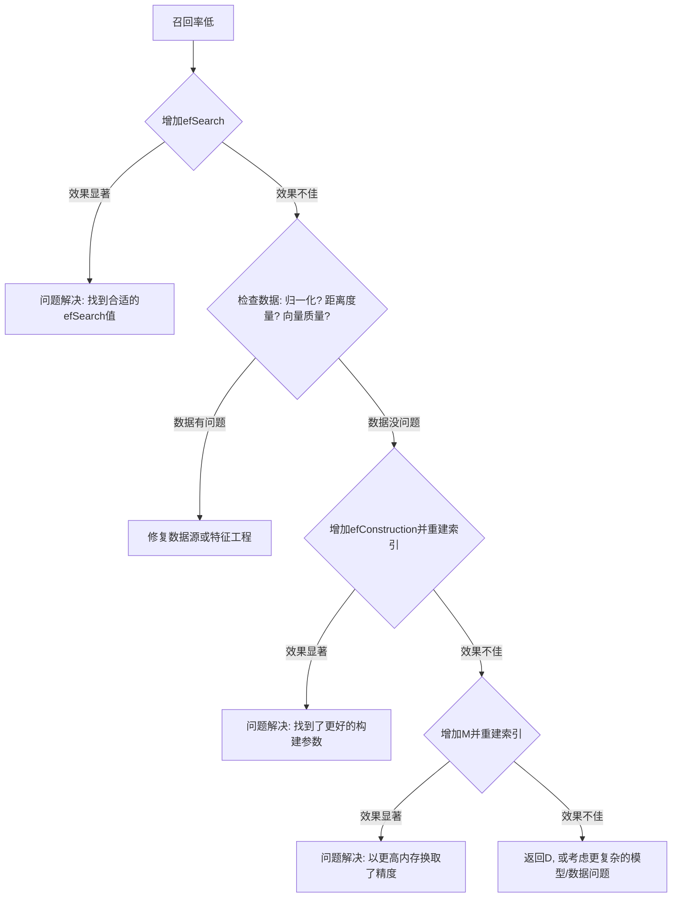

# HNSW 算法面试题答案

## 1. HNSW算法的核心思想是什么？

HNSW (Hierarchical Navigable Small World) 算法的核心思想是**构建一个分层的、可导航的小世界网络图**，以实现高效的近似最近邻（ANN）搜索。

其思想可以分解为以下几点：
1.  **图结构**：将所有数据点构建成一个图，其中节点是数据点，边表示节点之间的“邻近”关系。
2.  **小世界网络**：该图具有“小世界”特性，即大部分连接是“短程”的（连接到物理上相近的邻居），同时也有一些“长程”连接（连接到图上很远的点）。这保证了从任意一点出发，都可以通过很少的几步（对数级别）到达图中的任何其他点。
3.  **分层结构（Hierarchical）**：为了进一步加速搜索，HNSW引入了分层结构。它构建了多层图，最底层（Layer 0）包含所有的数据点。往上每一层都是下一层的一个稀疏子集。层数越高，节点越少，连接的平均距离越长（长程连接越多）。
4.  **贪心搜索**：搜索时，从顶层的唯一入口点开始，在当前层贪心地走向离查询目标最近的节点。当无法再找到更近的节点时，将该节点作为下一层的入口点，继续向下搜索。这个过程逐层递进，直到最底层，从而快速定位到查询目标所在的区域，并在最底层进行精细搜索。

总结来说，HNSW 通过**分层**来分离不同尺度的连接（长程 vs. 短程），并利用**贪心算法**在这些层上进行导航，从而在巨大的数据集中实现了对数级别的搜索复杂度。

---

## 2. 请解释“小世界网络”在HNSW中的作用。

“小世界网络”是HNSW算法能够实现高效搜索的关键理论基础。一个网络被称为“小世界网络”，通常具备两个特性：

1.  **高聚集性（High Clustering Coefficient）**：网络中的节点倾向于形成紧密的团簇，即一个节点的邻居们之间也很可能是邻居。在HNSW中，这对应于**短程连接**，即每个节点都与其在向量空间中最接近的几个邻居相连。
2.  **短的平均路径长度（Short Average Path Length）**：网络中任意两个节点之间，都可以通过相对较少的几步连接起来。在HNSW中，这对应于**长程连接**，即图中存在一些“捷径”或“高速公路”，能够连接两个在空间上相距很远的点。

**在HNSW中的作用**：

- **实现可导航性（Navigability）**：小世界网络的结构使得贪心搜索变得非常有效。当从一个点开始寻找目标时：
    - **长程连接**让搜索可以快速“跳跃”到目标附近的大致区域，避免了在无关区域的无效遍历。
    - **短程连接**则保证了当搜索进入目标附近区域后，能够进行精细化的局部搜索，最终精确地找到最近的邻居。

如果没有长程连接，搜索可能会陷入一个远离全局最优解的“局部最优”区域。如果没有短程连接，搜索虽然能快速跨越距离，但无法在局部区域精确收敛。HNSW通过在不同层级控制长短程连接的比例，完美地结合了这两者，从而保证了搜索的**速度和精度**。

---

## 3. HNSW与传统的近似最近邻搜索方法相比有何优势？

与传统的ANN方法（如基于树的方法、LSH等）相比，HNSW具有显著优势：

| 特性 | HNSW | KD-Tree / Ball-Tree (树方法) | LSH (局部敏感哈希) |
| :--- | :--- | :--- | :--- |
| **性能/召回率** | **非常高**。在公开的ANN评测中，HNSW通常能在相同的召回率下达到最高的QPS（每秒查询次数）。 | 在低维数据上表现良好，但在高维时性能急剧下降（维度灾难）。 | 召回率通常较低，需要很长的哈希码和多个哈希表才能达到较高精度，导致内存消耗巨大。 |
| **对高维数据的处理** | **非常出色**。其图结构对维度不敏感，在高维空间中依然能保持很好的性能。 | **差**。随着维度增加，树的剪枝效率迅速降低，最终退化为暴力搜索。 | 相对树方法更好，但为了区分高维数据，需要的哈希函数和表数量会显著增加。 |
| **动态数据集支持** | **优秀**。支持增量添加数据点，无需重新构建整个索引。删除操作也可以通过“软删除”实现。 | **差**。插入新数据点可能导致树结构严重不平衡，需要昂贵的重构操作。 | **较好**。新数据点可以独立地被哈希到桶中，但数据分布变化可能导致哈希函数失效，需要重建。 |
| **内存消耗** | **可控但偏高**。主要由参数`M`控制。可以通过结合向量量化（PQ）技术大幅降低。 | 相对较低。 | **非常高**。为了达到理想的召回率，需要存储大量的哈希表。 |
| **参数调节** | **直观**。`M`和`efConstruction`控制索引质量，`efSearch`控制查询精度和速度的平衡，易于调节。 | 参数较少，但对数据分布敏感。 | 参数（如哈希函数族、表数量、桶大小）选择复杂，理论性强，不易调优。 |

**总结优势**：
- **顶级性能**：在速度和精度的平衡上做到了极致。
- **强大的高维扩展性**：是解决高维ANN问题的首选方案之一。
- **良好的动态性**：支持在线系统持续加入新数据。
- **调参友好**：提供了清晰的参数来权衡构建成本、内存、查询速度和精度。

---

## 4. 如何理解HNSW中的分层结构？

HNSW的分层结构是其与普通小世界网络（如NSW）最核心的区别，也是其性能飞跃的关键。可以将其理解为一个**多层导航地图系统**：

- **Layer 0 (底层)**：这是最密集的“街道地图”，包含了所有的数据点。在这一层，节点间的连接主要是短程的，用于在目标附近进行最精确的搜索。
- **Layer 1, 2, ... (上层)**：这些是“高速公路”或“地铁线路图”。每一层都是其下一层的一个稀疏子集。层数越高，节点越少，节点间的平均距离也越远，长程连接的比例越高。
- **层级关系**：如果一个节点存在于第 `L` 层，那么它一定也存在于所有低于 `L` 的层（0 到 `L-1` 层）。
- **入口点（Entry Point）**：在最顶层，只有一个全局入口点，所有搜索都从这里开始。

**分层的作用**：
1.  **分离长短程连接**：高层负责全局导航（利用长程连接），低层负责局部搜索（利用短程连接），结构清晰，职责分离。
2.  **实现对数复杂度**：搜索从稀疏的顶层开始，每向下一层，候选点的范围被指数级缩小，但搜索的精度却在不断提升。这使得总的搜索步数与数据总量的对数成正比，即 `O(logN)`。
3.  **避免陷入局部最优**：如果在底层直接进行贪心搜索，很容易被密集的局部邻居困住。而从高层开始的粗粒度搜索确保了第一步就能跨越巨大距离，直接到达目标的“大致区域”，为后续的精细搜索打下良好基础。

---

## 5. 在HNSW中，“可导航性”的含义是什么？

在HNSW中，“可导航性”（Navigability）指的是**图结构支持高效贪心搜索的能力**。一个具有良好可导航性的图，意味着从图中任意一个起始节点出发，通过反复选择最接近查询目标的邻居节点进行移动，能够快速且稳定地找到全局或接近全局的最近邻。

具体来说，它包含以下几点：

1.  **对数级复杂度**：可导航的图结构使得搜索路径的长度随节点总数 `N` 的对数 `log(N)` 增长，而不是线性增长。
2.  **避免局部最优**：图的连接（特别是长程连接）必须足够好，以确保贪心搜索不会轻易地“卡”在一个远离真正目标的局部区域。即使当前节点的所有直接邻居都比当前节点离目标远，图中也应该有“桥梁”能够跳出这个区域。
3.  **鲁棒性**：即使起始点选择得不好，一个可导航的图也能很快地将搜索路径修正到正确的方向上。

HNSW通过其**分层的小世界网络**设计，出色地实现了可导航性。高层级的长程连接提供了全局视角和快速跳转能力，而低层级的短程连接则保证了在目标区域内的搜索精度，二者结合，构成了高效的导航路径。

---

## 6. 描述HNSW图中节点连接的基本原则。

HNSW在为新节点构建连接时，遵循一个**启发式选择策略**，其目标不仅仅是连接到最近的邻居，更是**构建一个连接多样化且高效的图**。

基本原则如下：

1.  **邻居候选集**：当插入一个新节点 `q` 时，在它所属的每一层，算法会先通过搜索找到一个邻居候选集（这个集合的大小由构建参数 `efConstruction` 控制）。
2.  **选择 `M` 个连接**：从这个候选集中，算法需要为 `q` 挑选 `M` 个节点建立双向连接。
3.  **启发式选择 (Heuristic)**：挑选过程不是简单地选择最近的 `M` 个。而是遍历候选集中的每个候选节点 `e`，如果 `e` 与 `q` 的距离，比 `e` 与 `q` **已经选择的邻居**中任何一个的距离都近，那么 `e` 就被认为是一个好的连接。
    - **直观解释**：这个原则试图避免选择那些聚集在同一方向的邻居。如果一个候选邻居 `e` 离 `q` 的某个已选邻居 `n` 更近，那么意味着 `e` 和 `n` 可能在同一片小区域。为了图的“视野”更开阔，算法倾向于跳过 `e`，去选择一个位于不同方向上的邻居。
4.  **连接数量上限**：每个节点在每一层的连接数有一个上限（`M` for layers > 0, `2*M` for layer 0），以控制图的密度和内存占用。在插入新连接后，如果某个节点的连接数超限，会进行**剪枝**，保留距离最近、质量最好的连接。

这个原则是HNSW性能优越的关键之一，因为它保证了节点的邻居分布在不同的方向上，极大地增强了图的可导航性。

---

## 7. 什么是跳表（Skip List），它如何影响HNSW的设计？

**跳表（Skip List）**是一种基于概率的数据结构，用于在有序序列中实现快速的查找、插入和删除操作，其平均时间复杂度为 `O(log n)`。

它的结构可以看作一个**多层的有序链表**：
- **第0层**是一个普通的有序链表，包含所有元素。
- **第1层**是第0层的一个“快速通道”，它只包含第0层中一部分节点。
- **第i层**是第(i-1)层的一个更稀疏的“快速通道”。
- 一个节点是否被“提升”到更高层，是在插入时通过**抛硬币**等随机过程决定的。

**跳表对HNSW的影响**：
HNSW的设计思想**直接受到了跳表的启发**，可以看作是**跳表在高维空间的泛化**。

| 跳表 (1D) | HNSW (高维) |
| :--- | :--- |
| 有序链表 | 向量空间中的点 |
| 多层“快速通道”链表 | 分层的小世界网络图 |
| 节点按值排序 | 节点按向量间距离（远近）组织 |
| 搜索时从顶层链表开始 | 搜索时从顶层图开始 |
| 通过概率决定节点层数 | 通过概率公式决定节点层数 |

HNSW借鉴了跳表最核心的两点：
1.  **分层思想**：通过分层来创建不同粒度的“快速通道”，实现 `O(logN)` 的搜索效率。
2.  **概率性层级分配**：通过一个随机化的过程来决定新数据点应该被提升到哪一层。这个简单的机制被证明在整体上能够构建出非常高效的层级结构，而无需复杂的全局调整。

可以说，HNSW是将跳表从一维有序数据推广到高维无序数据上的一种巧妙实现。

---

## 8. HNSW中的长程连接和短程连接分别指什么？

- **短程连接 (Short-range links)**：
  - 指的是图中连接**物理上（即在向量空间中）彼此靠近**的节点的边。
  - 这些连接在HNSW的**底层（特别是Layer 0）**中最为密集。
  - **作用**：负责**精细化搜索（fine-grained search）**。当搜索进入目标所在的局部区域后，短程连接提供了足够高的图密度，使得贪心算法能够沿着这些边精确地收敛到最近的邻居。它们是**保证高召回率（accuracy）**的基础。

- **长程连接 (Long-range links)**：
  - 指的是图中连接**物理上相距很远**的节点的边。这些连接是图中的“捷径”或“高速公路”。
  - 这些连接在HNSW的**高层**中更为普遍。因为高层节点稀疏，连接它们的边自然就跨越了很长的空间距离。
  - **作用**：负责**全局导航（coarse-grained search）**。在搜索初期，长程连接让算法能够从入口点快速“跳跃”到目标附近的大致区域，极大地缩短了搜索路径，**保证了搜索的高速度（low latency）**并避免陷入局部最优。

HNSW的精妙之处在于通过分层结构，在不同层级上自然地形成了以不同类型连接为主的图，使得搜索过程能够先快后准，兼顾速度与精度。

---

## 9. 在HNSW中，参数`M`的作用是什么？

`M` 是HNSW中一个核心的**构建时（build-time）参数**。

它的主要作用是**定义图中每个节点（在每一层）期望建立的连接数**。更准确地说，`M` 是在构建过程中，为新节点选择邻居时，要连接的双向链接的数量。

**`M` 的影响**：

- **图的密度**：`M` 值越大，图的连接越密集，每个节点的“邻居”就越多。
- **内存消耗**：`M` 值越大，需要存储的连接信息就越多，索引文件会越大，内存消耗也越高。这是最直接的影响。
- **索引质量和召回率**：
    - **更大的 `M`** 通常会带来**更高的召回率（精度）**。因为图更密集，搜索时可供选择的路径就更多，找到真正最近邻的可能性就越大。
    - **更小的 `M`** 可能导致图过于稀疏，搜索时容易走错路或过早终止，从而**降低召回率**。
- **构建时间**：更大的 `M` 会轻微增加索引的构建时间，因为需要为每个节点寻找和建立更多的连接。

**如何选择 `M`**：
`M` 的选择是一个在**召回率**和**内存消耗**之间的权衡。
- 对于需要极高精度的场景，可以选择较大的 `M` 值（如 32, 48, 64）。
- 对于内存敏感或对精度要求不那么极致的场景，可以选择较小的 `M` 值（如 12, 16, 24）。

通常，Layer 0 的连接数上限是 `2*M`，而其他层的上限是 `M`，因为Layer 0 需要最密集的连接来保证最终的搜索精度。

---

## 10. 参数`efConstruction`和`efSearch`的意义及它们之间的区别是什么？

这两个参数是HNSW中用于控制**搜索范围**的关键参数，但分别作用于**构建**和**查询**两个不同阶段。它们都定义了一个动态候选列表的大小。

- **`efConstruction` (构建时参数)**：
    - **意义**：在**构建索引**时，为新插入的节点查找邻居的过程中，维护的动态候选列表的大小。
    - **作用**：控制**索引的质量**。一个更大的 `efConstruction` 值意味着在插入节点时，会进行更深入、更广泛的搜索来寻找最合适的邻居进行连接。这会产生一个连接质量更高、更优化的图结构。
    - **权衡**：值越大，**索引构建时间越长**，但最终得到的**索引质量越好**，这通常能带来更高的查询性能（在相同 `efSearch` 下有更高召回率）。

- **`efSearch` (查询时参数)**：
    - **意义**：在**执行查询**时，搜索最近邻过程中，维护的动态候选列表的大小。
    - **作用**：控制**查询的精度和速度**。一个更大的 `efSearch` 值意味着在搜索时会探索更多的路径，检查更多的节点，从而增加了找到真正最近邻的概率。
    - **权衡**：值越大，**查询结果的召回率越高**，但**查询耗时也越长**。`efSearch` 可以在查询时动态调整，而无需重新构建索引。

**核心区别**：

| 参数 | `efConstruction` | `efSearch` |
| :--- | :--- | :--- |
| **作用阶段** | 索引构建时 | 查询时 |
| **影响对象** | **索引质量** | **查询质量** |
| **权衡** | 构建时间 vs. 索引质量 | 查询速度 vs. 查询精度 |
| **可调整性**| 设置后需重新构建索引 | 可在每次查询时动态指定 |

**实践建议**：
- 通常设置 `efConstruction` 远大于 `efSearch`（例如，`efConstruction` = 400, `efSearch` = 100）。
- 这相当于“构建时多花功夫，查询时才能更省力”。一个高质量的图（高 `efConstruction`）使得在查询时可以用一个相对较小的 `efSearch` 就能达到很高的召回率。

---

## 11. 描述HNSW插入新节点的过程。

将一个新节点 `q` 插入HNSW索引的过程是一个自顶向下的、逐层构建连接的精细过程：

1.  **随机选择层数 `L`**：
    - 首先，通过一个概率公式 `l = floor(-ln(uniform(0,1)) * mL)` 为新节点 `q` 随机分配一个它将存在于的最高层数 `L`。这意味着 `q` 将会出现在从 0 到 `L` 的所有层中。

2.  **寻找各层入口点 (从顶层到 `L+1` 层)**：
    - 从整个图的全局入口点（位于最顶层）开始。
    - 在当前层（例如 `lc`），执行贪心搜索，找到离 `q` 最近的一个节点。
    - 将这个找到的节点作为下一层 (`lc-1`) 搜索的入口点。
    - 这个过程一直持续到第 `L+1` 层结束。此时，我们为接下来要在第 `L` 层进行的插入操作找到了一个绝佳的“落脚点”。

3.  **逐层插入并建立连接 (从 `L` 层到底层)**：
    - 从第 `L` 层开始，一直到第 0 层，对每一层执行以下操作：
        a. **寻找邻居**：以从上层传递下来的入口点为起点，在当前层执行一次k-NN搜索，以找到 `q` 的一组最近邻候选（候选集大小由 `efConstruction` 控制）。
        b. **选择连接**：从这组候选中，使用**启发式规则**（见问题6）为 `q` 挑选 `M` 个最优的节点来建立双向连接。
        c. **剪枝**：在为 `q` 添加新连接后，`q` 的那些新邻居的连接数可能会超过预设的上限（`M` 或 `2*M`）。如果超过，就需要对这些邻居的连接进行剪枝，保留距离最近的连接，去掉多余的。

这个过程完成后，新节点 `q` 就被完美地整合到了HNSW图的多层结构中。

---

## 12. HNSW是如何确定一个新节点应该位于哪一层的？

HNSW通过一个**概率模型**来随机确定新节点的最高层数，这个设计直接借鉴自跳表（Skip List）。

具体方法如下：
- 为每个新插入的节点 `q` 生成一个随机数 `u`，该数服从 `(0, 1)` 之间的均匀分布。
- 使用以下公式计算该节点的最高层数 `l`：
  `l = floor(-ln(u) * mL)`

其中：
- `ln` 是自然对数。
- `u` 是 `(0,1)` 之间的随机数。
- `mL` 是一个归一化因子，其值为 `1 / ln(M)`（`M` 是图的度数参数）。

**这个公式的特性**：
- **指数衰减概率**：它使得节点被分配到高层的概率随着层数的增加而**指数级衰减**。
- **结果分布**：
    - 大部分节点只会被分配到较低的层（如Layer 0, Layer 1）。
    - 极少数节点会被分配到非常高的层。
- **结构形成**：正是这种概率分布，自然地形成了HNSW所需的**金字塔形分层结构**：底层节点密集，顶层节点稀疏。

这种方法的优点是**极其简单且无需全局信息**。它是一种分布式的决策过程，但从宏观上看，却能稳定地构建出具有优秀对数扩展性的层级网络。

---

## 13. 在HNSW中执行查询操作的具体步骤是什么？

在HNSW中查询与给定向量 `q` 最接近的 `k` 个邻居，其过程与插入操作非常相似，也是一个自顶向下的贪心搜索：

1.  **获取入口点**：
    - 从图的最顶层的全局入口点开始。

2.  **自顶向下贪心搜索 (直到Layer 1)**：
    - 在当前层 `lc`（从顶层开始），以该层的入口点为起点，执行贪心搜索，找到离 `q` 最近的一个节点。
    - 这个节点将成为下一层 (`lc-1`) 搜索的入口点。
    - 重复这个过程，直到到达 Layer 1。

3.  **在Layer 0中进行最终搜索**：
    - 将上一层（Layer 1）找到的最近点作为 Layer 0 的入口点。
    - 在 Layer 0 中，执行一次 k-NN 搜索：
        a. 维护一个由 `efSearch` 个候选节点组成的动态列表（通常是优先队列），并用入口点进行初始化。
        b. 在搜索的每一步，从候选列表中弹出离 `q` 最近的未访问节点。
        c. 访问该节点的邻居，计算它们与 `q` 的距离。
        d. 如果邻居比候选列表中最远的节点还要近，则将其插入候选列表，并移除最远的节点。
        e. 重复此过程，直到无法找到更近的节点。

4.  **返回结果**：
    - 搜索结束后，`efSearch` 大小的候选列表里就是离 `q` 最近的一批节点。
    - 从这个列表中，选出距离最近的 `k` 个节点作为最终的查询结果。

`efSearch` 参数是此过程中的关键，它决定了在最终搜索阶段探索的广度，直接影响召回率和查询延迟。`efSearch` 必须大于等于 `k`。

---

## 14. 为什么说HNSW支持动态数据集？这与其他ANN算法相比有什么不同？

说HNSW支持动态数据集，主要是因为它能够**高效地处理数据的增量添加和删除**，而无需对整个索引进行完全的重新构建。

**HNSW如何支持动态性**：
1.  **增量添加（Insertion）**：
    - 如问题11所述，新数据点可以独立地被插入到现有的图结构中。
    - 这个过程是**局部**的：它只会影响新节点附近的一些连接，而不会改变整个图的宏观结构。
    - 插入单个数据点的时间复杂度约为 `O(logN)`，非常高效，使其非常适合需要持续接收新数据的在线系统（如推荐系统、搜索引擎）。

2.  **数据删除（Deletion）**：
    - HNSW通常采用**“软删除”**策略。即，并不立即从图中移除一个节点，而是将其标记为“已删除”。
    - 在查询时，如果搜索路径遇到一个被标记为已删除的节点，会直接忽略它。
    - **优点**：软删除操作极快 `O(1)`，并且不会破坏图的连通性。
    - **缺点**：随着删除操作增多，图中会积累越来越多的“死节点”，占用内存并可能轻微影响查询性能。因此，在大量删除后，通常需要定期进行索引重建。

**与其他算法的对比**：

- **基于树的方法 (如KD-Tree, Annoy)**：
    - **添加**：插入新数据点可能打破树的平衡，为了维持性能，需要进行昂贵的树旋转或重构操作。Annoy通过构建多棵树来缓解这个问题，但本质上仍是静态的。
    - **删除**：在平衡树中删除节点同样复杂且低效。
    - **结论**：对动态数据支持很差，通常用于静态数据集。

- **基于量化的方法 (如IVFADC)**：
    - 在构建索引前，需要一个**训练阶段**来学习聚类中心（codebooks）。
    - **添加**：新数据点可以被分配到最近的聚类中心，但如果新数据与原始数据分布差异很大，会导致索引质量下降。
    - **删除**：可以从倒排列表中移除，相对容易。
    - **结论**：支持动态添加，但当数据分布发生显著变化时，需要重新训练和构建索引。

**总结**：HNSW的图结构和局部更新的特性，使其在处理动态数据集方面比许多传统ANN算法（特别是基于树和需要全局训练的算法）具有天然的优势。

---

## 15. 解释层级分配的概率机制。

见问题12的答案。这套机制是HNSW的核心设计之一，通过一个简单的、局部的随机决策，实现了宏观上高效稳定的分层金字塔结构。

---

## 16. 如何在HNSW中实现高效的空间利用率？

HNSW本身是一个内存消耗较大的算法，因为除了存储原始向量外，还需要存储大量的图连接信息。提高空间利用率（即降低内存占用）主要通过以下几种方式：

1.  **调整核心参数 `M`**：
    - `M` 直接控制了图中连接的数量。减小 `M` 的值是降低内存消耗最直接的方法。
    - 这需要在内存和召回率之间做权衡，因为更小的 `M` 通常意味着更低的精度。

2.  **向量量化 (Vector Quantization)**：
    - 这是最重要和最有效的内存优化技术。其核心思想是**压缩存储原始向量**。
    - **乘积量化 (Product Quantization, PQ)** 是最常用的技术：
        a. 将高维向量切分成若干个低维子向量。
        b. 对每一组子向量分别进行k-means聚类，得到一个小的“码本”（codebook）。
        c. 用子向量所属聚类中心的ID来代替原始的子向量。
    - **效果**：一个高维浮点数向量（如512维 * 4字节 = 2KB）可以被压缩成一个很短的整数ID序列（如32维 * 1字节 = 32字节），压缩比可达几十倍。
    - **代价**：距离计算变为近似计算（通过预计算的码本距离表），会损失一定的精度。
    - **结合方式**：在HNSW中，图的连接结构保持不变，只是在计算节点间距离时，使用量化后的编码进行近似计算，并且节点本身存储的是压缩后的向量。

3.  **优化数据类型**：
    - 如果向量数据范围允许（例如，都是0-255的像素值），可以使用`int8`代替`float32`来存储。
    - 对于图连接信息，如果节点总数不多，可以使用`uint32`代替`uint64`来存储节点ID。

4.  **定期重建索引**：
    - 如果系统中存在大量“软删除”的节点，这些节点占用的空间无法被回收。定期对有效数据进行索引重建，可以清除这些无效数据，回收空间。

在实际应用中，**HNSW + PQ** 是实现大规模、低成本ANN搜索的黄金组合。

---

## 17. HNSW算法的时间复杂度是多少？

HNSW算法在构建和搜索上都达到了近似**对数级别**的复杂度。

- **构建复杂度**：
  - 插入单个节点的平均复杂度为 `O(logN)`。
  - 因此，构建一个包含 `N` 个节点的完整索引，总的复杂度大约为 `O(N * logN)`。
  - 更精确地，它还受 `M` 和 `efConstruction` 等参数影响，但 `logN` 是主导项。

- **搜索复杂度**：
  - 查询单个最近邻的平均复杂度为 `O(logN)`。
  - 这里的 `logN` 体现了分层结构的优势：从顶层开始，每下一层，搜索空间都得到了有效的剪枝。
  - 同样，实际耗时也与 `M` 和 `efSearch` 呈正相关，因为它们决定了在每一步需要检查的邻居数量。

**与暴力搜索的对比**：
- 暴力搜索（Exhaustive Search）的复杂度是 `O(N)`。
- 对于一个包含10亿个向量的数据集，`log(10^9)` 大约是30。这意味着HNSW理论上能比暴力搜索快几千万倍，展示了其在海量数据上的巨大优势。

这个对数级别的复杂度，是HNSW成为业界主流ANN方案的根本原因。

---

## 18. 在实际应用中，如何选择合适的`M`值？

选择合适的 `M` 值是一个经验性和实验性很强的工作，需要在**召回率（精度）、内存占用、和查询速度（QPS）**三者之间进行权衡。

以下是一些指导原则：

1.  **从默认值开始**：
    - 大多数HNSW的实现库（如`faiss`, `hnswlib`）都提供了合理的默认值，通常在 `M=12` 到 `M=32` 之间。这是一个很好的起点。

2.  **根据召回率要求调整**：
    - **高召回率是首要目标**：如果应用场景对精度要求极高（如以图搜图、人脸识别），应尝试**增加 `M`** 的值。例如，从16增加到32，再到48或64。通常 `M` 越大，可达到的最高召回率也越高。
    - **召回率要求不高**：如果应用可以容忍一定的误差（如新闻推荐），可以选择较小的 `M` 值以节省内存。

3.  **考虑内存限制**：
    - `M` 是影响内存占用的最主要因素之一。索引大小约等于 `N * (D*4 + 2*M*8)` 字节（`D`是维度，假设双向链接，指针8字节）。
    - 在部署前，估算在`M`值的设定下，索引是否能装入内存。如果内存不足，**减小 `M`** 是最直接的办法。

4.  **结合 `efConstruction` 和 `efSearch` 进行实验**：
    - `M` 定义了图的静态结构，而 `efSearch` 决定了在查询时动态探索的范围。
    - **实验方法**：
        a. 固定 `M` 和 `efConstruction`，然后测试不同的 `efSearch` 值，绘制出一条“召回率 vs. QPS”的曲线。
        b. 更换一个 `M` 值，重复步骤 a，得到另一条曲线。
        c. 比较这些曲线，选择在满足你的业务指标（如“95%召回率下QPS > 1000”）的条件下，内存占用最小的那个 `M` 值。

**经验总结**：
- **`M=16`**：一个均衡的常用选择。
- **`M=32-64`**：用于高精度场景。
- **`M<=12`**：用于内存极其受限的场景。

---

## 19. 对于高维数据，HNSW是如何处理的？

HNSW被认为是**处理高维数据最有效的ANN算法之一**，其优势主要源于它的图结构设计，这让它能很好地规避“维度灾难”。

**为什么HNSW在高维下表现好**：

1.  **不依赖空间划分**：像KD-Tree这样的空间划分树，在高维空间中，超平面或超球体的“表面积”会急剧增大，导致几乎所有数据点都离划分边界很近。这使得剪枝变得无效，查询需要访问树的大部分区域，算法退化为暴力搜索。HNSW不依赖于对整个空间进行刚性划分。

2.  **基于邻里关系**：HNSW的核心是“邻居的邻居也很可能是邻居”这一思想。它构建的是一个相对的“邻里关系图”。这种关系在一定程度上对维度不那么敏感。只要向量的距离度量（如欧氏距离、余弦相似度）在高维空间中仍然有意义，那么邻里关系就依然存在，图的导航能力也得以保持。

3.  **长程连接的重要性**：在高维空间的“空旷”和“处处是边界”的特性，使得长程连接变得尤为重要。HNSW在高层级中建立的这些“捷径”，确保了搜索可以快速穿越广阔的、无用的空间区域，直接抵达目标附近。

**处理方式总结**：
HNSW并没有针对高维数据做什么特殊的数学变换，而是其**算法结构本身（基于图的、分层的、小世界的）天然地适应了高维空间的挑战**。它通过关注数据点之间的相对距离和连通性，而不是试图去划分整个绝对空间，从而有效地绕开了维度灾ENE。

---

## 20. 如何利用向量量化技术优化HNSW的内存使用？

见问题16的答案。结合HNSW和向量量化（特别是PQ）是业界标准的大规模ANN解决方案。

---

## 21. 描述HNSW中的软删除和硬删除策略。

- **软删除 (Soft Deletion)**：
    - **策略**：当一个节点需要被删除时，系统并**不立即将其从图结构和内存中移除**。而是通过一个内部数据结构（如一个哈希集合或位图）将其ID标记为“已删除”。
    - **查询时**：在搜索过程中，如果算法访问到了一个被标记为已删除的节点，它会简单地**忽略这个节点**，并继续从其他邻居中选择路径。图的入口点也不能是已删除的节点，如果恰好是，需要更换一个新的入口点。
    - **优点**：
        - **速度快**：标记操作是 `O(1)` 的，非常高效。
        - **安全**：不会破坏图的连通性。移除节点可能会导致图的某些部分变得不可达。
    - **缺点**：
        - **空间浪费**：“已删除”的节点（包括其向量和连接信息）仍然占用内存。
        - **性能退化**：随着被删除的节点增多，查询时可能会频繁遇到并跳过这些“死节点”，轻微增加搜索延迟。

- **硬删除 (Hard Deletion)**：
    - **策略**：将节点**从图中彻底移除**，包括其所有的连接关系，并释放其占用的内存。
    - **挑战**：
        - **破坏连通性**：硬删除一个节点可能会使其邻居失去重要的连接，甚至可能导致图分裂成多个不连通的部分，严重影响可导航性。
        - **实现复杂**：安全地移除一个节点及其所有相关的边，并保证不破坏图的整体结构，是一个非常复杂的操作。需要考虑并发、修复图结构等问题。
    - **现状**：由于其复杂性和风险，**大多数主流的HNSW库（如`hnswlib`, `faiss`）都不支持或不推荐硬删除**。

**实践中的做法**：
- 主流做法是采用**软删除**来满足实时删除的需求。
- 当软删除的节点积累到一定比例（例如10%-20%），或者发现查询性能有明显下降时，通过**离线任务对整个索引进行重建**（只保留未被删除的节点），从而一次性地清理所有“僵尸”数据，恢复最佳性能和空间利用率。

---

## 22. 在HNSW中，是否需要对输入向量进行归一化？为什么？

是否需要归一化，主要**取决于你选择的距离度量（distance metric）**。

- **强烈推荐归一化的情况**：
    1.  **使用余弦相似度（Cosine Similarity）**：
        - 余弦相似度衡量的是向量间的**方向**，与长度无关。在数学上，`cosine_sim(A, B) = (A·B) / (||A|| * ||B||)`。
        - 如果向量在使用前都**被归一化为单位向量**（即长度为1），那么 `||A||` 和 `||B||` 都等于1。此时，**计算余弦相似度就等价于计算点积（Inner Product）**，计算量更小。
        - 更重要的是，对于单位向量，**最大化余弦相似度等价于最小化欧氏距离（L2 distance）**。这使得我们可以用为欧氏距离高度优化的HNSW算法来解决余弦相似度问题。即 `L2_sq(norm(A), norm(B)) = 2 - 2 * cosine_sim(A, B)`。
        - **结论**：当你的业务逻辑是基于“方向”相似性时（如语义搜索），请务必归一化，并可以使用L2距离或点积。

- **可以不归一化的情况**：
    1.  **使用欧氏距离（L2 Distance）且向量长度本身有意义**：
        - 如果向量的模长（magnitude）本身包含了重要的信息，那么归一化会丢失这部分信息。例如，在某些场景下，一个“强”信号的向量其长度可能就是比一个“弱”信号的向量长。
        - 在这种情况下，应该直接在原始向量上使用欧氏距离进行计算。

**总结**：
- **需要用余弦相似度/点积？** -> **归一化**。这是最常见的情况，特别是在NLP、CV等领域的特征向量上。
- **需要用欧氏距离，且向量长度有意义？** -> **不归一化**。
- **不确定？** -> **归一化通常是更安全、更通用的选择**，因为它消除了向量长度可能带来的干扰，让距离度量更纯粹地关注方向/位置差异。

---

## 23. 当`efSearch`设置过小时，可能会导致什么样的问题？

`efSearch` 控制着查询时动态候选列表的大小，它决定了搜索的“广度”。如果设置得过小，会导致以下严重问题：

1.  **召回率（Recall）急剧下降**：
    - 这是最主要的问题。一个过小的 `efSearch` 意味着搜索算法在每一步都过于“贪心”，只探索极少数最看似有希望的路径。
    - 这极大地增加了**陷入局部最优**的风险。搜索可能很快就在一个远离全局最优解的区域收敛，因为它没有足够的候选去发现能够“跳出”这个区域的更优路径。
    - 结果就是，查询返回的“最近邻”很可能并不是真正的最近邻，导致**精度灾难**。

2.  **结果不稳定**：
    - 由于探索的路径非常有限，搜索结果可能对起始点和图的微小结构变化非常敏感，导致查询结果的随机性增大。

**一个形象的比喻**：
- 假设你在一个陌生的城市找一家酒店。
- **高 `efSearch`**：你每到一个路口，都会查看地图，并把周围看起来有希望的 **5条** 街道都记下来，然后综合判断选择最优的一条前进。
- **低 `efSearch`**：你每到一个路口，只看一眼地图，选择**唯一一条**你觉得最对的路就直接走下去。

显然，后者的走错路的风险要大得多。一旦走上了一条通往城市另一端的错误高速路，就很难再回头了。

**注意**：`efSearch` 必须大于或等于你想要查询的 `k` 值。如果 `efSearch < k`，你甚至都无法获得 `k` 个结果。通常，`efSearch` 需要被设置为远大于 `k` 的值（例如 `k=10`, `efSearch=100`）才能获得良好的召- 召回率。

---

## 24. HNSW在处理非均匀分布的数据时表现如何？

HNSW对非均匀分布的数据具有**相当好的适应性**，其表现通常优于那些对数据分布有强假设的算法（如LSH）。

**适应机制**：
1.  **图密度自适应**：HNSW的图是基于数据的局部邻里关系构建的。在数据**稠密的区域**，节点间的距离很近，图会自然地形成密集的连接。在数据**稀疏的区域**，节点间的距离较远，图的连接也会相对稀疏。图的密度会自适应于数据的局部密度。
2.  **概率性分层**：无论节点位于稠密区还是稀疏区，它都有相同的概率被提升到高层。这意味着，即使是稀疏区域的节点，也有机会成为高层级的“灯塔”或“入口点”，确保这些区域在全局搜索中是**可达的**。这避免了搜索只偏向于大的、稠密的聚类。

**可能存在的问题**：
- **“枢纽”问题（Hubness）**：在高维空间中，一些数据点（被称为hubs）可能成为许多其他数据点的最近邻。在HNSW中，这些hub节点可能会拥有极高的入度（被很多节点连接）。
- **对搜索的影响**：
    - 一方面，hub节点可以作为优秀的“导航员”，帮助连接图的不同部分。
    - 另一方面，搜索路径可能过度地被吸引到这些hub节点，特别是当查询点位于稠密区域时，可能需要更多的探索（即更高的`efSearch`）才能从hub的影响中“挣脱”，找到更精确的邻居。

**结论**：
总体而言，HNSW的鲁棒性很好，能够有效处理非均匀分布的数据。但在面对极度不均衡或带有强hubness现象的数据集时，可能需要通过**调高`efConstruction`和`efSearch`**来保证图的质量和搜索的精度，以应对复杂的数据分布带来的挑战。

---

## 25. 你认为HNSW最适合解决哪些类型的问题或应用场景？

HNSW凭借其卓越的性能和灵活性，几乎是所有需要进行**大规模、高维度、快速近似最近邻搜索**问题的首选方案。

**经典应用场景**：

1.  **推荐系统 (Recommender Systems)**：
    - **User-to-User**：找到与当前用户行为最相似的用户，进行协同过滤推荐。
    - **Item-to-Item**：给定一个商品/文章/视频，快速找到最相似的一批，用于“相关推荐”。

2.  **搜索引擎 (Search Engines)**：
    - **语义搜索/向量搜索**：将用户查询和海量文档都转化为向量，通过ANN搜索找到语义上最相关的文档。这是现代搜索引擎和RAG（检索增强生成）应用的核心。
    - **以图搜图 (Reverse Image Search)**：将图片转化为特征向量，在海量图片库中寻找最相似的图片。

3.  **计算机视觉 (Computer Vision)**：
    - **人脸识别**：在百万人甚至上亿人的底库中，快速比对出与目标人脸最相似的ID。
    - **物体追踪/重识别 (Re-identification)**：在不同摄像头画面中，快速匹配同一个行人或车辆。

4.  **自然语言处理 (NLP)**：
    - **文本去重/相似度检测**：快速在海量文本中找到重复或高度相似的内容。
    - **问答系统**：匹配与用户问题最相似的知识库条目。

5.  **生物信息学**：
    - 在基因序列、蛋白质结构等大规模生物数据库中进行快速相似性搜索。

6.  **异常检测 (Anomaly Detection)**：
    - 一个数据点如果与它的k个最近邻的平均距离异常大，那么它很可能是一个离群点或异常点。

**问题类型总结**：
- **数据量大**：从几十万到几十亿。
- **维度高**：从几十维到几千维。
- **实时性要求高**：需要在毫秒级返回查询结果。
- **精度要求高**：召回率需要达到95%以上。
- **数据动态变化**：需要持续不断地加入新数据。

只要你的问题可以被建模为“**在海量高维向量中寻找最近的邻居**”，HNSW都极有可能是最适合的解决方案之一。

---

## 26. 如何评估HNSW模型的性能和召回率？

评估HNSW模型性能是一个多维度的任务，通常需要关注以下几个核心指标。评估前，你需要一个**测试数据集**以及其对应的**“真实”最近邻（Ground Truth）**。Ground Truth通常通过对测试集进行暴力（brute-force）k-NN搜索获得。

**核心评估指标**：

1.  **召回率 (Recall@k)**：
    - **定义**：这是**最重要**的精度指标。它衡量了HNSW返回的k个结果中，有多少是真正的k个最近邻。
    - **公式**：`Recall@k = | (HNSW返回的Top-k结果) ∩ (真实的Top-k结果) | / k`
    - **解读**：召回率越高，说明算法找得越准。例如，Recall@10 = 0.95 意味着在返回的10个结果中，平均有9.5个是真正的最近邻。

2.  **每秒查询次数 (Queries Per Second, QPS)**：
    - **定义**：这是衡量**速度**的指标。它表示在一秒钟内，系统能够处理多少次查询。
    - **公式**：`QPS = (总查询次数) / (总查询耗时)`
    - **解读**：QPS越高，说明系统服务能力越强，延迟越低。

3.  **内存占用 (Memory Usage)**：
    - **定义**：衡量构建好的索引需要占用多少RAM。
    - **解读**：这是衡量**成本**的关键指标，特别是在大规模部署时。通常以GB为单位。

4.  **构建时间 (Build Time)**：
    - **定义**：构建整个索引所需的时间。
    - **解读**：对于需要频繁更新索引的场景，这是一个重要的考量因素。

**标准评估方法**：

- **绘制“精度-速度”权衡曲线**：
    1.  选择一组固定的构建参数（如`M`, `efConstruction`）。
    2.  构建索引。
    3.  选择一个`efSearch`值的范围（例如 `[20, 40, 60, ..., 400]`）。
    4.  对于每一个`efSearch`值，运行测试集查询，并计算**平均Recall@k**和**平均QPS**。
    5.  将结果绘制成图表，**横轴为Recall，纵轴为QPS**。
- **分析曲线**：这条曲线清晰地展示了在当前索引结构下，精度和速度之间的权衡关系。你可以根据业务需求（例如，“召回率必须高于98%”或“单次查询延迟必须低于50ms”）在这条曲线上找到最合适的`efSearch`工作点。
- **比较不同模型**：你可以通过比较不同构建参数（例如，不同的`M`值）生成的曲线，来选择最优的索引构建策略。一个“更好”的模型，其曲线会更偏向图表的**右上角**（即在相同召回率下有更高的QPS，或在相同QPS下有更高的召回率）。

---

## 27. 如果发现HNSW的召回率低于预期，你会采取哪些措施进行调试？

当HNSW的召回率未达到预期时，可以按照从易到难、从查询端到构建端的顺序，系统地进行排查和调试：

**第一步：检查查询参数和数据本身**

1.  **增加 `efSearch`**：
    - 这是**最直接、最优先**的手段。`efSearch`直接控制查询的广度。低召回率最常见的原因就是`efSearch`设置得太小。尝试将其值翻倍或更高，观察召回率是否显著提升。如果提升，说明图的质量是好的，只是需要更广泛的搜索。

2.  **检查数据和距离度量**：
    - **向量归一化**：你是否应该归一化向量？如果你使用的距离是余弦相似度或点积，但忘记了归一化，结果将是错误的。请确认归一化是否已正确执行。
    - **距离选择**：你选择的距离度量（L2, IP, Cosine）是否与你的数据和业务目标匹配？
    - **向量质量**：问题可能不在HNSW，而在输入的向量本身。使用t-SNE或UMAP等降维可视化工具，抽样查看你的数据，确认语义上相似的item在向量空间中是否真的彼此靠近。如果向量质量本身很差，任何ANN算法都无能为力。

**第二步：优化索引构建参数（需要重建索引）**

3.  **增加 `efConstruction`**：
    - 如果大幅增加`efSearch`后，召回率提升仍然不明显，或者只能达到一个较低的上限，这通常意味着**图的质量本身有问题**。
    - `efConstruction`控制着构建时邻居搜索的质量。一个更大的`efConstruction`会花费更长的时间来构建一个连接更优、更“聪明”的图。尝试将其值提高（例如，从200到400），然后重新构建索引并测试。

4.  **增加 `M`**：
    - 如果提高`efConstruction`后效果仍不理想，可能是图的连接过于稀疏。`M`定义了图的“度”，即每个节点的连接数。
    - 增加`M`（例如，从16到32）可以创建更密集的图，为搜索提供更多可能的路径，从而提高召回率的上限。代价是内存占用会显著增加。

**调试流程总结**：

---

## 28. 描述一种可能的方法来可视化HNSW的图结构。

可视化一个拥有数百万甚至数十亿节点的高维图是极其困难的，但我们可以通过一些**抽样和降维**的方法来窥探其局部或宏观结构。

一种可行的方法如下：

1.  **数据抽样**：
    - 从你的数据集中随机抽取一小部分样本，例如500到2000个点。样本量不宜过大，否则可视化结果会变得一团糟。

2.  **降维**：
    - 使用一种降维算法（如 **t-SNE** 或 **UMAP**）将这些高维样本点投影到二维或三维空间中。UMAP通常能更好地保持数据的全局结构，是目前可视化的首选。
    - 这样，每个样本点就有了一个可以在图上绘制的 `(x, y)` 坐标。

3.  **获取图连接**：
    - 针对这些样本点，从你已经构建好的HNSW索引中，提取它们之间的连接关系。
    - 你可以选择可视化的层级：
        - **可视化Layer 0**：可以展示最底层的稠密短程连接。
        - **可视化更高层**：例如Layer 1或Layer 2，可以看到更稀疏的长程连接。

4.  **绘制图形**：
    - 使用一个图表库（如Python的`matplotlib`, `seaborn`结合`networkx`）进行绘制：
        a. **绘制节点**：将降维后的样本点作为散点图绘制在画布上。
        b. **绘制边**：根据上一步获取的连接关系，在对应的两个节点之间画一条线。
        c. **美化**：可以为不同层级的连接使用不同的颜色或线宽（例如，高层连接用粗线、亮色表示），或者高亮显示某个节点的邻居。

**通过这种可视化，我们可以直观地观察到**：
- **短程连接**：线段通常连接着在降维空间中彼此靠近的点，形成一个个“团簇”。
- **长程连接**：可以看到一些线段横跨整个画布，连接着两个相距很远的点或点簇，这就是小世界网络中的“捷径”。
- **层级差异**：对比Layer 0和Layer 1的可视化结果，能清晰地看到上层图的稀疏性和更长的平均连接长度。

这种方法虽然不能完全代表整个图的复杂性，但它提供了一个非常有价值的窗口，来直观地理解HNSW是如何组织数据和构建“高速公路”的。

---

## 29. 在实际部署HNSW时，可能会遇到哪些挑战？

在实际生产环境中部署HNSW，会遇到一系列工程上的挑战：

1.  **巨大的内存占用 (Memory Footprint)**：
    - **挑战**：HNSW索引本身（向量+图结构）需要完全加载到RAM中才能实现高性能。对于亿级甚至十亿级的数据集，这可能需要数百GB甚至TB级别的内存，成本非常高昂。
    - **解决方案**：
        - **向量量化 (PQ/SQ)**：通过压缩向量来将内存占用降低一个数量级。
        - **磁盘+SSD混合方案**：一些先进的ANN库（如`DiskANN`）支持将图结构放在内存中，而将向量存储在SSD上，通过智能预取来平衡成本和性能。

2.  **漫长的构建时间 (Build Time)**：
    - **挑战**：为海量数据构建一个高质量的HNSW索引可能需要数小时甚至数天。这对于需要频繁更新的业务来说是个巨大的瓶颈。
    - **解决方案**：
        - **分布式构建**：利用多台机器并行构建索引的不同分片。
        - **增量更新**：利用HNSW支持动态添加的特性，构建一个基础索引后，只对新数据进行增量插入。
        - **优化构建参数**：适当降低`efConstruction`可以显著加快构建速度，但可能牺牲索引质量。

3.  **动态数据管理 (Handling Updates/Deletes)**：
    - **挑战**：生产系统的数据是不断变化的。
        - **高吞吐量插入**：需要有稳健的机制来处理并发插入，并保证线程安全。
        - **删除**：软删除会导致“僵尸数据”堆积，索引性能逐渐退化。
    - **解决方案**：
        - 设计包含**定期重建（Rebuild）**和**增量合并（Merge）**的索引生命周期管理策略。例如，每天构建增量索引，每周将所有增量索引与主索引合并重建。

4.  **服务化和可用性 (Serving & Availability)**：
    - **挑战**：
        - **冷启动**：加载一个巨大的索引文件到内存中，可能导致服务启动时间长达数十分钟。
        - **高可用**：单个索引服务实例可能成为单点故障。
    - **解决方案**：
        - **内存映射（mmap）**：利用`mmap`可以让操作系统来负责将索引文件惰性加载到内存，大大缩短服务启动时间。
        - **服务化和分片**：将索引分片（sharding）到多个服务实例上，通过一个代理层（proxy）将查询分发到所有分片并聚合结果。这不仅解决了单机内存瓶颈，也实现了负载均衡和高可用。

5.  **参数调优的复杂性 (Parameter Tuning)**：
    - **挑战**：找到 `M`, `efConstruction`, `efSearch` 以及量化参数的最佳组合，以在满足业务指标（Recall, QPS, Latency）的前提下最小化成本，需要大量的实验和专业的知识。
    - **解决方案**：
        - 建立一个自动化的**离线评测和调参框架**，能够系统地测试不同参数组合，并生成性能报告，辅助决策。

---

## 30. 结合你的经验，谈谈如何根据不同的业务需求调整HNSW的参数配置？

根据不同业务需求调整HNSW参数，本质上是在**精度（Recall）、速度（QPS/Latency）、和成本（Memory）**这三个维度之间做出明智的取舍。

以下是我在实践中会考虑的一些典型场景和对应的调参策略：

**场景一：离线大数据分析/去重 (Offline Batch Processing)**
- **业务需求**：需要在海量数据（如亿级图片库）中找到所有重复或高度相似的项。对单次查询的实时性要求不高，但要求**召回率尽可能高**，且需要处理的数据总量巨大。
- **调参策略**：
    - **`M`**：设置得**相对较高**（如 `M=48` 或 `64`），因为内存成本可以通过分布式批量处理来分摊，而高`M`值是高召回率的保证。
    - **`efConstruction`**：设置得**非常高**（如 `efConstruction=500` 或更高）。构建时间虽然长，但这是一次性投入，一个高质量的图能确保去重效果。
    - **`efSearch`**：也设置得**相当高**。因为是离线任务，可以容忍较长的查询时间来换取最准确的结果。
    - **量化**：可能会谨慎使用或不使用，以避免量化带来的精度损失影响去重效果。

**场景二：在线语义搜索/推荐 (Online Serving)**
- **业务需求**：用户输入一个查询，必须在**几十毫秒内**返回结果。对召回率要求高（如 >95%），但可以容忍极小的误差。这是最常见的场景。
- **调参策略**：
    - **`M`**：选择一个**均衡的值**（如 `M=16` 或 `32`）。这是内存和召回率之间的一个关键平衡点。
    - **`efConstruction`**：设置得**比较高**（如 `efConstruction=400`）。投入时间构建一个好图，是为了在线服务时能用更低的`efSearch`跑出好效果。
    - **`efSearch`**：这是一个**需要在线调试的关键参数**。从一个中等值（如`efSearch=64`）开始，通过压力测试找到满足延迟要求（如 p99 < 50ms）的前提下，能够达到的最高`efSearch`值，以最大化召回率。
    - **量化 (PQ)**：对于大规模数据（如千万级以上），**几乎必须使用**。通过调优PQ的参数（如码本大小、子空间数量）来平衡压缩率和精度损失。

**场景三：实时异常检测/监控 (Real-time Anomaly Detection)**
- **业务需求**：对**延迟要求极为苛刻**（如 <10ms），需要在数据流中快速判断一个新数据点是否为异常。对召回率的要求相对可以放宽，漏掉一些异常点是可以接受的。
- **调参策略**：
    - **`M`**：设置得**较低**（如 `M=8` 或 `12`），以构建一个更轻量、更快的图。
    - **`efConstruction`**：可以设置得**相对较低**（如`efConstruction=100`），因为我们追求的是速度，而非极致的图结构。
    - **`efSearch`**：设置得**非常低**（如`efSearch=10` 或 `16`），确保最快的查询速度。
    - **量化**：可以使用，进一步加速距离计算。

**总结的哲学**：
- **构建阶段“下血本”**：`efConstruction` 和 `M` 决定了索引质量的上限。对于在线服务，通常值得花更多时间和资源在离线时把图建好。
- **查询阶段“看菜吃饭”**：`efSearch` 是在线权衡的旋钮。根据业务对延迟的容忍度，来决定愿意花多少计算量去换取精度。
- **成本是最终约束**：`M` 和是否使用量化，最终都受到服务器内存成本的制约。

最终，所有这些策略都需要通过一个**严谨的离线评测框架**来验证，用真实数据跑出Recall-QPS曲线，才能做出最符合业务目标的决策。
