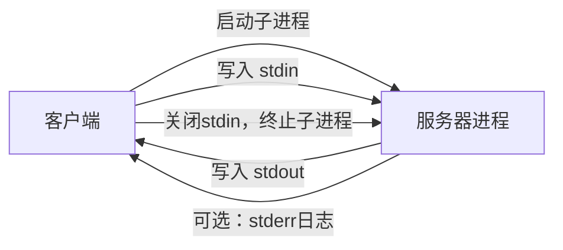
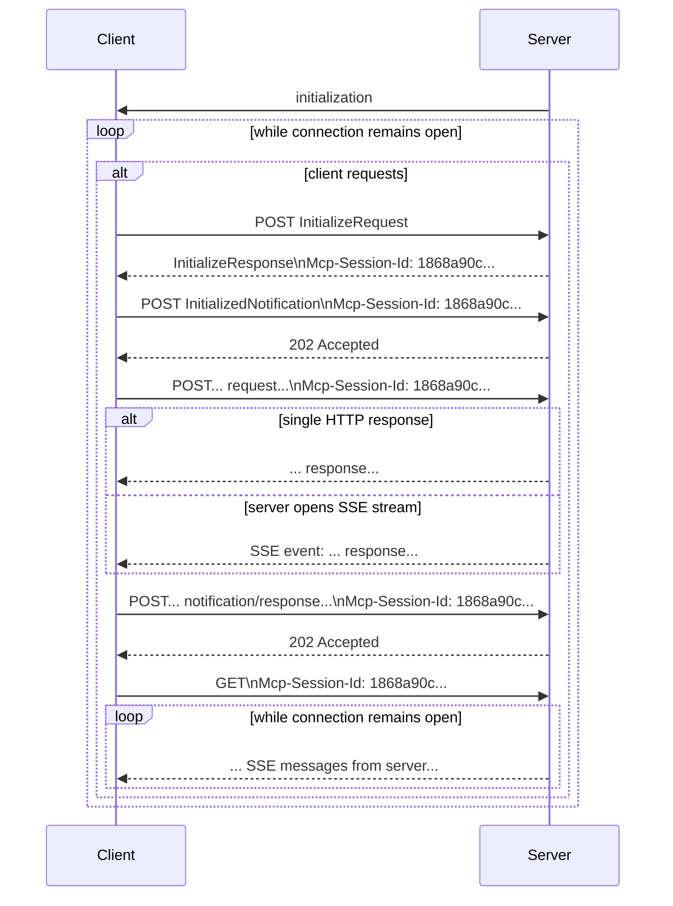

# MCP传输机制详解

## 概述

MCP（Model Context Protocol）使用JSON-RPC编码消息，所有JSON-RPC消息必须使用UTF-8编码。协议目前定义了两种标准传输机制用于客户端-服务器通信：

- **stdio**：通过标准输入和标准输出进行通信
- **Streamable HTTP**：可流式传输的HTTP

客户端应尽可能支持stdio传输。客户端和服务器也可以以可插拔方式实现**自定义传输**机制。

## 标准传输机制

### stdio传输

在stdio传输中：

- 客户端将MCP服务器作为子进程启动
- 服务器从标准输入(`stdin`)读取JSON-RPC消息，并将消息发送到标准输出(`stdout`)
- 消息可以是JSON-RPC请求、通知、响应，或包含一个或多个请求和/或通知的JSON-RPC**批处理**
- 消息通过换行符分隔，且不得包含嵌入的换行符
- 服务器可以在标准错误(`stderr`)上写入UTF-8字符串用于日志记录。客户端可以选择捕获、转发或忽略这些日志
- 服务器不得向`stdout`写入任何不是有效MCP消息的内容
- 客户端不得向服务器的`stdin`写入任何不是有效MCP消息的内容

### Streamable HTTP传输

此传输方式替代了协议版本2024-11-05中的[HTTP+SSE传输](https://modelcontextprotocol.io/specification/2024-11-05/basic/transports#http-with-sse)。在Streamable HTTP传输中，服务器作为可以处理多个客户端连接的独立进程运行。此传输使用HTTP POST和GET请求。服务器可以选择使用[Server-Sent Events](https://en.wikipedia.org/wiki/Server-sent_events) (SSE)来流式传输多个服务器消息。这允许基本的MCP服务器，以及支持流式传输和服务器到客户端通知和请求的更丰富的功能服务器。

服务器必须提供一个支持POST和GET方法的HTTP端点路径（以下称为MCP端点）。例如，这可以是类似`https://example.com/mcp`的URL。

#### 安全警告

实现Streamable HTTP传输时：

- 服务器必须验证所有传入连接的`Origin`头，以防止DNS重绑定攻击
- 在本地运行时，服务器应仅绑定到localhost (127.0.0.1)，而不是所有网络接口(0.0.0.0)
- 服务器应对所有连接实施适当的身份验证
- 如果没有这些保护措施，攻击者可能会使用DNS重绑定从远程网站与本地MCP服务器交互

#### 向服务器发送消息

- 客户端发送的每个JSON-RPC消息必须是对MCP端点的新HTTP POST请求
- 客户端必须使用HTTP POST将JSON-RPC消息发送到MCP端点
- 客户端必须包含一个`Accept`头，列出`application/json`和`text/event-stream`作为支持的内容类型
- POST请求的主体必须是以下之一：
    - 单个JSON-RPC请求、通知或响应
    - [批处理](https://www.jsonrpc.org/specification#batch)一个或多个请求和/或通知的数组
    - [批处理](https://www.jsonrpc.org/specification#batch)一个或多个响应的数组

如果输入仅包含（任意数量的）JSON-RPC响应或通知：

- 如果服务器接受输入，服务器必须返回HTTP状态码202 Accepted且无主体
- 如果服务器无法接受输入，必须返回HTTP错误状态码（例如，400 Bad Request）
- HTTP响应主体可以包含一个没有`id`的JSON-RPC错误响应

如果输入包含任意数量的JSON-RPC请求，服务器必须：

- 返回`Content-Type: text/event-stream`，以启动SSE流，或
- 返回`Content-Type: application/json`，以返回一个JSON对象
- 客户端必须支持这两种情况

如果服务器启动SSE流：

- SSE流最终应包含对POST主体中发送的每个JSON-RPC请求的一个JSON-RPC响应
- 这些响应可以是[批处理](https://www.jsonrpc.org/specification#batch)的
- 服务器可以在发送JSON-RPC响应之前发送JSON-RPC请求和通知
- 这些消息应与原始客户端请求相关
- 这些请求和通知可以是[批处理](https://www.jsonrpc.org/specification#batch)的
- 服务器在发送每个接收到的JSON-RPC请求的JSON-RPC响应之前，不应关闭SSE流，除非[会话](https://www.qianwen.com/chat/73a740ebab7f4a4e99a78e068573e304?ch=tongyi_redirect#%E4%BC%9A%E8%AF%9D%E7%AE%A1%E7%90%86)过期
- 发送完所有JSON-RPC响应后，服务器应关闭SSE流

断开连接可能随时发生（例如，由于网络条件）。因此：

- 断开连接不应被解释为客户端取消其请求
- 要取消，客户端应显式发送MCP `CancelledNotification`
- 为避免因断开连接而导致消息丢失，服务器可以使流[可恢复](https://www.qianwen.com/chat/73a740ebab7f4a4e99a78e068573e304?ch=tongyi_redirect#%E5%8F%AF%E6%81%A2%E5%A4%8D%E6%80%A7%E5%92%8C%E9%87%8D%E4%BC%A0)

#### 从服务器监听消息

客户端可以向MCP端点发出HTTP GET请求。这可用于打开SSE流，允许服务器与客户端通信，而无需客户端首先通过HTTP POST发送数据。

- 客户端必须包含一个`Accept`头，列出`text/event-stream`作为支持的内容类型
- 服务器必须在响应此HTTP GET时返回`Content-Type: text/event-stream`，或者返回HTTP 405 Method Not Allowed，表示服务器在此端点不提供SSE流

如果服务器启动SSE流：

- 服务器可以在流上发送JSON-RPC请求和通知
- 这些请求和通知可以是[批处理](https://www.jsonrpc.org/specification#batch)的
- 这些消息应与客户端当前正在运行的任何JSON-RPC请求无关
- 除非[恢复](https://www.qianwen.com/chat/73a740ebab7f4a4e99a78e068573e304?ch=tongyi_redirect#%E5%8F%AF%E6%81%A2%E5%A4%8D%E6%80%A7%E5%92%8C%E9%87%8D%E4%BC%A0)与先前客户端请求关联的流，否则服务器不得在流上发送JSON-RPC响应
- 服务器可以随时关闭SSE流
- 客户端可以随时关闭SSE流

#### 多连接处理

- 客户端可以同时连接到多个SSE流
- 服务器必须仅在其中一个连接的流上发送其每个JSON-RPC消息；即，它不得在多个流上广播相同的消息
- 使流[可恢复](https://www.qianwen.com/chat/73a740ebab7f4a4e99a78e068573e304?ch=tongyi_redirect#%E5%8F%AF%E6%81%A2%E5%A4%8D%E6%80%A7%E5%92%8C%E9%87%8D%E4%BC%A0)可以降低消息丢失的风险

#### 可恢复性和重传

为支持恢复断开的连接，以及重新传递可能丢失的消息：

- 服务器可以在SSE事件上附加一个`id`字段，如[SSE标准](https://html.spec.whatwg.org/multipage/server-sent-events.html#event-stream-interpretation)所述
- 如果存在，该ID必须在该[会话](https://www.qianwen.com/chat/73a740ebab7f4a4e99a78e068573e304?ch=tongyi_redirect#%E4%BC%9A%E8%AF%9D%E7%AE%A1%E7%90%86)内的所有流中全局唯一——或者如果未使用会话管理，则在与该特定客户端的所有流中全局唯一
- 如果客户端希望在连接断开后恢复，应向MCP端点发出HTTP GET，并包含`[Last-Event-ID](https://html.spec.whatwg.org/multipage/server-sent-events.html#the-last-event-id-header)`头，以指示其接收到的最后一个事件ID
- 服务器可以使用此头来重放断开连接的流上本应发送的、在最后一个事件ID之后的消息，并从该点恢复流
- 服务器不得重放在不同流上本应传递的消息
- 换句话说，这些事件ID应由服务器按流分配，作为该特定流内的游标

#### 会话管理

MCP"会话"由客户端和服务器之间逻辑相关的交互组成，从[初始化阶段](https://modelcontextprotocol.io/specification/2025-03-26/basic/lifecycle)开始。为支持希望建立有状态会话的服务器：

- 使用Streamable HTTP传输的服务器可以在初始化时分配一个会话ID，方法是在包含`InitializeResult`的HTTP响应中包含该ID
- 会话ID应该是全局唯一且加密安全的（例如，安全生成的UUID、JWT或加密哈希）
- 会话ID必须只包含可见ASCII字符（范围从0x21到0x7E）
- 如果服务器在初始化期间返回了`Mcp-Session-Id`，使用Streamable HTTP传输的客户端必须在所有后续HTTP请求中包含`Mcp-Session-Id`头
- 需要会话ID的服务器应对没有`Mcp-Session-Id`头（除初始化外）的请求以HTTP 400 Bad Request响应
- 服务器可以随时终止会话，之后必须对包含该会话ID的请求以HTTP 404 Not Found响应
- 当客户端收到对包含`Mcp-Session-Id`的请求的HTTP 404响应时，必须通过发送不附带会话ID的新`InitializeRequest`来启动新会话
- 不再需要特定会话的客户端（例如，因为用户正在离开客户端应用程序）应向MCP端点发送HTTP DELETE请求并包含`Mcp-Session-Id`头，以显式终止会话
- 服务器可以对此请求以HTTP 405 Method Not Allowed响应，表示服务器不允许客户端终止会话

## 向后兼容性

客户端和服务器可以通过以下方式与已弃用的[HTTP+SSE传输](https://modelcontextprotocol.io/specification/2024-11-05/basic/transports#http-with-sse)（来自协议版本2024-11-05）保持向后兼容：

希望支持旧客户端的服务器应：

- 继续托管旧传输的SSE和POST端点，以及为Streamable HTTP传输定义的新"MCP端点"
- 也可以将旧的POST端点和新的MCP端点合并，但这可能会引入不必要的复杂性

希望支持旧服务器的客户端应：

- 从用户接受MCP服务器URL，该URL可能指向使用旧传输或新传输的服务器
- 尝试向服务器URL POST一个`InitializeRequest`，使用如上定义的`Accept`头：
    - 如果成功，客户端可以假设这是支持新Streamable HTTP传输的服务器
    - 如果失败并返回HTTP 4xx状态码（例如，405 Method Not Allowed或404 Not Found）：
        - 向服务器URL发出GET请求，期望这将打开SSE流并返回`endpoint`事件作为第一个事件
        - 当`endpoint`事件到达时，客户端可以假设这是运行旧HTTP+SSE传输的服务器，并应使用该传输进行所有后续通信

## 自定义传输

客户端和服务器可以实现额外的自定义传输机制以满足其特定需求。该协议与传输无关，可以在支持双向消息交换的任何通信通道上实现。选择支持自定义传输的实现者必须确保保留MCP定义的JSON-RPC消息格式和生命周期要求。自定义传输应记录其特定的连接建立和消息交换模式，以帮助实现互操作性。