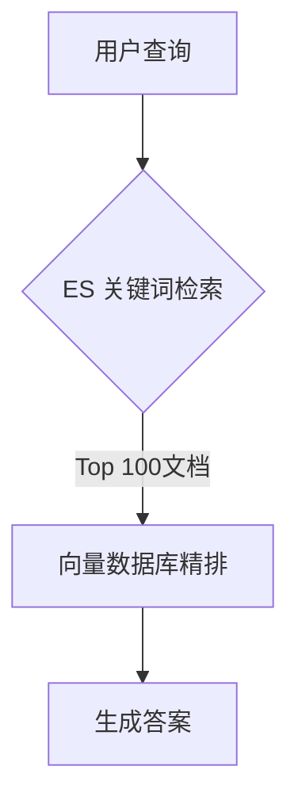

在 RAG（Retrieval-Augmented Generation）系统中，**Elasticsearch（ES）** 确实可以发挥重要作用，尤其在需要高效处理结构化或半结构化文本检索的场景中。以下是 ES 在 RAG 中的典型应用场景和技术实现细节：

***

## **1. Elasticsearch 在 RAG 中的核心应用场景**

### **(1) 混合检索中的稀疏检索层**

*   **作用**：\
    ES 的 **BM25 算法** 提供关键词检索能力，与向量检索（如 FAISS）形成互补，解决纯语义搜索的“词汇鸿沟”问题。
*   **优势**：
    *   精准匹配术语、缩写、专有名词（如“Transformer 模型”）。
    *   支持布尔逻辑（`AND`/`OR`）和字段加权（如标题比正文权重更高）。

**代码示例**：

```python
from elasticsearch import Elasticsearch

es = Elasticsearch()
query = {
    "query": {
        "bool": {
            "should": [
                {"match": {"title": {"query": "神经网络", "boost": 2}}},  # 标题权重更高
                {"match": {"content": "神经网络"}}
            ]
        }
    }
}
results = es.search(index="ai_papers", body=query)
```

### **(2) 结构化元数据过滤**

*   **作用**：\
    通过 ES 的过滤机制快速缩小检索范围，提升后续向量检索的效率。
*   **典型字段**：
    *   文档来源（`source`）、发布时间（`publish_date`）
    *   领域标签（`tags`）、作者（`author`）等。

**示例查询**：

```json
{
  "query": {
    "bool": {
      "must": [
        {"match": {"content": "深度学习"}},
        {"range": {"publish_date": {"gte": "2023-01-01"}}}
      ],
      "filter": [{"term": {"tags": "计算机视觉"}}]
    }
  }
}
```

### **(3) 多模态检索扩展**

*   **作用**：\
    当 RAG 系统需要处理非文本数据（如图片、表格）时，ES 可存储和检索关联的元数据。
*   **实现**：
    *   图片：存储 CLIP 生成的描述文本或对象检测结果（如 `objects: ["cat", "dog"]`）。
    *   表格：将表格内容转为键值对（如 `{"column1": "value1", ...}`）。

***

## **2. 与向量检索的协同方案**

### **(1) 两阶段检索架构**



*   **第一阶段**：ES 快速召回候选集（毫秒级）。
*   **第二阶段**：向量模型对候选集重排序（如用 Cross-Encoder）。

### **(2) 向量字段支持（ES 8.0+）**

*   **原生向量检索**：ES 支持 `dense_vector` 字段类型和近似搜索。
    ```json
    {
      "mappings": {
        "properties": {
          "text_embedding": {
            "type": "dense_vector",
            "dims": 768,
            "index": true,
            "similarity": "cosine"
          }
        }
      }
    }
    ```
*   **优势**：统一存储文本和向量，避免多数据库同步问题。

***

## **3. 性能优化技巧**

### **(1) 索引设计**

| **策略**   | **实现方法**                                                   |
| -------- | ---------------------------------------------------------- |
| **分片优化** | 根据数据量设置分片数（建议：每分片 20-50GB，如 `number_of_shards=5`）。         |
| **冷热分离** | 热数据用 SSD 节点，冷数据用 HDD 节点（通过 `index.routing.allocation` 控制）。 |
| **混合索引** | 对高频查询字段启用 `fielddata`，低频字段用 `doc_values`。                  |

### **(2) 查询加速**

*   **预过滤**：先按 `filter` 缩小范围，再执行 `match` 查询。
*   **缓存**：对静态数据启用 `query_cache`。
*   **并行化**：设置 `batched_reduce_size` 加速聚合查询。

***

## **4. 典型业务场景**

### **(1) 企业知识库问答**

*   **ES 角色**：
    *   存储产品手册、FAQ 等结构化文档。
    *   通过 `highlight` 返回匹配片段供生成器参考。
*   **查询示例**：
    ```python
    response = es.search(
        index="product_manual",
        body={
            "query": {"match": {"content": "如何重置密码"}},
            "highlight": {"fields": {"content": {}}}
        }
    )
    ```

### **(2) 法律/医疗领域**

*   **ES 优势**：
    *   精确匹配法律条款编号（如 `Article 12.3`）。
    *   支持正则表达式检索（如病历中的 ICD-10 编码）。

***

## **5. 局限性及解决方案**

| **问题** | **ES 的不足**     | **推荐解决方案**                             |
| ------ | -------------- | -------------------------------------- |
| 语义模糊查询 | BM25 对同义词泛化能力弱 | 结合同义词扩展或向量检索                           |
| 超长文本处理 | 默认对长文本分段索引     | 预处理时人工分块 + 设置 `position_increment_gap` |
| 实时向量更新 | 大规模向量索引重建耗时    | 使用 ES 的 `_reindex` API 增量更新            |

***

## **6. 技术栈集成示例**

### **(1) 全流程 Python 实现**

```python
from elasticsearch import Elasticsearch
from sentence_transformers import SentenceTransformer

# 初始化
es = Elasticsearch()
encoder = SentenceTransformer("paraphrase-multilingual-MiniLM-L12-v2")

# 混合检索
def hybrid_search(query, top_k=5):
    # 1. ES 关键词检索
    es_results = es.search(index="docs", body={"query": {"match": {"text": query}}}, size=100)
    candidate_ids = [hit["_id"] for hit in es_results["hits"]["hits"]]
    
    # 2. 向量精排
    query_embedding = encoder.encode(query)
    vectors = get_vectors_from_db(candidate_ids)  # 从向量数据库获取候选向量
    scores = np.dot(vectors, query_embedding)
    top_indices = np.argsort(scores)[-top_k:][::-1]
    
    return [candidate_ids[i] for i in top_indices]
```

### **(2) 与 LangChain 集成**

```python
from langchain.vectorstores import ElasticsearchStore
from langchain.embeddings import HuggingFaceEmbeddings

vectorstore = ElasticsearchStore(
    embedding=HuggingFaceEmbeddings(),
    index_name="rag_docs",
    es_url="http://localhost:9200"
)
vectorstore.add_texts(["RAG 是一种混合架构..."])
```

***

## **总结：何时选择 Elasticsearch？**

*   **推荐使用**：
    *   需要结合关键词和元数据过滤的场景。
    *   已有 ES 基础设施，希望减少运维复杂度。
    *   处理半结构化数据（如 JSON 日志、Markdown）。
*   **不建议使用**：
    *   纯语义搜索场景（直接使用 FAISS/Milvus）。
    *   超大规模向量检索（ES 的 ANN 性能弱于专用向量库）。

通过合理设计，ES 可以成为 RAG 系统中强大的检索增强组件，尤其在需要结构化查询和混合搜索的场景中表现优异。
