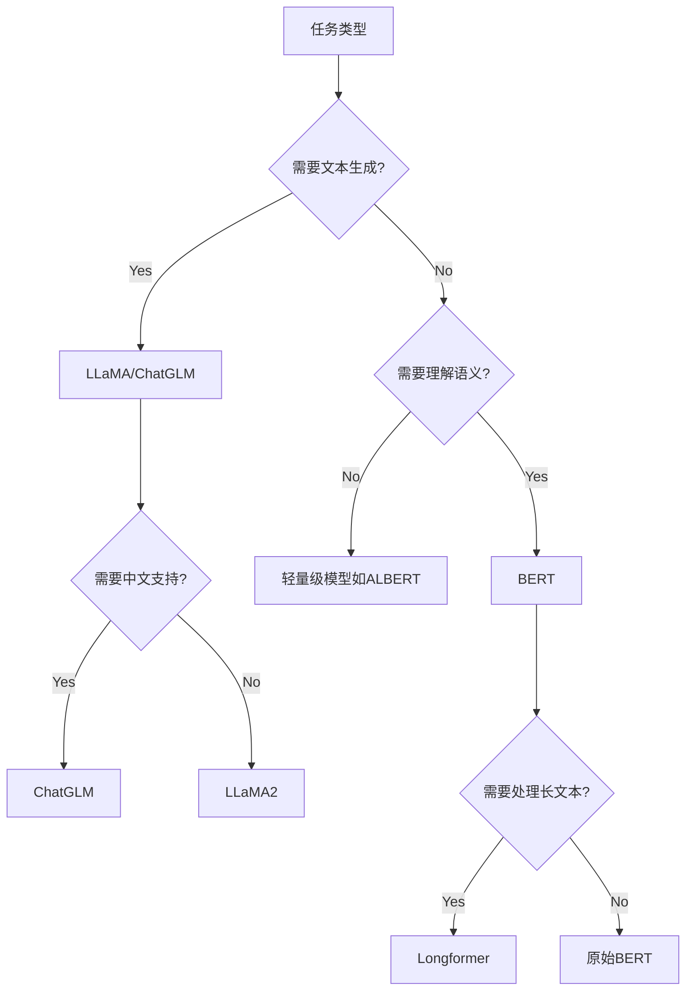
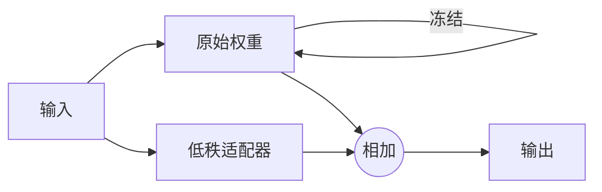

# 1. 生成式大模型 (Generative Large Language Models)

## 1.1 基本定义

生成式大模型是指基于海量数据训练的、能够生成连贯文本的深度学习模型，其核心特点是：

*   **参数规模大**：通常参数量在数十亿到万亿级别（如GPT-3有1750亿参数）
*   **生成能力**：可以自动补全/生成文本、代码、对话等内容
*   **架构基础**：主要基于Transformer架构（特别是解码器部分）

## 1.2 关键技术组成

```math
P(w_t | w_{<t}) = \text{softmax}(W \cdot \text{Transformer}(w_{<t}) + b)
```

1.  **自回归生成**：以上式为基础，逐个token生成文本
2.  **注意力机制**：通过`$\text{Attention}(Q,K,V) = \text{softmax}(\frac{QK^T}{\sqrt{d_k}})V$`捕捉长距离依赖

## 1.3 典型代表模型

*   GPT系列 (Generative Pre-trained Transformer)
*   PaLM (Pathways Language Model)
*   LLaMA (Meta开源模型)

***

# 2. 生成文本多样化的方法

## 2.1 解码策略优化

1.  **随机性控制**：
    *   Temperature调整 (`$T$`):
        ```math
        p_i' = \frac{\exp(p_i/T)}{\sum_j \exp(p_j/T)}
        ```
        *   `$T>1$`：增大随机性
        *   `$T<1$`：降低随机性

2.  **采样方法**：
    *   **Top-k采样**：仅从概率最高的k个token中随机选择
    *   **Top-p采样**（核采样）：从累计概率超过p的最小token集合中选择

## 2.2 提示工程 (Prompt Engineering)

1.  **多样性种子**：
    *   在prompt中明确要求："请给出3种不同风格的答案："
2.  **约束生成**：
    ```python
    # 示例：限制生成角度
    "从科技、人文、经济三个视角分别分析这个问题：..."
    ```

## 2.3 后处理技术

1.  **Beam Search多样化**：
    *   设置`num_beams > 1`但`early_stopping=False`
    *   加入`diversity_penalty`参数

2.  **重排序机制**：
    *   生成多个候选结果后，用判别模型选择最丰富的结果

## 2.4 模型层面改进

1.  **对抗训练**：
    *   通过判别器鼓励模型生成多样输出
2.  **多任务学习**：
    *   同时训练生成、分类、重构等任务提升泛化能力

***

# 对比表格：解码策略效果

| 方法          | 多样性 | 连贯性 | 适用场景  |
| ----------- | --- | --- | ----- |
| Greedy      | 低   | 高   | 确定性任务 |
| Beam Search | 中   | 高   | 机器翻译  |
| Top-k       | 高   | 中   | 创意写作  |
| Top-p       | 高   | 中高  | 开放域对话 |

建议实践时结合`temperature=0.7`和`top_p=0.9`作为起始点调试。

# 3. LLMs复读机问题 (Repetition Problem)

## 3.1 问题定义

复读机问题指语言模型在生成文本时**无意义地重复相同词汇、短语或句子片段**的现象，例如：

    "深度学习是机器学习的一个分支... 深度学习是机器学习的一个分支... 深度学习是..."

主要表现：

*   **局部重复**：连续重复相同词汇（如"真的真的真的"）
*   **全局重复**：循环生成相似语义的句子
*   **模板化输出**：不同输入得到高度相似的回复

## 3.2 根本原因分析

1.  **训练目标偏差**：
    *   MLE（最大似然估计）目标倾向于选择高概率token：
        ```math
        \mathcal{L}_{\text{MLE}} = -\sum_{t} \log P(w_t | w_{<t})
        ```
        容易过度利用"安全"的高频模式

2.  **暴露偏差** (Exposure Bias)：
    *   训练时使用真实上下文，推理时依赖模型自身生成（可能有误差积累）

3.  **注意力机制缺陷**：
    *   某些注意力头可能过度关注近期token（尤其是decoder-only模型）

4.  **数据特性**：
    *   训练数据中存在的重复模式（如网页文本的SEO重复）

## 3.3 缓解方法

### 3.3.1 训练阶段改进

1.  **Unlikelihood Training** (ICLR 2020)：
    *   对重复token引入惩罚项：
        ```math
        \mathcal{L}_{\text{UL}} = -\sum_{t} \left[ \log P(w_t | w_{<t}) + \alpha \sum_{c \in \mathcal{C}_t} \log(1 - P(c | w_{<t})) \right]
        ```
        其中`$\mathcal{C}_t$`为需要避免的token集合

2.  **Noisy Training**：
    *   在输入中注入随机删除/替换噪声，增强鲁棒性

### 3.3.2 解码阶段控制

1.  **Repetition Penalty**：
    *   对已出现token降低概率：
        ```math
        P'(w_t) = \begin{cases}
        P(w_t)/\lambda, & \text{if } w_t \in w_{<t} \\
        P(w_t), & \text{otherwise}
        \end{cases}
        ```
        其中`$\lambda>1$`为惩罚系数（如1.2）

2.  **N-gram Blocking**：
    *   禁止完整重复最近的n-gram（如huggingface的`no_repeat_ngram_size=3`）

3.  **动态Temperature**：
    *   检测到重复时自动升高temperature增加随机性

### 3.3.3 架构改进

1.  **注意力掩码增强**：
    *   强制注意力权重熵不低于阈值：
        ```math
        H(\mathbf{a}_t) = -\sum_i a_{t,i} \log a_{t,i} > \tau
        ```

2.  **记忆机制**：
    *   显式记录已生成内容（如使用K-V缓存标记）

### 方法对比表

| 方法                    | 训练成本 | 推理开销 | 适用场景     |
| --------------------- | ---- | ---- | -------- |
| Unlikelihood Training | 高    | 无    | 需重新训练模型时 |
| Repetition Penalty    | 无    | 低    | 通用场景     |
| N-gram Blocking       | 无    | 中    | 短文本生成    |
| Noisy Training        | 中    | 无    | 数据质量较差时  |

**实践建议**：

*   优先尝试`repetition_penalty=1.2`+`no_repeat_ngram_size=3`
*   对于严重重复问题可配合`temperature=0.7~0.9`调节
*   关键场景建议人工设计黑名单词表

# 4. LLaMA模型的输入长度限制

## 4.1 理论限制

LLaMA模型**不能处理无限长输入**，其输入长度存在硬性限制：

*   **预训练版本**：最大上下文长度为2048个token（约1500-2500个单词）
*   **改进版本**（如Code LLaMA）：部分扩展到4096 token

## 4.2 长度限制的根本原因

1.  **注意力机制计算复杂度**：
    *   Transformer的注意力计算复杂度为`$O(n^2)$`（n为序列长度）
    ```math
    \text{Attention}(Q,K,V) = \text{softmax}(\frac{QK^T}{\sqrt{d_k}})V
    ```
    当`$n=2048$`时，单层注意力需要计算约420万次点积

2.  **位置编码限制**：
    *   LLaMA使用旋转位置编码（RoPE）：
        ```math
        \text{RoPE}(x_m, m) = \begin{pmatrix}
        \cos m\theta & -\sin m\theta \\
        \sin m\theta & \cos m\theta
        \end{pmatrix} \begin{pmatrix}
        x_{m,1} \\
        x_{m,2}
        \end{pmatrix}
        ```
        训练时只学习了`$\theta_i$`在2048位置内的参数

3.  **显存限制**：
    *   序列长度与显存消耗呈平方关系：
        显存 ≈ 4 \* (d\_model \* n + n^2) \* layers
        3090显卡（24GB）在2048长度时已接近极限

## 4.3 突破限制的方法

### 4.3.1 工程优化

1.  **滑动窗口**：
    *   仅保留最近N个token的K-V缓存（如N=1024）
    *   实现方案：
        ```python
        past_key_values = past_key_values[-window_size:]  # 截断历史
        ```

2.  **内存压缩**：
    *   对历史K-V缓存进行低秩近似（如PCA）

### 4.3.2 算法改进

1.  **外推法**（Extrapolation）：
    *   调整RoPE的base值（如从10000改为500000）：
        ```math
        \theta_i = 500000^{-2i/d_{head}}
        ```
    *   代表工作：Code LLaMA的"PI"位置插值

2.  **块状注意力**：
    *   将输入分块处理（如Longformer的稀疏注意力）

### 4.3.3 当前最优方案对比

| 方法               | 最大长度  | 相对效果 | 实现难度 |
| ---------------- | ----- | ---- | ---- |
| 原始LLaMA          | 2048  | 100% | -    |
| 位置插值(PI)         | 32768 | 92%  | ★★☆  |
| 滑动窗口             | 可变    | 85%  | ★☆☆  |
| FlashAttention-2 | 8192  | 95%  | ★★☆  |

## 4.4 长度超限的表现

当输入超过最大长度时：

1.  **前端截断**：自动丢弃超出部分的token
2.  **性能下降**：
    *   困惑度(perplexity)显著上升
    *   在2048-4096区间可能产生"重复+胡言乱语"现象

## 实践建议

```python
# HuggingFace使用示例（强制长度限制）
inputs = tokenizer(text, 
                   truncation=True, 
                   max_length=2048,  # 严格限制
                   return_tensors="pt")
```

**扩展方向**：

*   对于长文档处理建议先做分块（如512token/块）
*   需要超长上下文时可考虑改用GPT-4-128k或Claude-200k

# 1. 如何选择模型（Bert vs. LLaMA/ChatGLM）

## 1.1 核心差异对比

| 维度         | BERT家族                  | LLaMA/ChatGLM      |
| ---------- | ----------------------- | ------------------ |
| **架构类型**   | Encoder-Decoder (双向注意力) | Decoder-only (自回归) |
| **训练目标**   | MLM+NSP (完形填空)          | Causal LM (下一个词预测) |
| **典型输入输出** | 输入文本→嵌入/分类标签            | 输入文本→生成文本          |
| **最大长度**   | 512 tokens (部分扩展版到1024) | 2048-4096 tokens   |
| **多语言支持**  | 强 (mBERT, XLM等)         | 较弱 (需额外训练)         |
| **计算需求**   | 推理成本低                   | 推理成本高              |

## 1.2 选择决策树



## 1.3 典型场景建议

1.  **选择BERT的情况**：
    *   文本分类（如情感分析）
    *   实体识别（NER）
    *   语义相似度计算
    *   需要微调的小规模数据集（<10万样本）

2.  **选择LLaMA/ChatGLM的情况**：
    *   开放域对话系统
    *   长文本生成（如报告写作）
    *   需要思维链(CoT)的任务
    *   中文场景优先ChatGLM（专为中文优化）

3.  **混合架构方案**：
    ```python
    # 检索增强生成(RAG)示例
    retriever = BertForRetrieval()  # BERT做检索
    generator = LLaMA()            # LLaMA做生成
    ```

***

# 2. 各专业领域是否需要独立大模型？

## 2.1 专业领域特性分析

| 领域     | 数据特点       | 是否需要独立模型 | 理由                       |
| ------ | ---------- | -------- | ------------------------ |
| **医疗** | 专业术语密集     | ✓        | 通用模型在ICD编码等任务上错误率高       |
| **法律** | 条文引用精确性要求高 | ✓        | 需要特殊的位置感知架构处理法条引用        |
| **金融** | 数值推理需求强    | △        | 可通过LoRA等适配器微调通用模型        |
| **教育** | 教学逻辑结构化    | △        | 提示工程足够覆盖多数场景             |
| **编程** | 代码语法严格     | ✓        | StarCoder等专用模型表现显著优于通用模型 |

## 2.2 独立模型的构建策略

### 2.2.1 全参数微调方案

```math
\mathcal{L}_{\text{FT}} = -\sum_{(x,y)\in \mathcal{D}_{\text{domain}}} \log P(y|x;\theta)
```

*   **适用场景**：数据量>100万条的专业领域
*   **代表案例**：
    *   Med-PaLM (医疗)
    *   Legal-BERT (法律)

### 2.2.2 参数高效微调

1.  **Adapter模块**：
    ```math
    h' = h + W_{\text{down}}} \sigma(W_{\text{up}}}h)
    ```
    *   仅新增约0.5%参数

2.  **LoRA**：
    ```math
    \Delta W = BA^T \quad \text{其中} \quad B \in \mathbb{R}^{d \times r}, A \in \mathbb{R}^{r \times k}
    ```
    *   秩r通常取4-64

### 2.2.3 领域增强方法对比

| 方法    | 训练成本 | 领域适应性 | 知识遗忘风险 |
| ----- | ---- | ----- | ------ |
| 全参数微调 | 高    | ★★★★★ | 高      |
| LoRA  | 中    | ★★★☆☆ | 低      |
| 提示微调  | 低    | ★★☆☆☆ | 无      |
| RAG   | 极低   | ★★★★☆ | 无      |

## 2.3 实践建议

1.  **决策流程**：
    IF 领域术语密度 > 30% OR 准确率要求 > 99%:
    采用独立模型
    ELSE IF 数据量 > 50万条:
    使用LoRA微调
    ELSE:
    采用RAG+通用模型

2.  **成本估算公式**：
    ```math
    \text{成本} = \underbrace{N_{\text{params}}} \times 4}_{\text{显存(GB)}} \times \underbrace{T_{\text{hours}}} \times P_{\text{GPU}}}_{\text{算力费用}}
    ```
    *   7B模型全微调约需4×7=28GB显存
    *   LoRA微调仅需约12GB

**典型案例**：

*   医疗问答系统：微调LLaMA的医学版本（如PMC-LLaMA）
*   法律合同审查：BERT+CRF的混合架构
*   金融报告生成：ChatGLM+FinRL LoRA适配器

# 如何让大模型处理更长文本

## 1. 核心挑战分析

*   **计算复杂度**：传统Transformer的注意力机制具有`$O(n^2)$`复杂度
*   **显存占用**：序列长度与显存消耗呈平方关系
*   **位置编码**：大多数模型的位置编码在预训练后无法外推

## 2. 关键技术方案

### 2.1 高效注意力机制

1.  **稀疏注意力**：
    ```math
    \text{Attention}(Q,K,V) = \text{softmax}(\frac{M \odot QK^T}{\sqrt{d_k}})V
    ```
    *   其中`$M$`为稀疏掩码矩阵（如滑动窗口、块稀疏等）
    *   **典型实现**：
        *   Longformer的局部+全局注意力
        *   BigBird的随机+局部+全局注意力

2.  **内存优化注意力**：
    *   FlashAttention（通过分块计算减少HBM访问）
    *   Memory-efficient Attention（梯度检查点技术）

### 2.2 位置编码改进

1.  **外推方法**：
    *   旋转位置编码(RoPE)的基频调整：
        ```math
        \theta_i' = \theta_i \times \frac{L_{\text{train}}}{L_{\text{extend}}}
        ```
        *   代表工作：Code LLaMA的PI（位置插值）

2.  **相对位置编码**：
    *   ALiBi（训练时添加衰减偏置）：
        ```math
        \text{AttentionScore} = q_i k_j^T - m \cdot |i-j|
        ```

### 2.3 架构级优化

1.  **层次化处理**：
    *   先分段编码再全局整合（如HTransformer）
    *   递归机制（如Transformer-XL）

2.  **记忆压缩**：
    *   对历史K-V缓存进行PCA降维
    *   增量更新机制

## 3. 实践方案对比

| 方法               | 最大长度 | 相对效果 | 实现难度 | 适用场景    |
| ---------------- | ---- | ---- | ---- | ------- |
| 原始Transformer    | 2K   | 100% | -    | 基准      |
| 滑动窗口(1024)       | ∞    | 85%  | ★☆☆  | 流式处理    |
| FlashAttention-2 | 8K   | 98%  | ★★☆  | 通用长文本   |
| 位置插值(PI)         | 32K  | 92%  | ★★☆  | 代码/数学   |
| 块稀疏注意力           | 64K  | 89%  | ★★★  | 超长文档    |
| Memorization     | 128K | 83%  | ★★★★ | 法律/医疗文档 |

## 4. 具体实现示例

### 4.1 HuggingFace长文本处理

```python
from transformers import AutoModelForCausalLM, AutoTokenizer

model = AutoModelForCausalLM.from_pretrained(
    "meta-llama/Llama-2-7b-chat-hf",
    device_map="auto",
    rope_scaling={"type": "linear", "factor": 4}  # 扩展4倍长度
)

tokenizer = AutoTokenizer.from_pretrained("meta-llama/Llama-2-7b-chat-hf")
inputs = tokenizer(long_text, return_tensors="pt").to("cuda")
outputs = model.generate(**inputs, max_new_tokens=4000)
```

### 4.2 自定义注意力掩码

```python
# 实现局部注意力（窗口大小=512）
attention_mask = torch.ones(L, L).tril()  # 下三角
for i in range(L):
    attention_mask[i, max(0,i-512):i+1] = 1  # 滑动窗口
```

## 5. 领域专用优化建议

1.  **法律文档**：
    *   采用Hierarchical Transformer
    *   关键段落记忆缓存

2.  **学术论文**：
    *   章节摘要+全局重排
    *   公式特殊编码

3.  **对话系统**：
    *   对话历史压缩（如TF-IDF筛选）
    *   关键事实记忆库

## 6. 效果评估指标

1.  **长文本困惑度**（PPL）：
    ```math
    \text{PPL} = \exp\left(-\frac{1}{N}\sum_{i=1}^N \log P(w_i|w_{<i})\right)
    ```
2.  **信息保留率**：
    *   对长文档进行QA测试，计算答案准确率

## 7. 最新进展（2024）

*   **Mamba**：选择性状态空间模型，线性复杂度处理长序列
*   **Ring Attention**：分布式处理百万级token
*   **Infini-attention**：压缩记忆+局部注意力组合

**实施路线图**：

    1. 评估实际需要的长度（如8K/32K/100K+）
    2. 选择合适的基础模型（LLaMA/GLM/GPT等）
    3. 确定优化方案（架构修改/注意力优化/位置编码调整）
    4. 领域适配（可选微调）
    5. 部署时的显存优化（量化/分块）

\# NLP中的注意力权重熵详解

\## 一、基本概念
注意力权重熵是衡量注意力分布\*\*不确定性\*\*或\*\*分散程度\*\*的指标，类似于信息论中的信息熵。

\## 直观理解
想象你在阅读时：
\- \*\*低熵注意力\*\*：只聚焦在几个关键词上（如专有名词）
\- \*\*高熵注意力\*\*：注意力均匀分散在所有单词上

\## 二、数学定义
对于注意力权重分布α，其熵计算为：

\$\$
H(\alpha) = -\sum\_{i=1}^n \alpha\_i \log \alpha\_i
\$\$

其中：
\- α\_i 是第i个位置的注意力权重
\- n 是序列长度

\## 三、计算示例
假设两个不同的注意力分布：

\## 案例1：集中分布
\`\`\`python
alpha = \[0.9, 0.05, 0.03, 0.02]  # 明显聚焦在第一个token
entropy = -sum(p \* log(p) for p in alpha)  # ≈0.36
\`\`\`

\## 案例2：均匀分布
\`\`\`python
alpha = \[0.25, 0.25, 0.25, 0.25]  # 均匀关注
entropy = -sum(p \* log(p) for p in alpha)  # ≈1.39
\`\`\`

\## 四、在NLP中的应用价值

\## 1. 模型诊断工具
\| 熵值范围 | 典型含义 |
\|---------|---------|
\| 0~0.5 | 高度集中注意力 |
\| 0.5~1 | 适度聚焦 |
\| >1 | 分散注意力 |

\## 2. 实际应用场景
\- \*\*检测模型关注模式\*\*：分析是否合理聚焦关键信息
\- \*\*异常检测\*\*：识别注意力机制失效的层/头
\- \*\*模型压缩\*\*：低熵注意力头可优先剪枝

\## 五、DeepSeek的创新应用

\## 1. 熵正则化
在损失函数中加入熵约束：
\$\$
\mathcal{L} = \mathcal{L}\_{task} + \lambda H(\alpha)
\$\$
\- λ>0：鼓励多样性
\- λ<0：促进聚焦

\## 2. 动态头选择
\`\`\`python
def select\_heads(attention\_entropies, threshold=0.7):
&#x20;   return \[i for i, ent in enumerate(attention\_entropies)&#x20;
&#x20;           if ent < threshold]
\`\`\`

\## 3. 熵感知注意力
\`\`\`python
class EntropyAwareAttention(nn.Module):
&#x20;   def forward(self, Q, K, V):
&#x20;       attn = softmax(QK^T/√d)
&#x20;       entropy = compute\_entropy(attn)
&#x20;       return entropy \* attn @ V  # 熵加权输出
\`\`\`

\## 六、典型研究案例

\## 1. 机器翻译
\- \*\*发现\*\*：低层倾向于高熵（捕捉局部语法）
\- \*\*高层\*\*：低熵（聚焦关键语义词）

\## 2. 文本分类
\- \*\*正常模型\*\*：\[CLS]标记的注意力熵应较低
\- \*\*异常情况\*\*：熵值过高可能预示模型依赖虚假特征

\## 七、可视化分析
!\[注意力熵热力图]\(<https://miro.medium.com/v2/resize:fit:1400/1*PHE5F4OLQaqA2W6EvXs3zw.png>)
（颜色越深表示该位置的注意力熵越高）

需要了解如何具体计算某个BERT模型的注意力熵吗？或者想探讨特定任务的典型熵值范围？

```ini
```


# LoRA（Low-Rank Adaptation）低秩适配详解

## 一、核心概念

LoRA是一种**高效微调大模型**的技术，通过低秩矩阵分解来更新权重，而非直接修改原始参数。

## 类比理解

就像给机器加装"技能模块"：

*   **全参数微调**：把整台机器拆了重组
*   **LoRA**：外接一个轻量插件（只训练这个插件）

## 二、技术原理

## 1. 数学表达

对于原始权重矩阵 ( W \in \mathbb{R}^{d \times k} )，LoRA的更新方式：

```math
W' = W + \Delta W = W + BA
```

其中：

*   ( B \in \mathbb{R}^{d \times r} ) (低秩矩阵)
*   ( A \in \mathbb{R}^{r \times k} ) (低秩矩阵)
*   ( r \ll \min(d,k) ) (秩，通常4-64)

## 2. 结构图示



## 三、实现步骤

## 1. 参数初始化

```python
class LoRALayer(nn.Module):
    def __init__(self, original_layer, rank=8):
        super().__init__()
        self.original = original_layer  # 原始层(冻结)
        self.A = nn.Parameter(torch.randn(original_layer.weight.shape[1], rank))
        self.B = nn.Parameter(torch.zeros(rank, original_layer.weight.shape[0]))
        
        # 冻结原始参数
        for p in self.original.parameters():
            p.requires_grad = False
```

## 2. 前向传播

```python
def forward(self, x):
    orig_out = self.original(x)
    lora_out = x @ (self.A @ self.B).T  # 低秩变换
    return orig_out + lora_out
```

## 四、关键优势

## 1. 参数效率对比

| 方法       | 可训练参数量      | 示例(175B模型) |
| -------- | ----------- | ---------- |
| 全参数微调    | 100%        | 175B       |
| Adapter  | \~3-5%      | 5.25-8.75B |
| **LoRA** | **\~0.01%** | **17.5M**  |

## 2. 计算特性

*   **无推理延迟**：合并 ( W' = W + BA ) 后与原始模型速度相同
*   **内存高效**：只需存储小矩阵梯度

## 五、实际应用

## 1. 典型配置

```yaml
lora_config:
  target_modules: ["q_proj", "v_proj"]  # 通常只改注意力层的Q/V
  rank: 8
  alpha: 16  # 缩放因子
  dropout: 0.1
```

## 2. 训练流程

```python
model = get_pretrained_model()
lora.mark_only_lora_as_trainable(model)  # 只训练LoRA参数

optimizer = AdamW(model.parameters(), lr=1e-4)
for batch in dataloader:
    outputs = model(batch)
    loss = outputs.loss
    loss.backward()
    optimizer.step()
```

## 六、变体与改进

## 1. LoRA+

*   **特点**：对A/B矩阵使用不同学习率
*   **配置**：
    ```python
    optimizer.add_param_group({
        'params': lora_A_params, 
        'lr': 1e-3
    })
    ```

## 2. 动态秩LoRA

```python
# 根据梯度信息自动调整秩
if grad_norm < threshold:
    rank = max(rank//2, min_rank)
```

## 七、在DeepSeek中的应用

## 1. 混合专家适配

```python
# 对MoE的每个专家单独应用LoRA
for expert in moe.experts:
    expert.add_lora(rank=4)
```

## 2. 量化兼容

*   **方案**：在量化后的权重上添加LoRA
*   **优势**：保持4bit存储，8bit训练

需要了解如何为特定架构（如Transformer）实现LoRA吗？或者想探讨不同秩的选择策略？
