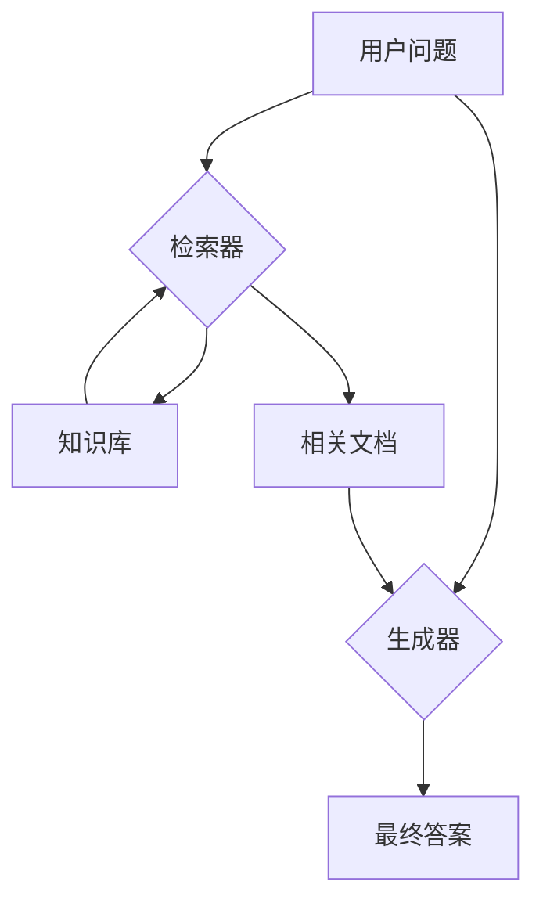

# 2. RAG系统架构

## 2.1 实现原理

RAG（Retrieval-Augmented Generation）系统的架构设计优雅地结合了信息检索（IR）和自然语言生成（NLG）两大领域的优势，形成了一个高效、准确的问答系统。其核心架构可以被清晰地划分为两个主要组件：**检索器（Retriever）** 和 **生成器（Generator）**。

### 2.1.1 双组件架构

1.  **检索器（Retriever）**:
    *   **职责**：负责从一个大规模的知识库（Corpus）中，根据用户的输入查询（Query），快速、准确地召回（Recall）一个相关的文档子集。
    *   **工作流程**：它接收用户的原始问题，将其转换为适合检索的形式（通常是向量），然后在预先建立好的索引中执行搜索操作，返回最相关的Top-K个文档块。
    *   **核心技术**：可以采用多种检索技术，如：
        *   **稠密检索（Dense Retrieval）**：基于深度学习模型（如BERT, DPR）生成的向量进行相似性搜索，能够理解语义相似性。
        *   **稀疏检索（Sparse Retrieval）**：基于关键词匹配的传统方法，如TF-IDF或BM25，对关键词的匹配度高。
        *   **混合检索（Hybrid Search）**：结合稠密和稀疏检索的优点，提高检索的全面性和准确性。

2.  **生成器（Generator）**:
    *   **职责**：负责接收检索器返回的文档，并基于这些信息生成一个流畅、连贯、准确的自然语言答案。
    *   **工作流程**：它将用户的原始问题和检索到的文档块一起打包成一个结构化的提示（Prompt），然后将这个提示输入给一个大型语言模型（LLM）。
    *   **核心技术**：通常是一个预训练好的、具备强大生成能力的Transformer模型，如GPT系列、Llama系列等。

这个架构可以用下面的流程图来表示：



### 2.1.2 两大阶段：索引与检索生成

RAG系统的整个生命周期可以分为两个主要阶段：

1.  **索引阶段（Indexing Phase - 离线）**：
    *   这是一个预处理阶段，目标是构建一个可供快速检索的知识库索引。
    *   **流程**：
        1.  `文档加载 (Document Loading)`: 从文件、数据库等加载原始数据。
        2.  `文本切分 (Text Splitting)`: 将文档切分成合适的块。
        3.  `向量化 (Embedding)`: 将文本块转换为向量。
        4.  `索引存储 (Index Storing)`: 将文本和向量存入向量数据库或搜索引擎（如Elasticsearch）。
    *   这个阶段通常是离线执行的，当知识库内容发生变化时需要更新索引。

2.  **检索生成阶段（Retrieval-Generation Phase - 在线）**：
    *   这是用户与系统交互的实时阶段。
    *   **流程**：
        1.  `查询处理 (Query Processing)`: 接收用户查询，并可能进行转换或扩展。
        2.  `文档检索 (Document Retrieval)`: 检索器根据查询从索引中召回相关文档。
        3.  `答案生成 (Answer Generation)`: 生成器基于检索到的文档和原始查询生成答案。

## 2.2 所解决的问题

这种清晰的架构设计主要解决了以下问题：

1.  **模块化与解耦**：将复杂的问答任务分解为“检索”和“生成”两个相对独立的模块。这使得每个模块可以被独立地优化、替换或升级。例如，可以尝试不同的检索算法，或者更换更强大的生成模型，而不需要改动整个系统。
2.  **效率与成本的平衡**：索引阶段是计算密集型的，但它是离线完成的。在线的检索生成阶段，通过先缩小信息范围（检索），再进行精细处理（生成），避免了让LLM直接处理海量文本，从而大大提高了响应速度并降低了API调用成本。
3.  **可扩展性**：无论是知识库的规模扩展（增加更多文档），还是用户请求的并发扩展，这种架构都更容易进行水平扩展。可以通过增加向量数据库的节点或部署更多的生成器实例来应对负载增长。
4.  **可维护性**：当系统出现问题时，可以更容易地定位问题是在检索阶段（如召回不准）还是在生成阶段（如答案不流畅），便于调试和修复。

## 2.3 核心代码

在您的 `./rag` 项目中，`main.py` 文件清晰地展示了索引阶段和检索生成阶段的分离，而 `rag_chain.py` 则体现了检索器和生成器的协同工作。

### 2.3.1 索引阶段的实现

`main.py` 中的 `run_build` 函数完整地执行了索引阶段的流程。

```python
# rag/main.py

def run_build():
    # ...
    # 1. 加载文档
    loader = DocumentLoader()
    documents = loader.load_directory("data/documents")
    
    # 2. 分割文档
    splitter = TextSplitterManager()
    split_docs = splitter.split_documents(documents)
    
    # 3. 创建嵌入 (由VectorStoreManager在内部调用)
    embedding_manager = EmbeddingManager()
    
    # 4. 构建向量存储 (包含向量化和存储)
    vector_store = VectorStoreManager(embedding_manager)
    vector_store.add_documents(split_docs)
    # ...
```

### 2.3.2 检索生成阶段的实现

`main.py` 中的 `run_chat` 或 `run_query` 函数启动了在线的检索生成服务，其核心逻辑由 `RAGChain` 实现。

```python
# rag/main.py

def run_chat():
    # ...
    # 初始化RAG链，包含了检索器和生成器
    rag_chain = RAGChain()
    
    while True:
        user_input = input("\n👤 您: ").strip()
        # ...
        # stream_chat 或 query 方法执行“检索-生成”流程
        for chunk in rag_chain.stream_chat(user_input):
            print(chunk, end="", flush=True)
    # ...
```

### 2.3.3 检索器与生成器的协同

在 `rag_chain.py` 的 `query` 方法中，我们可以清晰地看到检索器 (`self.retriever`) 和生成器 (`self.llm`) 的分工与合作。

```python
# rag/rag_chain.py

class RAGChain:
    # ...
    def query(self, question: str, ...):
        # 1. 使用检索器获取文档
        retrieval_results = self.retriever.retrieve(question, top_k=top_k)
        
        # 2. 准备上下文
        context_docs = [result.document.page_content for result in retrieval_results]
        context = "\n\n".join(context_docs)
        
        # 3. 构建提示
        prompt = self._build_prompt_with_context(question, context, ...)
        
        # 4. 使用生成器生成答案
        answer = self.llm.generate(prompt)
        
        return answer
```

## 2.4 实际工程中的应用

在大型商业RAG系统中，这种架构思想被进一步强化：

*   **微服务化**：索引、检索、生成等模块通常会被部署为独立的微服务。例如，会有一个专门的“索引服务”负责接收新文档并更新索引，一个“检索服务”提供API供业务方调用，一个“生成服务”封装了与LLM的交互。
*   **可插拔组件**：整个系统被设计成高度可配置的。工程师可以通过配置文件轻松切换不同的`DocumentLoader`、`TextSplitter`、`EmbeddingModel`、`Retriever`和`LLM`，以适应不同的业务需求和技术选型。
*   **异步处理**：对于大规模的文档索引，通常会采用消息队列（如Kafka, RabbitMQ）和后台工作进程（如Celery）来实现异步处理，确保主服务不会被阻塞。
*   **监控与告警**：对检索器的召回率/准确率、生成器的响应延迟/内容质量、以及各个组件的健康状况进行全面的监控，是保证系统稳定运行的关键。

## 2.5 面试题及答案

**1. 请画出RAG系统的基本架构图，并解释其中每个组件的作用。**

*   **答案**：
    *   （可以画出2.1.1中的Mermaid图）
    *   **用户问题 (User Query)**: 用户输入的查询。
    *   **检索器 (Retriever)**: 核心组件之一，负责根据用户问题从知识库中快速召回最相关的文档片段。
    *   **知识库 (Knowledge Base/Corpus)**: 存储系统所需知识的来源，通常已经被预处理并建立了索引。
    *   **相关文档 (Relevant Documents)**: 检索器返回的、与问题相关的文档片段。
    *   **生成器 (Generator)**: 核心组件之二，通常是一个大型语言模型（LLM）。它接收用户问题和检索到的相关文档，并基于这些信息生成最终的自然语言答案。
    *   **最终答案 (Final Answer)**: 系统输出的、回答用户问题的文本。

**2. RAG系统的工作流程分为哪两个主要阶段？它们各自的目标是什么？**

*   **答案**：
    *   RAG系统的工作流程分为 **索引阶段 (Indexing Phase)** 和 **检索生成阶段 (Retrieval-Generation Phase)**。
    *   **索引阶段的目标** 是对原始知识文档进行预处理，并构建一个高效的、可供快速查询的索引。这是一个离线过程，主要包括文档加载、切分、向量化和存储。
    *   **检索生成阶段的目标** 是实时地响应用户查询。这是一个在线过程，接收用户问题后，通过检索器从索引中找到相关信息，然后由生成器整合这些信息并生成最终答案。

**3. 为什么RAG系统要采用检索器和生成器分离的架构？这种架构有什么好处？**

*   **答案**：这种分离式架构主要有以下好处：
    1.  **模块化与解耦**：使得系统的不同部分可以独立开发、优化和替换。例如，我们可以专注于改进检索算法，或者轻松升级到更强大的LLM，而不会影响到对方。
    2.  **效率与成本**：将任务分解。检索器快速地从海量数据中筛选出小部分相关信息，然后生成器只对这部分信息进行精细处理。这避免了让昂贵的LLM处理无关数据，显著提高了响应速度并降低了计算成本。
    3.  **可扩展性**：知识库的扩展（增加文档）和服务的扩展（处理更多用户）都变得更加容易。可以独立地扩展存储、检索或生成服务的资源。
    4.  **可维护性**：当系统出现问题时，分离的架构有助于快速定位问题根源，究竟是检索不准还是生成有误，从而简化了调试过程。

**4. 在你的项目中，检索器和生成器是如何具体实现的？**

*   **答案**：（需要结合自己的项目来回答，以下是基于 `./rag` 项目的示例）
    *   在我的项目中，这个架构主要体现在 `rag_chain.py` 的 `RAGChain` 类中。
    *   **检索器** 的角色由 `HybridRetrieverManager` 类承担。它封装了底层的 `VectorStoreManager`（用于向量检索）和可能的 `ElasticsearchManager`（用于关键词检索），负责执行 `retrieve` 方法来获取相关文档。
    *   **生成器** 的角色由 `LLMManager` 类承担。它封装了与具体LLM（例如，通过 `langchain_community.llms` 或其他SDK）的交互逻辑，负责执行 `generate` 或 `stream_chat` 方法来产生最终的文本答案。
    *   `RAGChain` 类本身则扮演了“协调者”的角色，它实例化了检索器和生成器，并在其 `query` 方法中定义了它们之间的协作流程：先调用检索器，然后将结果传递给生成器。
