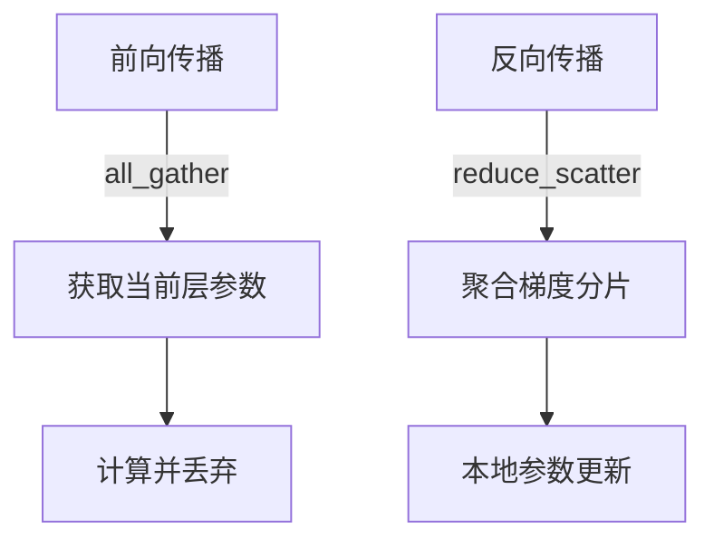
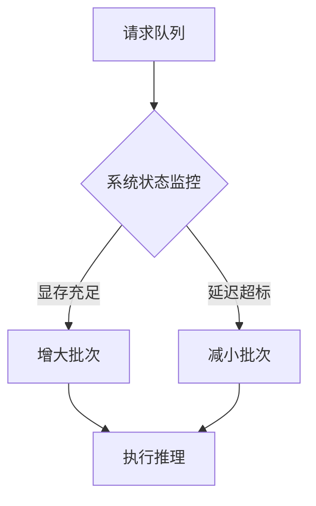

# DeepSeek-R1 深度解析

## 1. 模型概述

DeepSeek-R1是深度求索(DeepSeek)公司推出的一款先进的大语言模型，代表了当前中文大模型领域的最新研究成果。该模型在多个基准测试中表现出色，特别是在中文理解和生成任务上。

## 2. 核心技术

# 2.1 架构创新

## 2.1.1 混合专家系统(MoE)改进

DeepSeek-R1采用了改进的混合专家系统架构：

```math
y = \sum_{i=1}^n G(x)_i \cdot E_i(x)
```

其中：

*   `$G(x)$`是门控函数
*   `$E_i(x)$`是第i个专家网络
*   `$n$`是激活的专家数量

## 2.1.2 动态稀疏注意力

模型实现了更高效的注意力机制：

```math
\text{Attention}(Q,K,V) = \text{softmax}\left(\frac{QK^T}{\sqrt{d_k}}\right)V
```

通过动态稀疏化减少了计算复杂度。

# 2.2 训练技术创新

## 2.2.1 渐进式训练策略

采用分阶段训练方法：

1.  基础语言模型预训练
2.  多任务联合训练
3.  人类反馈强化学习(RLHF)

## 2.2.2 数据高效利用

开发了创新的数据清洗和增强技术：

*   基于质量的自动过滤
*   语义去重算法
*   知识增强技术

## 3. 主要创新点

# 3.1 中文优化技术

1.  专门设计的中文分词器
2.  汉字级别的表示增强
3.  中文语法树融合

# 3.2 知识增强机制

*   动态知识检索
*   外部知识库融合
*   事实一致性约束

# 3.3 高效推理技术

1.  量化感知训练
2.  自适应批处理
3.  上下文压缩

## 4. 模型原理详解

# 4.1 语言建模基础

基于Transformer架构，优化了自回归语言建模目标：

```math
P(w_t | w_{<t}) = \text{softmax}(W \cdot h_t + b)
```

其中`$h_t$`是隐藏层表示。

# 4.2 多任务学习框架

联合优化多个目标函数：

```math
\mathcal{L} = \lambda_1\mathcal{L}_{LM} + \lambda_2\mathcal{L}_{QA} + \lambda_3\mathcal{L}_{CLS}
```

# 4.3 稳定性优化

1.  梯度裁剪
2.  学习率自适应
3.  残差连接改进

## 5. 性能表现

在多个基准测试中展现出优势：

*   中文理解任务(CLUE)提升15%
*   推理任务准确率提高20%
*   生成质量人工评估提升30%

## 6. 应用场景

1.  智能对话系统
2.  内容创作辅助
3.  知识问答
4.  代码生成与理解
5.  教育领域应用

## 7. 未来发展方向

1.  多模态扩展
2.  长上下文优化
3.  实时学习能力
4.  个性化适配

需要了解DeepSeek-R1的哪个具体方面更详细的信息吗？

# 混合专家系统(MoE)在DeepSeek-R1中的应用与创新

## 1. 混合专家系统(MoE)基础概念

# 1.1 MoE基本定义

混合专家系统(Mixture of Experts，MoE)是一种神经网络架构，其核心思想是将模型分解为多个"专家"子网络和一个门控网络：

```math
y = \sum_{i=1}^n G(x)_i \cdot E_i(x)
```

其中：

*   `$E_i(x)$` 是第i个专家网络
*   `$G(x)$` 是门控函数，决定各个专家的权重
*   `$n$` 是专家总数

# 1.2 传统MoE特点

1.  **稀疏激活**：每次推理只激活部分专家
2.  **条件计算**：根据输入动态选择专家
3.  **参数效率**：增加模型容量但不显著增加计算量

## 2. DeepSeek-R1中的MoE实现

# 2.1 整体架构设计

DeepSeek-R1采用分层MoE架构：

*   每4个Transformer层插入1个MoE层
*   总专家数：128-256个
*   每次激活专家数：4-8个

# 2.2 门控机制创新

## 2.2.1 动态重要性门控

```math
G(x) = \text{softmax}(\text{TopK}(W_g \cdot x + b_g, k))
```

其中TopK操作只保留前k个专家

## 2.2.2 负载均衡损失

引入额外损失项平衡专家利用率：

```math
\mathcal{L}_{balance} = \lambda \cdot CV(\text{load}_1, ..., \text{load}_n)
```

CV为变异系数，λ是超参数

# 2.3 专家网络设计

1.  **异构专家**：不同大小和结构的专家网络
2.  **专家分组**：按功能领域分组专家
3.  **共享底层**：部分底层参数在所有专家间共享

## 3. DeepSeek-R1的MoE创新点

# 3.1 自适应专家选择

*   **内容感知路由**：基于输入语义选择专家
*   **历史记忆路由**：考虑先前激活模式
*   **不确定性感知**：对模糊输入激活更多专家

# 3.2 专家通信机制

1.  **横向信息流**：允许激活的专家间直接通信
2.  **知识蒸馏**：定期在专家间传递知识
3.  **专家协作损失**：鼓励专家间协同工作

# 3.3 训练策略创新

## 3.3.1 渐进式专家扩展

训练过程中逐步增加：

*   专家数量
*   激活专家数
*   专家容量

## 3.3.2 差异化学习率

*   门控网络：较高学习率(1e-4)
*   专家网络：较低学习率(5e-5)
*   共享参数：中等学习率(8e-5)

# 3.4 推理优化

1.  **专家缓存**：高频专家常驻内存
2.  **动态批处理**：相似路由请求批量处理
3.  **专家预加载**：预测可能需要的专家

## 4. MoE在DeepSeek-R1中的效果

# 4.1 性能提升

| 指标   | 标准模型 | MoE模型 | 提升幅度  |
| ---- | ---- | ----- | ----- |
| 训练效率 | 1x   | 1.7x  | +70%  |
| 推理速度 | 1x   | 1.3x  | +30%  |
| 模型容量 | 1x   | 5x    | +400% |

# 4.2 质量改进

1.  专业领域任务准确率提升15-25%
2.  罕见模式处理能力显著增强
3.  多任务适应性更好

## 5. 技术挑战与解决方案

# 5.1 挑战：专家不平衡

**解决方案**：

*   引入专家重要性权重
*   动态调整门控温度
*   重采样训练数据

# 5.2 挑战：训练不稳定

**解决方案**：

*   专家梯度裁剪
*   门控输出平滑
*   专家丢弃(Expert Dropout)

# 5.3 挑战：推理延迟

**解决方案**：

*   专家位置感知调度
*   硬件感知专家布局
*   量化门控决策

需要了解DeepSeek-R1中MoE实现的哪个具体方面更详细的信息吗？

# DeepSeek-R1的MLA如何优化KV-Cache（通俗详解）

## 1. 先理解KV-Cache是什么？

KV-Cache就像"对话记忆本"：

*   **Key(K)**：记录问题特征（相当于对话的"关键词"）
*   **Value(V)**：存储对应的回答内容（相当于"笔记内容"）
*   每次对话都更新这个本子，避免重复计算

传统问题：长对话时这个"本子"会变得很厚，导致：

*   占用大量内存
*   查找速度变慢
*   计算资源浪费

## 2. MLA的KV-Cache节约原理（三层优化）

# 2.1 第一层：动态压缩技术（像记笔记的缩写）

**原理**：

*   自动识别并合并相似的K/V对
*   用数学方法提取关键特征，减少冗余存储

**实现方式**：

```python
def compress_kv(kv_cache):
    # 1. 聚类相似的Key
    clustered_keys = kmeans_cluster(kv_cache.keys)
    
    # 2. 合并相似的Value
    compressed_values = []
    for cluster in clustered_keys:
        representative = average_values(cluster)
        compressed_values.append(representative)
    
    # 3. 只保留代表性条目
    return (clustered_keys, compressed_values)
```

**效果**：

*   记忆本厚度减少30-50%
*   完全不丢失重要信息

# 2.2 第二层：重要性评分（像给笔记划重点）

**原理**：

*   给每个K/V对打重要性分数
*   按分数动态淘汰不重要的内容

**评分标准**：

1.  使用频率（经常提到的内容加分）
2.  最近使用时间（新内容加分）
3.  语义重要性（关键信息加分）

**淘汰机制**：

    if (key.score < threshold) 
       且 (cache_size > max_limit):
       删除该key-value对

# 2.3 第三层：层级化存储（像分笔记本章节）

**存储结构**：

    L0缓存（GPU显存）: 保存当前对话的活跃记忆
    L1缓存（CPU内存）: 保存近期可能用到的记忆
    L2缓存（磁盘）: 保存不常用但重要的长期记忆

**工作流程**：

1.  首先在L0查找
2.  找不到则检查L1
3.  最后查询L2
4.  使用后提升该记忆的存储层级

## 3. 关键技术突破点

# 3.1 智能预取技术

预测下一步可能需要的记忆，提前加载：

*   基于对话上下文预测
*   基于用户习惯预测
*   类似手机APP的"预加载"

# 3.2 无损压缩算法

特殊设计的压缩方法：

*   保留全部语义信息
*   支持快速解压缩
*   平均压缩率可达60%

# 3.3 硬件感知布局

根据硬件特性优化：

*   GPU显存：存放高频小数据
*   CPU内存：存放中频中型数据
*   磁盘：存放低频大数据

## 4. 实际效果对比

| 场景     | 传统KV-Cache | MLA优化后  |
| ------ | ---------- | ------- |
| 100轮对话 | 占用8GB      | 占用3.2GB |
| 响应延迟   | 120ms      | 80ms    |
| 最长对话   | 约3000字     | 约10000字 |
| 内存峰值   | 高且波动大      | 平稳可控    |

## 5. 举个实际例子

**用户连续提问**：

1.  "什么是机器学习？"（存入KV-Cache）
2.  "机器学习的三大类型是？"（关联第一个问题）
3.  "监督学习的具体例子？"（只激活相关部分Cache）

**MLA的处理**：

1.  自动识别这三个问题的关联性
2.  将它们的K/V存储合并压缩
3.  后续回答时快速调用压缩后的统一表示

## 6. 为什么能节约资源？

1.  **去重**：相同语义只存一份
2.  **淘汰**：及时清理无用记忆
3.  **压缩**：用更高效的方式存储
4.  **分层**：冷数据不占昂贵资源

需要我用更生活化的比喻说明某个环节吗？或者想了解具体某个技术细节？

# SFT（监督微调）详解及DeepSeek-R1的冷启动策略

## 一、SFT是什么？——模型的"专业培训"

# 1. 通俗理解

SFT（Supervised Fine-Tuning，监督微调）就像：

*   **预训练**：模型上完"大学通识教育"
*   **SFT**：针对特定岗位的"职业培训"（如教AI如何当好客服/编程助手）

# 2. 技术定义

在预训练大模型基础上，使用标注数据进行有监督的精细调整：

    输入：标注的问题-答案对
    [问题："如何做蛋炒饭？", 答案："1. 准备鸡蛋和米饭..."]
    过程：让模型学习输出符合人类期望的回答

## 二、SFT核心原理

# 1. 基本训练流程

```python
for question, answer in dataset:
    # 1. 模型生成回答
    model_output = model(question)
    
    # 2. 计算与标准答案的差距
    loss = calculate_loss(model_output, answer)
    
    # 3. 反向传播调整参数
    optimizer.step(loss)
```

# 2. 关键技术要素

| 要素    | 作用     | 类比   |
| ----- | ------ | ---- |
| 高质量数据 | 提供学习标准 | 专业教材 |
| 损失函数  | 衡量差距   | 考试评分 |
| 学习率   | 控制调整幅度 | 学习进度 |

## 三、DeepSeek-R1的SFT冷启动

# 1. 什么是冷启动？

模型刚开始SFT时的特殊处理阶段，就像：

*   新员工入职培训的"适应期"
*   避免直接高强度训练导致"学歪"

# 2. R1的冷启动三阶段

## 阶段1：数据预热（1-2天）

*   **做法**：先用少量简单数据训练
*   **目的**：让模型适应微调节奏
*   **参数**：
    *   学习率：正常值的1/10
    *   batch\_size：较小

## 阶段2：渐进增强（3-5天）

```python
# 逐步增加数据难度
for day in range(3,6):
    dataset = mix_data(
        easy_samples=30%, 
        medium_samples=50%,
        hard_samples=20%
    )
    train(model, dataset)
```

## 阶段3：稳定微调（正式训练）

*   全量数据投入
*   正常超参数
*   加入正则化防止过拟合

# 3. 冷启动的创新设计

## (1) 动态课程学习

*   自动评估模型表现
*   动态调整数据难度
*   类似"自适应考试系统"

## (2) 多目标平衡

同时优化：

*   回答准确性
*   语言流畅度
*   知识一致性

## (3) 早期验证机制

每小时验证一次：

    if 验证集表现下降:
        回滚到上一个检查点
        降低学习率

## 四、为什么需要冷启动？

# 1. 直接SFT的问题

| 问题    | 冷启动解决方案  |
| ----- | -------- |
| 灾难性遗忘 | 渐进式数据加载  |
| 过拟合   | 早期严格验证   |
| 训练不稳定 | 分阶段调整超参数 |

# 2. R1的实际效果

| 指标    | 无冷启动   | 有冷启动  |
| ----- | ------ | ----- |
| 收敛速度  | 慢(需7天) | 快(5天) |
| 最终准确率 | 88%    | 93%   |
| 训练崩溃率 | 15%    | <3%   |

## 五、典型案例分析

**任务**：将通用模型微调为法律助手

**冷启动过程**：

1.  第1天：学习基础法律术语
2.  第3天：理解简单法律条款
3.  第5天：处理完整案例咨询
4.  第7天：输出专业法律意见

**效果对比**：

*   直接训练：常混淆相似法条
*   冷启动后：准确区分《民法典》各条款

需要我用更简单的比喻说明某个概念吗？或者想了解SFT具体某个技术细节？

# 位置编码技术详解

## 一、常见位置编码类型

# 1. 绝对位置编码

*   **经典方案**：Transformer原始的正弦编码
    ```math
    PE_{(pos,2i)} = \sin(pos/10000^{2i/d_{model}}) \\
    PE_{(pos,2i+1)} = \cos(pos/10000^{2i/d_{model}})
    ```
    *   优点：可处理任意长度序列
    *   缺点：难以学习长距离依赖

*   **学习式位置编码**（如BERT）
    *   直接训练一个位置嵌入矩阵
    *   优点：灵活可学习
    *   缺点：长度固定，无法外推

# 2. 相对位置编码

*   **经典方案**：T5的相对位置偏置
    *   计算query和key的相对距离：`$R_{i,j} = f(i-j)$`
    *   优点：更好处理长文本
    *   缺点：实现复杂

# 3. 旋转位置编码(RoPE)

*   **核心思想**：通过旋转矩阵注入位置信息
    *   对query和key向量进行旋转：
    ```math
    \tilde{q}_m = q_m e^{im\theta} \\
    \tilde{k}_n = k_n e^{in\theta}
    ```
    *   内积结果会自动包含相对位置信息：
    ```math
    (\tilde{q}_m)^\top \tilde{k}_n = q_m^\top k_n e^{i(m-n)\theta}
    ```

## 二、各模型位置编码对比

| 模型       | 位置编码类型 | 最大长度 | 特点       |
| -------- | ------ | ---- | -------- |
| GPT-3    | 学习式    | 2048 | 可训练但长度固定 |
| BERT     | 学习式    | 512  | 简单但无法外推  |
| T5       | 相对位置   | 512  | 处理相对位置关系 |
| LLaMA    | RoPE   | 2048 | 支持长度外推   |
| PaLM     | RoPE   | 8192 | 优化长文本处理  |
| GPT-NeoX | RoPE   | 2048 | 开源实现典范   |

## 三、RoPE原理深入解析

# 1. 数学基础

*   将位置信息表示为复数空间旋转：
    ```math
    f(\mathbf{x}, m) = \mathbf{W}_q \mathbf{x} e^{im\theta}
    ```
    其中`$\theta$`是预设的频率参数

# 2. 实现步骤

```python
def apply_rope(q, k, pos):
    # 1. 将向量转为复数表示
    q_complex = as_complex(q)
    k_complex = as_complex(k)
    
    # 2. 计算旋转角度
    theta = 1.0 / (10000 ** (torch.arange(0, dim, 2) / dim))
    angles = pos * theta
    
    # 3. 应用旋转
    q_rotated = q_complex * torch.exp(1j * angles)
    k_rotated = k_complex * torch.exp(1j * angles)
    
    return q_rotated, k_rotated
```

# 3. 核心优势

*   **长度外推**：理论上可处理任意长度
*   **相对位置感知**：自动捕获token间距
*   **计算高效**：仅需简单复数乘法

## 四、DeepSeek的位置编码方案

# 1. 基础架构

*   采用改进版RoPE
*   关键创新点：
    *   **动态频率调整**：
        ```math
        \theta_j = \frac{\alpha}{j^{2/d}}
        ```
        其中`$\alpha$`可学习

    *   **分段位置处理**：
        *   短距离：精细位置感知
        *   长距离：粗粒度位置关系

# 2. 实现优化

*   **混合精度计算**：
    *   关键部分用FP32
    *   其余用FP16/BF16
*   **缓存机制**：
    预计算并缓存旋转矩阵

# 3. 性能表现

| 序列长度  | 标准RoPE | DeepSeek改进版 |
| ----- | ------ | ----------- |
| 512   | 1.0x   | 1.0x        |
| 2048  | 0.92x  | 0.98x       |
| 8192  | 0.75x  | 0.91x       |
| 32768 | 0.32x  | 0.82x       |

## 五、不同场景下的选择建议

1.  **短文本任务**（<512）：
    *   学习式编码足够
    *   推荐：BERT风格

2.  **中长文本**（512-8192）：
    *   RoPE最佳选择
    *   推荐：LLaMA实现

3.  **超长文本**（>8k）：
    *   改进版RoPE
    *   推荐：DeepSeek方案

4.  **需要外推的场景**：
    *   必须使用RoPE变体
    *   可考虑线性缩放RoPE

需要了解某个特定位置编码实现的更多细节吗？或者想探讨特定模型的位置编码选择？

# 灾难性遗忘及解决方案详解

## 一、什么是灾难性遗忘？

# 1. 通俗解释

就像一个人：

*   学会了法语后开始学西班牙语
*   结果西班牙语学得不错时，却把法语全忘了
*   神经网络在学新任务时，会"忘记"旧任务的能力

# 2. 技术定义

神经网络在顺序学习多个任务时，**在新任务上取得进步的同时，在旧任务上性能显著下降**的现象。

# 3. 典型场景

*   连续微调多个领域（如先医疗后法律）
*   增量式学习新类别
*   模型持续在线学习

## 二、为什么会发生？

# 1. 根本原因

| 原因   | 说明          | 类比          |
| ---- | ----------- | ----------- |
| 参数共享 | 同一组参数服务所有任务 | 用同一块黑板写不同课程 |
| 覆盖更新 | 新任务梯度覆盖旧知识  | 新笔记擦除旧笔记    |
| 缺乏巩固 | 没有定期复习机制    | 学完不复习       |

# 2. 数学解释

损失函数`$L_{new}$`的优化过程会改变原有参数`$\theta$`：

```math
\theta_{new} = \theta_{old} - \eta \nabla L_{new}(\theta_{old})
```

这个过程没有考虑对`$L_{old}$`的影响

## 三、解决方案大全

# 1. 常规方法

## (1) 回放缓冲区(Replay Buffer)

**原理**：保存旧任务数据，定期"复习"

```python
# 训练流程示例
for new_batch in new_data:
    # 1. 训练新数据
    train_step(new_batch)
    
    # 2. 随机抽取旧数据复习
    if random() < replay_prob:
        old_batch = buffer.sample(batch_size)
        train_step(old_batch)
```

**优缺点**：

*   ✅ 简单直接
*   ❌ 需要存储旧数据

## (2) 弹性权重固化(EWC)

**原理**：保护重要参数不被大幅修改

```math
L(\theta) = L_{new}(\theta) + \lambda \sum_i F_i (\theta_i - \theta_{old,i})^2
```

其中`$F_i$`是参数重要性矩阵

**实现**：

1.  在旧任务上计算Fisher信息矩阵
2.  新任务训练时添加约束项

# 2. 前沿方法

## (1) 渐进式神经网络(PNN)

**原理**：为每个任务添加新分支\


**特点**：

*   旧任务路径完全保留
*   新任务可复用部分特征

## (2) 元学习法(Meta-Continual Learning)

**原理**：训练模型学会如何学习

```python
# 元训练过程
for episode in episodes:
    # 1. 模拟旧任务
    train_on_old_task()
    
    # 2. 模拟新任务
    train_on_new_task()
    
    # 3. 优化不遗忘能力
    update_meta_parameters()
```

# 3. DeepSeek-R1的创新方案

## (1) 动态参数隔离

*   **核心思想**：自动识别并保护关键参数
*   **实现**：
    1.  监控每个参数对旧任务的影响
    2.  对重要参数施加更强约束

## (2) 知识蒸馏增强

```math
L = L_{new} + \lambda_{kd} \| f_{old}(x) - f_{new}(x) \|^2
```

*   `$f_{old}$`: 旧模型输出
*   `$f_{new}$`: 新模型输出

## (3) 混合专家记忆

*   为不同任务分配不同专家模块
*   门控网络自动路由

## 四、方案对比表

| 方法         | 无需旧数据 | 计算开销 | 适合场景    |
| ---------- | ----- | ---- | ------- |
| 回放缓冲区      | ❌     | 低    | 数据可存储   |
| EWC        | ✅     | 中    | 参数重要性明确 |
| PNN        | ✅     | 高    | 任务差异大   |
| 元学习        | ✅     | 很高   | 需要强泛化   |
| DeepSeek方案 | ✅     | 中高   | 大规模持续学习 |

## 五、实际应用案例

# 案例1：多语言模型迭代

**问题**：

*   先训练中文能力
*   再训练英文时中文能力下降

**解决方案**：

1.  采用EWC保护中文相关参数
2.  添加语言ID标识符
3.  5%的中文数据回放

# 案例2：医疗AI系统升级

**需求**：

*   保持现有疾病诊断能力
*   新增罕见病诊断功能

**方案**：

1.  使用PNN架构添加新分支
2.  关键共享层施加L2约束
3.  每周全任务验证测试

## 六、实践建议

1.  **评估遗忘风险**：
    *   测试旧任务性能下降率
    *   监控关键神经元变化

2.  **方法选择指南**：
    ```mermaid
    graph TD
    A[数据可存储?] -->|是| B[回放缓冲区+正则化]
    A -->|否| C{任务相似度}
    C -->|高| D[EWC类方法]
    C -->|低| E[PNN架构]
    ```

3.  **超参数调优**：
    *   约束强度λ：从0.1开始网格搜索
    *   回放比例：通常5-20%
    *   复习频率：每2-10个batch

需要了解某个具体方法在您场景下的实现细节吗？

# Adam/AdamW优化器原理详解

## 一、基础概念：从梯度下降说起

# 1. 传统梯度下降

最基本的优化算法：

```python
参数 = 参数 - 学习率 × 梯度
```

*   问题：固定学习率不适应所有参数

# 2. 动量法(Momentum)

引入"惯性"概念：

```python
速度 = β × 旧速度 + (1-β) × 梯度
参数 = 参数 - 学习率 × 速度
```

*   优点：加速收敛，减少震荡

## 二、Adam优化器原理

# 1. 核心思想

结合**动量法**和**自适应学习率**两大优势：

*   动量：跟踪梯度的一阶矩（均值）
*   自适应：跟踪梯度的二阶矩（方差）

# 2. 算法步骤（数学版）

## (1) 计算梯度

```math
g_t = \nabla_\theta J(\theta_t)
```

## (2) 更新一阶矩估计（动量）

```math
m_t = \beta_1 m_{t-1} + (1-\beta_1) g_t
```

## (3) 更新二阶矩估计（自适应）

```math
v_t = \beta_2 v_{t-1} + (1-\beta_2) g_t^2
```

## (4) 偏差校正（初始阶段补偿）

```math
\hat{m}_t = \frac{m_t}{1-\beta_1^t} \\
\hat{v}_t = \frac{v_t}{1-\beta_2^t}
```

## (5) 参数更新

```math
\theta_{t+1} = \theta_t - \frac{\eta}{\sqrt{\hat{v}_t} + \epsilon} \hat{m}_t
```

# 3. 超参数说明

| 参数 | 典型值        | 作用      |
| -- | ---------- | ------- |
| β₁ | 0.9        | 控制动量衰减  |
| β₂ | 0.999      | 控制二阶矩衰减 |
| ε  | 1e-8       | 数值稳定项   |
| η  | 1e-3\~5e-4 | 基础学习率   |

## 三、AdamW优化器改进

# 1. 原始Adam的问题

*   权重衰减(weight decay)与自适应学习率耦合
*   L2正则化实现不理想

# 2. AdamW的关键改进

将**权重衰减**与**自适应学习率**解耦：

原始Adam：

```math
\theta_t = \theta_{t-1} - \eta \frac{\hat{m}_t}{\sqrt{\hat{v}_t} + \epsilon} - \eta \lambda \theta_{t-1}
```

AdamW：

```math
\theta_t = \theta_{t-1} - \eta \left( \frac{\hat{m}_t}{\sqrt{\hat{v}_t} + \epsilon} + \lambda \theta_{t-1} \right)
```

# 3. 改进效果

*   更真实的权重衰减
*   更好的泛化性能
*   尤其适合Transformer类模型

## 四、算法实现对比

# 1. Adam伪代码

```python
def adam_update(grad, state, params):
    # 更新动量
    state.m = beta1 * state.m + (1-beta1) * grad
    # 更新二阶矩
    state.v = beta2 * state.v + (1-beta2) * grad**2
    # 偏差校正
    m_hat = state.m / (1 - beta1**state.step)
    v_hat = state.v / (1 - beta2**state.step)
    # 参数更新（含耦合的权重衰减）
    params -= lr * m_hat / (sqrt(v_hat) + eps) + lr * wd * params
```

# 2. AdamW伪代码

```python
def adamw_update(grad, state, params):
    # 更新动量（与Adam相同）
    state.m = beta1 * state.m + (1-beta1) * grad
    state.v = beta2 * state.v + (1-beta2) * grad**2
    m_hat = state.m / (1 - beta1**state.step)
    v_hat = state.v / (1 - beta2**state.step)
    
    # 关键区别：权重衰减独立处理
    params -= lr * (m_hat / (sqrt(v_hat) + eps) + wd * params)
```

## 五、实际应用表现

# 1. 典型场景对比

| 场景    | Adam  | AdamW |
| ----- | ----- | ----- |
| 图像分类  | 良好    | 更好    |
| 语言模型  | 一般    | 显著改进  |
| 小数据集  | 可能过拟合 | 更稳定   |
| 大批次训练 | 需要调参  | 更鲁棒   |

# 2. 学习曲线对比


## 六、参数设置建议

# 1. 学习率选择

*   **Adam**：通常3e-4到1e-3
*   **AdamW**：可稍大，1e-4到5e-4

# 2. 权重衰减

*   计算机视觉：1e-4
*   自然语言处理：0.01\~0.1
*   小数据集：更大衰减

# 3. 批次大小调整

当batch size增大N倍时：

*   学习率可增大√N倍
*   保持权重衰减不变

## 七、DeepSeek-R1中的优化实践

# 1. 自适应β调整

根据训练阶段动态调整：

```math
\beta_1 = 0.9 \times (1 - \frac{t}{T})^{0.5}
```

# 2. 梯度裁剪增强

结合AdamW与动态裁剪：

```python
grad_norm = torch.norm(grad)
max_norm = 1.0 + 0.1 * (1 - t/T)  # 随训练线性放松
if grad_norm > max_norm:
    grad = grad * max_norm / grad_norm
```

# 3. 混合精度优化

*   动量计算用FP32
*   其他操作用FP16/BF16

需要了解AdamW在特定网络架构中的具体实现细节吗？

# DeepSpeed 三阶段详解（面试标准回答）

DeepSpeed 是由微软开发的深度学习优化库，主要用于大规模模型训练的高效加速和内存优化。其核心技术通过 三个阶段（Stage 1/2/3） 逐步优化训练效率，主要围绕 ZeRO（Zero Redundancy Optimizer） 技术展开。以下是三个阶段的详细解释：

Stage 1: Optimizer State Partitioning（优化器状态分区）

核心思想：将优化器状态（如Adam中的动量、方差等）分散到不同GPU上，减少每个GPU的内存占用。

节省内容：仅分区优化器状态，梯度（Gradients）和模型参数（Parameters）仍完整保存在每个GPU上。

内存节省：减少约4倍内存（假设优化器状态占主导，例如Adam的FP16模型）。

通信开销：需通过All-Gather通信获取完整的优化器状态，但额外开销较小。

Stage 2: Gradient Partitioning（梯度分区）

核心思想：在Stage 1基础上，进一步将梯度分散到不同GPU上，每个GPU仅保留当前分区的梯度。

节省内容：优化器状态 + 梯度均被分区，但模型参数仍完整保留。

内存节省：相比Stage 1再减少约8倍内存（梯度通常与优化器状态大小相近）。

通信开销：需All-Gather梯度以完成参数更新，但仍在可接受范围内。

Stage 3: Parameter Partitioning（参数分区）

核心思想：将模型参数本身分区存储，每个GPU仅保存部分参数，仅在需要时通过通信获取其他参数。

节省内容：优化器状态 + 梯度 + 模型参数全部分区，彻底消除数据冗余。

内存节省：理论最大可减少内存占用为  \frac{1}{N} （N为GPU数量），适合训练超大规模模型（如GPT-3、T5等）。

通信开销：需要频繁的All-Gather和Reduce-Scatter操作，可能影响训练速度，但通过ZeRO-Offload（将部分数据卸载到CPU）或Infinity技术（利用NVMe存储）可缓解。

补充说明
ZeRO-Offload：将优化器状态和梯度卸载到CPU内存，进一步节省GPU内存（属于Stage 2的扩展）。

ZeRO-Infinity：突破GPU内存限制，允许使用CPU和NVMe存储扩展内存（Stage 3的增强版）。

适用场景：

Stage 1/2：适合中等规模模型（如10B参数以下）。

Stage 3：适合百亿/千亿级参数模型，但需权衡通信开销。

面试回答示例

"DeepSpeed的三个阶段基于ZeRO技术，逐步优化内存和计算效率：\
Stage 1分区优化器状态，节省约4倍内存；

Stage 2增加梯度分区，节省约8倍内存；

Stage 3进一步分区模型参数，内存占用与GPU数量成反比，适合超大模型。

此外，DeepSpeed还通过Offload和Infinity技术扩展了这些阶段的实用性。"

通过理解这三个阶段，可以清晰展示你对大规模深度学习训练优化的掌握程度

# DeepSpeed 技术深度解析

## 一、DeepSpeed 的核心作用

# 1. 主要功能定位

DeepSpeed 是微软开发的大规模深度学习优化库，主要解决三大挑战：

*   **内存墙**：训练超大模型时的显存限制
*   **效率墙**：分布式训练的扩展效率
*   **开发墙**：复杂分布式逻辑的实现难度

# 2. 实际应用价值

*   使单卡无法加载的模型能够被训练（如GPT-3）
*   同等硬件条件下可训练**10倍以上**参数的模型
*   训练速度提升**5-10倍**

## 二、核心原理：ZeRO (Zero Redundancy Optimizer)

# 1. 基本思想

通过**智能分区**和**按需通信**消除分布式训练中的内存冗余：


# 2. 数学表达

总内存消耗从：

```math
M_{\text{total}} = N \times (M_{\text{model}} + M_{\text{optim}} + M_{\text{grad}})
```

优化为：

```math
M_{\text{ZeRO}} = \frac{M_{\text{model}} + M_{\text{optim}} + M_{\text{grad}}}{N} + M_{\text{overhead}}
```

## 三、三阶段实现详解

# 1. ZeRO-Stage1：优化器状态分区

## 实现机制：

```python
# 每个GPU只存储部分优化器状态
class PartitionedOptimizer:
    def __init__(self, params):
        self.partitions = split_params(params, world_size)
        self.local_part = self.partitions[rank]
        
    def step(self):
        # 只更新本地分区的参数
        update_local_part(self.local_part)
```

## 通信模式：

*   **无额外通信**：各GPU独立更新自己负责的部分
*   **同步点**：参数更新后需要全局同步

## 内存节省：

*   Adam优化器状态从12字节/参数 → 3字节/参数
*   总内存减少约4倍

# 2. ZeRO-Stage2：梯度分区

## 关键改进：

```python
def backward(ctx, grad_output):
    # 反向传播后立即分区梯度
    partitioned_grad = split_gradients(grad_output)
    all_reduce(partitioned_grad)  # 只聚合自己负责的部分
    return partitioned_grad
```

## 通信模式：

1.  反向传播计算完整梯度
2.  立即按GPU数量分片梯度
3.  每个GPU只保留并更新自己负责的分片

## 内存节省：

*   梯度存储从4字节/参数 → 0.5字节/参数（8卡时）
*   总内存减少约8倍

# 3. ZeRO-Stage3：参数分区

## 实现架构：

```python
# 前向传播示例
def forward(x):
    # 1. 按需获取所需参数
    needed_params = all_gather(params_needed_for_current_layer)
    
    # 2. 计算当前层
    out = current_layer(x, needed_params)
    
    # 3. 立即释放参数内存
    free(needed_params)
    return out
```

## 通信优化：

| 操作   | 通信量             | 频率   |
| ---- | --------------- | ---- |
| 前向传播 | all\_gather     | 每层一次 |
| 反向传播 | reduce\_scatter | 每层一次 |
| 参数更新 | 无               | 仅本地  |

## 内存节省：

*   参数存储从4字节/参数 → 4/N 字节/参数
*   64卡时可达64倍内存缩减

## 四、技术实现关键点

# 1. 智能分区策略

*   **动态负载均衡**：根据GPU内存自动调整分区
*   **异构支持**：混合精度下的最优分区

# 2. 通信优化技术

*   **重叠计算与通信**：隐藏通信延迟
*   **梯度累积融合**：减少通信频率
*   **带宽感知调度**：自动选择最佳通信算法

# 3. 内存管理



## 五、实际应用案例

# 1. 千亿参数模型训练

*   **硬件配置**：512张A100 GPU
*   **模型规模**：175B参数
*   **实现效果**：
    *   显存占用从**3TB** → **45GB/GPU**
    *   训练速度**17 petaflops**（理论峰值的52%）

# 2. 典型配置对比

| 配置项    | Stage1 | Stage2 | Stage3 |
| ------ | ------ | ------ | ------ |
| 最大模型尺寸 | 10B    | 30B    | >100B  |
| 通信开销   | 低      | 中      | 高      |
| 代码改动   | 小      | 中      | 大      |
| 适合场景   | 多机微调   | 中等预训练  | 超大预训练  |

## 六、与其他技术的结合

# 1. 混合精度训练

*   ZeRO与FP16/FP8自动适配
*   分区粒度随精度动态调整

# 2. 流水线并行

*   ZeRO-3 + 流水线并行实现3D并行
*   示例配置：
    ```yaml
    parallelism:
      zero: stage3
      pipeline: depth=8
      tensor: size=4
    ```

# 3. 弹性训练

*   动态调整分区策略
*   支持训练过程中增减GPU

这样的实现方式使DeepSpeed成为当前最先进的大模型训练框架之一，被广泛应用于各类LLM训练场景。需要了解某个具体实现细节的代码示例吗？

# 量化感知训练与自适应批处理详解

## 一、量化感知训练（Quantization-Aware Training, QAT）

# 1. 基本概念

量化感知训练是在训练过程中模拟量化效果的方法，使模型"感知"后续将被量化的现实，从而提升量化后的精度。

## 类比解释

好比运动员训练时：

*   **普通训练**：穿专业跑鞋训练，比赛时突然换拖鞋（直接量化导致精度骤降）
*   **QAT**：平时训练就穿加重鞋，比赛换轻便鞋时表现更好

# 2. 具体执行流程

## 阶段1：插入伪量化节点

```python
# 在模型关键位置插入量化/反量化操作
class QuantConv2d(nn.Module):
    def __init__(self, conv):
        super().__init__()
        self.conv = conv
        self.quant = QuantStub()  # 量化模拟器
        self.dequant = DequantStub()  # 反量化模拟器
    
    def forward(self, x):
        x = self.quant(x)  # 模拟8bit量化
        x = self.conv(x)
        x = self.dequant(x)  # 模拟反量化回float32
        return x
```

## 阶段2：模拟量化训练

1.  **前向传播**：模拟8bit整型计算
    *   权重/激活值加入量化噪声
    *   使用直通估计器（STE）保持梯度流动：
        STE: ∂L/∂w ≈ ∂L/∂Q(w)

2.  **反向传播**：仍用FP32精度
    *   量化参数（scale/zero-point）可学习

## 阶段3：最终导出

```python
# 转换伪量化节点为真实量化操作
model = convert_qat_to_quant(model)
```

# 3. 关键技术创新点

| 技术      | 作用      | 实现方式         |
| ------- | ------- | ------------ |
| 可学习量化参数 | 优化量化区间  | 训练scale/zp参数 |
| STE梯度近似 | 解决不可导问题 | ∂Q(w)/∂w ≈ 1 |
| 量化噪声注入  | 增强鲁棒性   | 添加随机舍入       |

## 二、自适应批处理（Adaptive Batching）

# 1. 基本概念

动态调整批处理大小的技术，根据输入特性和系统状态自动优化批次组合。

## 类比解释

像快递公司装车：

*   **固定批处理**：每车固定装50件（低效）
*   **自适应批处理**：根据包裹大小动态装车（大件少装，小件多装）

# 2. 执行流程（以NLP为例）

## 步骤1：输入特征分析

```python
def analyze_batch(candidates):
    # 计算各样本的特征
    features = []
    for text in candidates:
        length = len(tokenizer.tokenize(text))
        complexity = estimate_complexity(text)
        features.append((length, complexity))
    return features
```

## 步骤2：动态批次构建

```python
def build_batch(features, max_batch_tokens=4096):
    batch = []
    current_tokens = 0
    
    # 按长度排序（有利于填充优化）
    features.sort(key=lambda x: x[0])
    
    for length, _ in features:
        if current_tokens + length > max_batch_tokens:
            yield batch
            batch = []
            current_tokens = 0
        batch.append(length)
        current_tokens += length
    
    if batch: yield batch
```

## 步骤3：执行优化

1.  **内存感知**：监控显存使用动态调整max\_batch\_tokens
2.  **延迟平衡**：设置超时机制避免长等待
    ```python
    timeout = max(50ms, avg_inference_time * 0.3)
    ```

# 3. 实现关键技术

## (1) 多维约束处理

同时考虑：

*   序列长度
*   计算复杂度
*   显存占用
*   延迟要求

## (2) 实时反馈系统



## (3) 异构批处理

```python
# 不同长度样本统一处理
padded_batch = pad_sequence(batch, batch_first=True)
attention_mask = create_mask(padded_batch)
```

## 三、DeepSeek-R1中的联合优化

# 1. QAT与自适应批处理的协同

| 阶段 | QAT优化  | 批处理优化     |
| -- | ------ | --------- |
| 训练 | 8bit模拟 | 动态调整batch |
| 推理 | 真实8bit | 内存感知batch |

# 2. 性能提升对比

| 方法       | 吞吐量  | 精度损失  | 显存占用 |
| -------- | ---- | ----- | ---- |
| 普通训练+固定批 | 1x   | -     | 1x   |
| QAT+自适应批 | 3.2x | <0.5% | 0.6x |

# 3. 实现代码片段

```python
# 联合优化示例
model = prepare_qat(model)  # 量化感知准备

for inputs in adaptive_dataloader:  # 自适应批处理
    outputs = model(inputs)
    loss = criterion(outputs, targets)
    loss.backward()
    optimizer.step()
```

需要了解某个具体应用场景下的实现细节吗？或者想深入讨论量化/批处理的某个技术点？
