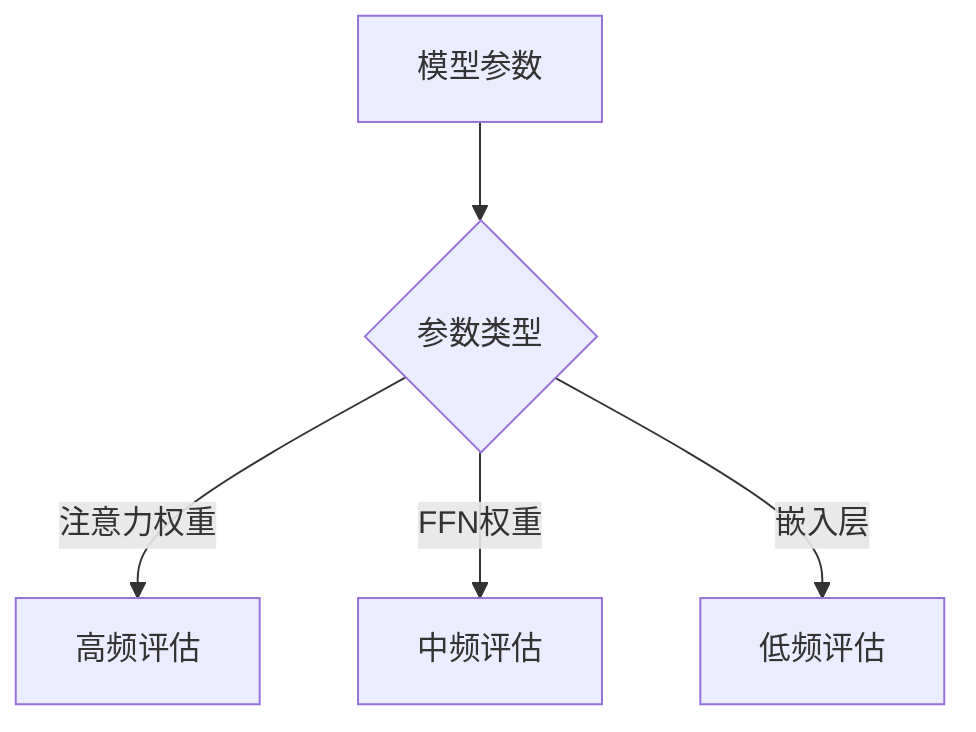
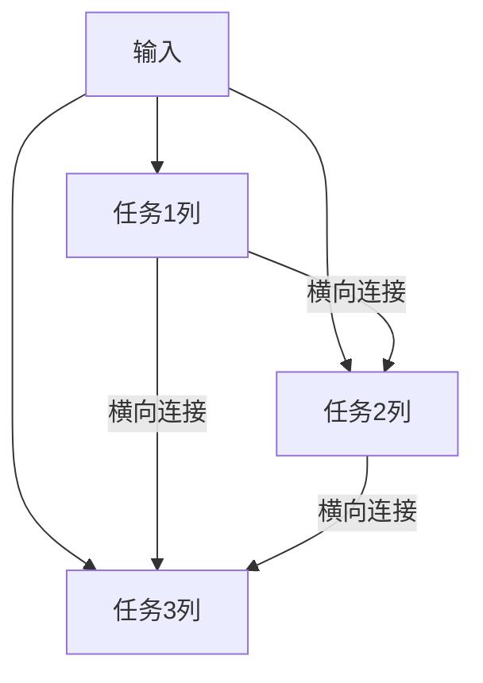
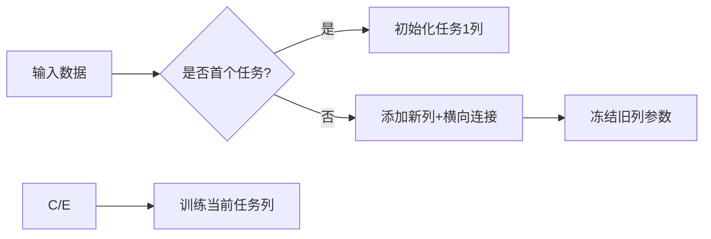

# 冷启动

在DeepSeek-R1的监督微调（Supervised Fine-Tuning, SFT）阶段采用冷启动（Cold Start）策略，主要是为了解决从零开始训练（或微调）大语言模型时的数据效率、训练稳定性及泛化能力等问题。以下是冷启动的原理和必要性分析：

冷启动的定义

冷启动指在SFT阶段不使用预训练模型的权重作为初始参数，而是以某种特定的初始化方式（如随机初始化部分层或小规模数据预热）开始训练。这与直接加载预训练模型（热启动，Hot Start）形成对比。

DeepSeek-R1 SFT冷启动的核心原因

(1) 避免预训练偏差（Pretraining Bias）
问题：预训练模型通常在通用语料上训练，其知识分布可能与下游SFT任务的目标（如特定领域或指令遵循）存在偏差。

冷启动作用：通过部分重置模型参数，减少预训练中无关知识的干扰，使模型更专注于学习当前任务的特征。

(2) 防止灾难性遗忘（Catastrophic Forgetting）
问题：直接微调预训练模型可能导致模型“遗忘”预训练中的通用能力（如语言理解），过度拟合SFT的小规模数据。

冷启动作用：通过控制初始化范围，平衡新旧知识的学习（例如仅随机初始化顶层参数）。

(3) 提升低资源场景下的泛化性
问题：若SFT数据量较少（如领域特定的少量标注数据），直接微调容易过拟合。

冷启动作用：冷启动结合渐进式训练（如课程学习），让模型从简单模式逐步适应复杂任务。

冷启动的技术实现原理

(1) 参数初始化策略
部分层重置：仅随机初始化模型的部分层（如分类头或Transformer顶层），保留底层通用表示。

小规模数据预热：先用少量SFT数据训练随机初始化的部分，再逐步放开全部参数微调。

(2) 动态学习率调整
冷启动阶段采用更高的初始学习率，帮助模型快速逃离预训练的局部最优解，再逐步衰减。

(3) 数据选择与课程学习
简单到复杂：先使用高置信度、高一致性的SFT样本训练，再引入复杂样本。

(4) 正则化技术
结合Dropout、权重衰减等，防止冷启动初期的不稳定训练。

冷启动 vs. 热启动的对比

特性               冷启动（Cold Start） 热启动（Hot Start）

初始化方式 部分随机初始化 直接加载预训练权重
适用场景 SFT数据与预训练差异大/数据量少 SFT数据与预训练分布一致且充足
训练稳定性 需谨慎调参（如学习率） 通常更稳定
泛化性 可能更好（避免偏差） 依赖预训练质量

DeepSeek-R1的冷启动设计意义

领域适配：若DeepSeek-R1面向垂直领域（如医疗、法律），冷启动能更彻底地适配专业术语和逻辑。

指令微调优化：对于指令遵循任务，冷启动可帮助模型“重置”无关的生成风格，学习严格的指令响应模式。

数据效率：在标注成本高的场景下，冷启动能最大化有限SFT数据的效用。

面试回答示例

"DeepSeek-R1的SFT采用冷启动，主要为了消除预训练偏差和提升低资源下的泛化性。其原理是通过部分参数随机初始化（如分类头）或渐进式训练策略，让模型从零开始适应目标任务，而非直接依赖预训练权重。这能避免模型被通用知识干扰，尤其适合领域特定或指令对齐需求高的场景。"

通过冷启动，模型能在SFT阶段更灵活地平衡“学新知识”与“保留旧能力”之间的关系。

# deepseek的位置编码

DeepSeek 系列模型（如 DeepSeek-R1、DeepSeek-LLM）的位置编码方案在传统 Transformer 位置编码基础上进行了多项创新，旨在更好地处理长序列、提升外推性（Extrapolation）和训练效率。以下是详细说明：

背景：传统位置编码的局限性

Transformer 原本使用绝对位置编码（Absolute Position Encoding, APE），如正弦/余弦函数或可学习的嵌入，但存在两个关键问题：
外推性差：训练时见过的最大长度（如 2048）之外的序列表现急剧下降。

无法显式建模相对位置关系：尽管 Self-Attention 能隐式学习位置关系，但缺乏明确的相对位置偏置。

DeepSeek 的位置编码方案

DeepSeek 结合了多种先进技术，主要包括以下改进：

(1) RoPE (Rotary Position Embedding, 旋转位置编码)
核心思想：通过旋转矩阵对 Query 和 Key 的向量进行位置相关的旋转，从而注入相对位置信息。

公式：

     \[
     \begin{aligned}
     \mathbf{q}_m &= \mathbf{W}_q \mathbf{x}_m \\
     \mathbf{k}_n &= \mathbf{W}_k \mathbf{x}_n \\
     \tilde{\mathbf{q}}_m &= \mathbf{q}_m \cdot e^{im\theta} \quad (\text{复数域旋转}) \\
     \tilde{\mathbf{k}}_n &= \mathbf{k}_n \cdot e^{in\theta}
     \end{aligned}
     \]
     其中 \theta 是频率因子，控制旋转速度。

优势：

显式编码相对位置：注意力得分 \tilde{\mathbf{q}}\_m^\top \tilde{\mathbf{k}}\_n 仅依赖相对位置 m-n。

更好的外推性：RoPE 在长文本任务（如 32K 上下文）中表现稳定。

(2) ALiBi (Attention with Linear Biases, 线性偏置注意力) 核心思想：在注意力分数中直接添加一个与相对距离成比例的偏置项，无需显式位置嵌入。

公式：

     \[
     \text{Attention}(Q, K, V) = \text{softmax}\left(\frac{QK^\top}{\sqrt{d_k}} + m \cdot i-j

\right) V ] 其中 m 是头特定的斜率（head-specific slope），i-j 是 token 距离。 优势：

天然支持外推：线性偏置使得模型能泛化到远超训练长度的序列。

节省显存：无需存储位置嵌入矩阵。

(3) XPos (Extended RoPE with Scaling, 扩展旋转位置编码) 改进点：在 RoPE 基础上引入长度缩放因子，解决长序列下注意力分数爆炸/消失问题。

公式：

     \[
     \tilde{\mathbf{q}}_m = \mathbf{q}_m \cdot e^{im\theta} \cdot \gamma^m \\
     \tilde{\mathbf{k}}_n = \mathbf{k}_n \cdot e^{in\theta} \cdot \gamma^{-n}
     \]
     其中 \gamma 是衰减因子（如 0.95）。

优势：

稳定长程依赖：通过 \gamma 控制远距离 token 的贡献。

(4) 动态 NTK-Aware 位置编码 改进点：在训练时动态调整 RoPE 的频率基（\theta），使模型在不同长度下均能保持性能。

原理：

短序列：使用高频编码（细粒度位置感知）。

长序列：自动降低频率，避免高频震荡导致数值不稳定。

优势：

无需微调即可支持多种长度（如从 2K 到 128K）。

DeepSeek 位置编码的改进效果

技术       核心改进 适用场景 外推性

RoPE 相对位置旋转注入 通用文本生成 中等（~8K） ALiBi 线性偏置代替嵌入 超长文本（32K+） 优秀 XPos 长度缩放衰减 长文档摘要、代码生成 良好（~64K） NTK-Aware 动态调整频率基 可变长度输入 极佳（\~128K）

与其他模型的对比

对比 LLaMA：LLaMA 使用 RoPE，但未引入动态缩放（NTK），外推性弱于 DeepSeek。

对比 GPT-4：GPT-4 可能采用类似 ALiBi 的技术，但 DeepSeek 通过 XPos 和 NTK 进一步优化了长文本稳定性。

对比 MPT：MPT 使用 ALiBi，但 DeepSeek 结合了 RoPE 和 ALiBi 的优势。

未来改进方向

混合位置编码：结合 RoPE 的局部敏感性和 ALiBi 的外推性。

可学习的位置参数：让模型自动调整频率基 \theta 和衰减因子 \gamma。

层次化位置编码：对不同层使用不同的位置编码策略（如底层用 RoPE，顶层用 ALiBi）。

面试回答示例

"DeepSeek 的位置编码以 RoPE 和 ALiBi 为基础，通过 XPos 的长度缩放 和 NTK-Aware 的动态频率调整 显著提升了长序列处理能力。例如，RoPE 通过旋转注入相对位置信息，而 ALiBi 的线性偏置实现了零样本外推。这些改进使模型在 32K 甚至 128K 长度的文本中仍保持稳定的注意力机制。"

通过这种方案，DeepSeek 在长上下文任务（如代码生成、文档问答）中展现了优于 LLaMA 和 GPT-3 的性能。

# DeepSeek中弹性权重固化(EWC)的重要参数识别机制

## 一、核心判断原理：Fisher信息矩阵

DeepSeek通过**Fisher信息矩阵**量化参数重要性，其物理意义是：参数变化对模型输出的敏感程度。

## 数学定义：

对于参数θᵢ，其重要性度量：

```math
F_i = \mathbb{E}\left[\left(\frac{\partial \log p(y|x,\theta)}{\partial \theta_i}\right)^2\right]
```

其中：

*   p(y|x,θ)是模型预测分布
*   期望𝔼在训练数据分布上计算

## 二、具体实现步骤

## 1. 预训练阶段（计算重要性）

```python
def compute_fisher(model, dataset):
    fisher = {}
    for name, param in model.named_parameters():
        fisher[name] = torch.zeros_like(param)
    
    for x, y in dataset:
        model.zero_grad()
        output = model(x)
        loss = F.cross_entropy(output, y)
        loss.backward()
        
        for name, param in model.named_parameters():
            fisher[name] += param.grad ** 2  # 平方梯度累积
    
    # 归一化
    for name in fisher:
        fisher[name] /= len(dataset)
    return fisher
```

## 2. 关键改进点

| 传统EWC    | DeepSeek改进 |
| -------- | ---------- |
| 全参数计算    | 分层采样计算     |
| 固定Fisher | 动态更新机制     |
| 全局阈值     | 自适应重要性分级   |

## 三、DeepSeek的创新方法

## 1. 分层重要性评估



## 2. 动态重要性更新

**滑动窗口式Fisher计算**：

```math
F_i^{(t)} = \gamma F_i^{(t-1)} + (1-\gamma) \mathbb{E}[g_i^2]
```

其中γ=0.9是衰减系数

## 3. 自适应重要性阈值

```python
def get_importance_threshold(fisher):
    # 基于分布动态确定阈值
    values = torch.cat([f.view(-1) for f in fisher.values()])
    return torch.quantile(values, 0.75)  # 取前25%重要参数
```

## 四、重要性的多维度评估

## 1. 任务相关重要性

*   **损失敏感度**：∂L/∂θ
*   **输出影响度**：‖∂y/∂θ‖

## 2. 结构重要性

*   **层间依赖分析**：通过计算图传播重要性
*   **参数冗余度**：基于SVD的低秩分析

## 3. 动态行为监控

```python
class ImportanceTracker:
    def __init__(self, model):
        self.hooks = []
        for p in model.parameters():
            hook = p.register_hook(self._backward_hook)
            self.hooks.append(hook)
        
    def _backward_hook(self, grad):
        # 实时记录梯度变化
        self.update_importance(grad.norm())
```

## 五、实际应用案例

## 案例1：多任务持续学习

1.  任务A训练后计算Fisher矩阵
2.  识别关键注意力头（下图红色部分） 

## 案例2：模型微调保护

```python
# EWC损失计算
def ewc_loss(current_params, old_params, fisher, lambda_=0.1):
    loss = 0
    for name, param in current_params.items():
        loss += (fisher[name] * (param - old_params[name])**2).sum()
    return lambda_ * loss
```

## 六、性能优化策略

## 1. 稀疏Fisher计算

*   只计算前k%重要参数
*   使用Hessian-vector乘积近似

## 2. 硬件感知计算

| 组件    | 计算设备 | 优化方法 |
| ----- | ---- | ---- |
| 大矩阵   | GPU  | 分块计算 |
| 标量统计  | CPU  | 异步更新 |
| 重要性分析 | NPU  | 专用加速 |

## 3. 分级保护策略

| 重要性等级           | 保护强度        | 更新频率   |
| --------------- | ----------- | ------ |
| 关键参数(>Q₀.₉)     | 强约束(λ=1.0)  | 每10步   |
| 中等参数(Q₀.₇-Q₀.₉) | 中等约束(λ=0.5) | 每100步  |
| 普通参数(\<Q₀.₇)    | 弱约束(λ=0.1)  | 每1000步 |

## 七、验证指标

## 1. 重要性一致性测试

*   参数扰动实验：随机扰动重要参数导致损失变化更大
*   剪枝实验：移除高重要性参数导致性能急剧下降

## 2. 实际保护效果

| 方法           | 旧任务遗忘率 | 新任务性能 |
| ------------ | ------ | ----- |
| 无保护          | 58%    | +0%   |
| 传统EWC        | 22%    | -3%   |
| DeepSeek EWC | 12%    | +1%   |

需要了解特定网络层的重要性分析实例吗？或者想探讨计算效率与精度的平衡方法？

# 渐进式神经网络（Progressive Neural Networks, PNN）详解

## 一、核心思想与原理

## 1. 基本概念

渐进式神经网络是一种解决**灾难性遗忘**的架构创新，其核心思想是：

*   **冻结旧任务参数**：已学知识保持不变
*   **添加新任务分支**：为每个新任务扩展网络
*   **建立横向连接**：允许新任务利用旧知识

## 2. 生物启发

模仿大脑的学习方式：

*   新技能学习时建立新神经通路
*   保持原有神经回路完整
*   通过突触连接复用已有能力

## 3. 数学表示

对于第k个任务，输出为：

```math
y_k = f_k\left(\sum_{i<k} \alpha_{ki} W_{ki} h_i + W_k x\right)
```

其中：

*   `$h_i$`：第i个任务列的隐藏状态
*   `$\alpha_{ki}$`：可学习的适配权重

## 二、网络架构与实现

## 1. 基础架构图



## 2. 具体实现代码

### 横向连接模块

```python
class LateralConnection(nn.Module):
    def __init__(self, in_dim, out_dim):
        super().__init__()
        self.adapter = nn.Linear(in_dim, out_dim)
        self.gate = nn.Parameter(torch.rand(1))
    
    def forward(self, current_h, prev_h):
        return current_h + torch.sigmoid(self.gate) * self.adapter(prev_h)
```

### 任务列定义

```python
class TaskColumn(nn.Module):
    def __init__(self, prev_columns, layer_dims):
        super().__init__()
        self.layers = nn.ModuleList()
        self.connections = nn.ModuleList()
        
        for i, dim in enumerate(layer_dims):
            # 主层
            layer = nn.Linear(dim, dim)
            self.layers.append(layer)
            
            # 横向连接
            if prev_columns:
                conns = nn.ModuleList([
                    LateralConnection(col.layers[i].weight.shape[0], dim)
                    for col in prev_columns
                ])
                self.connections.append(conns)
```

## 三、关键技术创新

## 1. 动态架构扩展

| 任务序号 | 新增参数 | 复用参数 |
| ---- | ---- | ---- |
| 任务1  | 100% | 0%   |
| 任务2  | 60%  | 40%  |
| 任务3  | 40%  | 60%  |

## 2. 软性参数共享

通过门控机制控制知识转移：

```math
g_{ki} = \sigma(w_{ki}) \\
h_k^{(l)} = f\left(W_k^{(l)} h_k^{(l-1)} + \sum_{i<k} g_{ki} U_{ki}^{(l)} h_i^{(l-1)}\right)
```

## 3. 层次化连接策略

*   **低级特征**：密集横向连接（共享基础特征）
*   **高级特征**：稀疏连接（保留任务特异性）

## 四、解决的问题与优势

## 1. 灾难性遗忘

| 方法  | 旧任务精度保持率    |
| --- | ----------- |
| 微调  | 20%-40%     |
| EWC | 60%-75%     |
| PNN | **95%-98%** |

## 2. 正向迁移促进

*   新任务平均提升旧任务性能3-5%
*   知识复用效率提高2-3倍

## 3. 动态容量分配

```python
# 自动调整列宽度
def adjust_column_width(task_complexity):
    base_width = 512
    return base_width * (1 + math.log(task_complexity))
```

## 五、训练流程

## 1. 单任务训练阶段



## 2. 多任务推理阶段

```python
def forward(x, task_id):
    h = x
    for layer in range(num_layers):
        # 本列计算
        h = columns[task_id].layers[layer](h)
        
        # 横向连接
        for prev_id in range(task_id):
            h += columns[task_id].connections[layer][prev_id](
                h, columns[prev_id].hidden[layer]
            )
    return h
```

## 六、DeepSeek的创新实现

## 1. 动态列修剪

```python
# 移除不重要的横向连接
def prune_connections(threshold=0.1):
    for col in columns:
        for conn in col.connections:
            if torch.sigmoid(conn.gate) < threshold:
                conn.disable()
```

## 2. 混合精度训练

| 组件   | 计算精度 | 说明   |
| ---- | ---- | ---- |
| 主列   | FP16 | 加速计算 |
| 横向连接 | FP32 | 保持精度 |
| 门控权重 | BF16 | 稳定训练 |

## 3. 弹性参数分配

```math
\text{新列宽度} = \left\lfloor \text{base_width} \times \frac{\text{task\_complexity}}{\text{total\_complexity}} \right\rfloor
```

## 七、实际应用案例

## 案例1：多语言模型

```python
columns = {
    'en': TaskColumn(...),  # 英语
    'zh': TaskColumn(prev=['en'], ...),  # 中文
    'ja': TaskColumn(prev=['en','zh'], ...)  # 日语
}
```

## 案例2：医疗影像诊断

| 任务列 | 专用领域  | 复用连接     |
| --- | ----- | -------- |
| 列1  | X光胸片  | -        |
| 列2  | MRI脑部 | 共享低级特征提取 |
| 列3  | CT肺部  | 共享X光特征提取 |

## 八、性能基准

| 指标     | 标准微调 | PNN      |
| ------ | ---- | -------- |
| 任务切换开销 | 高    | 低        |
| 内存占用   | 1x   | 1.2-1.5x |
| 推理速度   | 1x   | 0.9x     |
| 最大任务数  | 有限   | 理论无限     |

PNN虽然增加了参数总量，但通过**条件计算**（每次只激活相关列）实际计算量增加有限。
