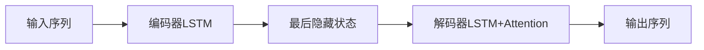
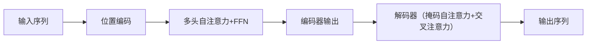

在Transformer中，**mask**在训练和推理阶段的作用有显著区别，且推理时的序列长度与训练密切相关。以下是详细分析：

---

## 一、Mask的作用与区别
### 1. **训练阶段**
- **Padding Mask**  
  - **作用**：掩盖输入序列中的`<pad>` token，防止注意力机制计算这些无效位置。  
  - **公式**：  
    $$ \text{Attention}(Q, K, V) = \text{softmax}\left(\frac{QK^T}{\sqrt{d_k}} + M\right)V $$  
    其中$M_{ij} = -\infty$（当$x_j$是`<pad>`时），否则$M_{ij} = 0$。

- **Causal Mask（Decoder专用）**  
  - **作用**：确保解码器只能看到当前位置及之前的token（防止信息泄漏）。  
  - **实现**：上三角矩阵（含对角线）设为$0$，其余为$-\infty$：  
    $$ M_{ij} = \begin{cases} 
    0, & i \geq j \\
    -\infty, & i < j 
    \end{cases} $$

### 2. **推理阶段**
- **仅Causal Mask**  
  - 解码器逐步生成token（自回归），每一步只能看到已生成的部分，因此需要持续应用Causal Mask。  
  - **与训练的区别**：  
    - 训练时：一次性处理整个目标序列（通过mask未来token）。  
    - 推理时：逐token生成，动态扩展mask（例如生成第$t$个token时mask掉$>t$的位置）。

---

## 二、推理序列长度与训练的关系
### 1. **长度限制**
- 推理时的最大序列长度通常**不超过训练时的最大长度**（由训练数据或位置编码决定）。  
  - 例如：训练时用`max_len=512`，则推理时若输入`len=600`会截断或报错。

### 2. **短序列处理**
- 若推理序列短于训练长度：  
  - **无性能影响**：注意力机制自动忽略多余位置（通过padding mask）。  
  - **效率优化**：可缓存已计算的key/value（如KV Cache），避免重复计算。

### 3. **长序列泛化**
- **绝对位置编码**（如原始Transformer）：  
  - 超出训练长度的位置编码是未训练的，性能可能骤降。  
- **相对位置编码**（如RoPE、T5 bias）：  
  - 更好泛化到更长序列（因依赖相对距离而非绝对位置）。

---

## 三、关键面试考点
1. **为什么训练时用完整序列+mask，而推理时逐步生成？**  
   - 训练时并行计算提升效率；推理时无法预知未来token，必须自回归。

2. **如何处理训练未见的超长序列？**  
   - 方案：扩展位置编码（如线性插值）、分块处理（如Longformer的局部注意力）。

3. **KV Cache的作用**  
   - 推理时缓存历史token的key/value，将复杂度从$O(n^2)$降至$O(n)$。

---

## 示例：推理时的动态Mask
假设生成序列`[A, B, C]`：  
- 生成第1个token `A`：mask所有位置（无历史信息）。  
- 生成第2个token `B`：mask位置`2:`（仅看`A`）。  
- 生成第3个token `C`：mask位置`3:`（看`A, B`）。  

用Markdown公式表示第$t$步的mask矩阵$M$（$t=3$）：  
$$
M = \begin{bmatrix} 
0 & -\infty & -\infty \\ 
0 & 0 & -\infty \\ 
0 & 0 & 0 
\end{bmatrix}
$$

---

总结：训练mask确保并行性与正确性，推理mask保证自回归生成，序列长度受训练设置约束。理解这一点对优化推理效率（如动态批处理、KV Cache）至关重要。

Transformer 和传统的 Seq2Seq（Sequence-to-Sequence）模型（如基于 RNN/LSTM 的模型）在结构和工作原理上有本质区别，主要体现在 **编码方式**、**长程依赖处理**、**并行化能力** 等方面。以下是详细对比：

---

## **1. 核心结构差异**
| **特性**               | **传统 Seq2Seq（如 LSTM）**                          | **Transformer**                          |
|------------------------|-----------------------------------------------------|------------------------------------------|
| **基本单元**           | RNN/LSTM/GRU（循环结构）                            | 自注意力（Self-Attention） + 前馈网络     |
| **编码方式**           | 逐步处理序列，依赖隐藏状态传递信息                   | 并行处理整个序列，通过注意力机制全局建模  |
| **位置信息处理**       | 隐式（通过时间步顺序）                              | 显式（通过位置编码 Positional Encoding） |
| **长序列依赖**         | 容易丢失信息（梯度消失/爆炸）                       | 直接建模任意距离依赖（注意力权重机制）    |
| **并行化能力**         | 差（必须顺序计算）                                  | 强（所有位置同时计算）                    |

---

## **2. 关键机制对比**
### **(1) 注意力机制**
- **传统 Seq2Seq**：  
  仅在解码阶段使用 **单向注意力**（如 Bahdanau 注意力），解码器每一步关注编码器的隐藏状态。
- **Transformer**：  
  使用 **多头自注意力（Multi-Head Self-Attention）**，编码器和解码器均能同时关注输入的所有位置，且通过多头机制捕捉不同子空间的依赖关系。

### **(2) 信息传递**
- **传统 Seq2Seq**：  
  依赖循环网络的隐藏状态逐步传递信息，早期时间步的信息可能被稀释。
- **Transformer**：  
  通过自注意力直接计算任意两个位置的关系，无论距离多远都能直接建模（如句子开头和结尾的关联）。

### **(3) 训练效率**
- **传统 Seq2Seq**：  
  受限于序列长度，训练需逐步展开（时间步间存在依赖），难以并行。
- **Transformer**：  
  所有位置同时计算，GPU 利用率高，训练速度显著更快。

---

## **3. 典型架构区别**
### **传统 Seq2Seq（LSTM+Attention）**

### **Transformer**

---

## **4. 优缺点总结**
| **模型类型**       | **优点**                                      | **缺点**                                  |
|--------------------|----------------------------------------------|------------------------------------------|
| **传统 Seq2Seq**   | 结构简单，对小数据集友好                      | 长序列性能差，训练慢，难以并行化          |
| **Transformer**    | 长程依赖强，并行高效，可扩展性高（如 BERT）   | 需要大量数据，内存占用高（平方级复杂度）  |

---

## **5. 为什么 Transformer 更强大？**
1. **全局视野**：自注意力机制直接建模所有位置的关联，避免 RNN 的逐步信息损失。
2. **并行计算**：摆脱序列顺序限制，适合硬件加速。
3. **可扩展性**：通过堆叠更多层和注意力头提升性能（如 GPT-3 的千亿参数）。

---

## **典型应用场景**
- **传统 Seq2Seq**：短文本翻译、简单对话任务（数据量小或资源有限时）。
- **Transformer**：机器翻译（如 Google NMT）、文本生成（GPT）、预训练模型（BERT、T5）等大规模任务。

如果需要进一步解释某一细节（如注意力计算或位置编码），可以继续提问！