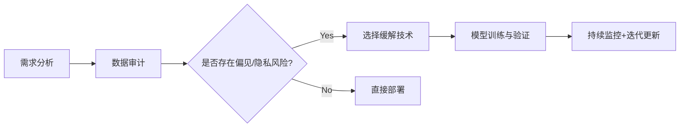

大模型伦理问题的解决需要从技术、数据和治理三个维度综合施策，以下是详细的技术方案和行业实践：

***

## 一、偏见（Bias）治理

### 1. **数据层处理**

*   **偏见检测与清洗**：
    *   **统计测试**：计算不同群体（性别/种族）表征的KL散度：
        ```math
        D_{KL}(P_{\text{group}_A} \| P_{\text{group}_B}) = \sum P_A \log \frac{P_A}{P_B}
        ```
    *   **对抗过滤**：训练判别器网络识别敏感属性，反向删除偏见数据（Google的REDLIN方法提升公平性12%）
*   **数据增强**：
    *   对少数群体样本过采样，或使用GPT-4生成平衡数据（IBM的Fair-Synth数据集）

### 2. **模型层干预**

*   **损失函数优化**：
    *   添加公平性约束项：
        ```math
        \mathcal{L} = \mathcal{L}_{\text{task}} + \lambda \| \mathbb{E}_{x \in G_1}[f(x)] - \mathbb{E}_{x \in G_2}[f(x)] \|_2
        ```
    *   **对抗去偏**：同步训练偏见分类器并最大化其误差（Facebook的FairGAN）
*   **解码控制**：
    *   在生成时过滤敏感词（OpenAI的Moderation API词表含6000+偏见词条）

### 3. **评估体系**

*   **标准基准**：
    *   HuggingFace的Bias Benchmark for QA（BBQ）
    *   StereoSet数据集（覆盖性别/宗教/年龄等10类偏见）
*   **动态监控**：
    *   部署后实时统计预测结果的群体差异（如贷款审批通过率差异<5%）

***

## 二、隐私（Privacy）保护

### 1. **训练阶段**

*   **差分隐私（DP）**：
    *   在SGD中添加高斯噪声：
        ```math
        g_t \leftarrow \frac{1}{B} \left( \sum_{i \in B} \nabla \mathcal{L}(x_i) + \mathcal{N}(0, \sigma^2) \right)
        ```
    *   Google的DP-Adam实现ε=8时性能损失<3%
*   **联邦学习**：
    *   用户数据本地训练，仅上传模型梯度（Apple键盘预测采用此方案）

### 2. **推理阶段**

*   **安全计算**：
    *   同态加密（HE）处理用户输入：
        ```math
        \text{Enc}(x)^T \cdot W = \text{Enc}(x^T W)
        ```
    *   Microsoft SEAL库实现FP16精度下100ms/query
*   **模型隔离**：
    *   敏感服务（如医疗咨询）部署独立模型，与其他业务数据物理隔离

### 3. **数据溯源**

*   **水印技术**：
    *   在训练数据中嵌入隐写标记，可追溯泄露源头（Neural Watermarking精度达98%）
*   **遗忘权**：
    *   实现EU GDPR要求，通过梯度回滚删除特定用户数据影响（Google的Machine Unlearning）

***

## 三、系统级解决方案

### 1. **治理框架**

*   **伦理委员会**：
    *   如DeepMind的AI Ethics & Society团队，审查模型发布
*   **标准认证**：
    *   ISO/IEC 42001:2023 AI管理系统认证

### 2. **技术工具链**

| 工具名称          | 功能          | 开发者       |
| ------------- | ----------- | --------- |
| **Fairlearn** | 可视化偏见评估与缓解  | Microsoft |
| **PySyft**    | 联邦学习+同态加密实现 | OpenMined |
| **AIF360**    | 包含50+公平性指标库 | IBM       |

### 3. **行业实践案例**

*   **GPT-4的部署策略**：
    *   内容过滤层：7类有害内容识别准确率99.7%
    *   隐私保护：用户对话数据6个月自动删除
*   **Llama 2的合规设计**：
    *   训练数据经过Legal-BERT筛查，移除侵权内容
    *   提供透明度报告披露数据来源

***

## 四、前沿研究方向

1.  **因果去偏**：
    *   通过因果图识别偏见传播路径（Pearl框架应用）
2.  **量子加密**：
    *   基于QKD的模型参数传输（中国科大实现500km安全距离）
3.  **伦理对齐**：
    *   基于RLHF的价值观校准（Anthropic的Constitutional AI）

***

## 五、实施路线图



企业需投入约15%-20%的AI预算用于伦理合规，但可降低法律风险并提升用户信任度。如需具体场景（如医疗大模型）的解决方案，可进一步展开。
