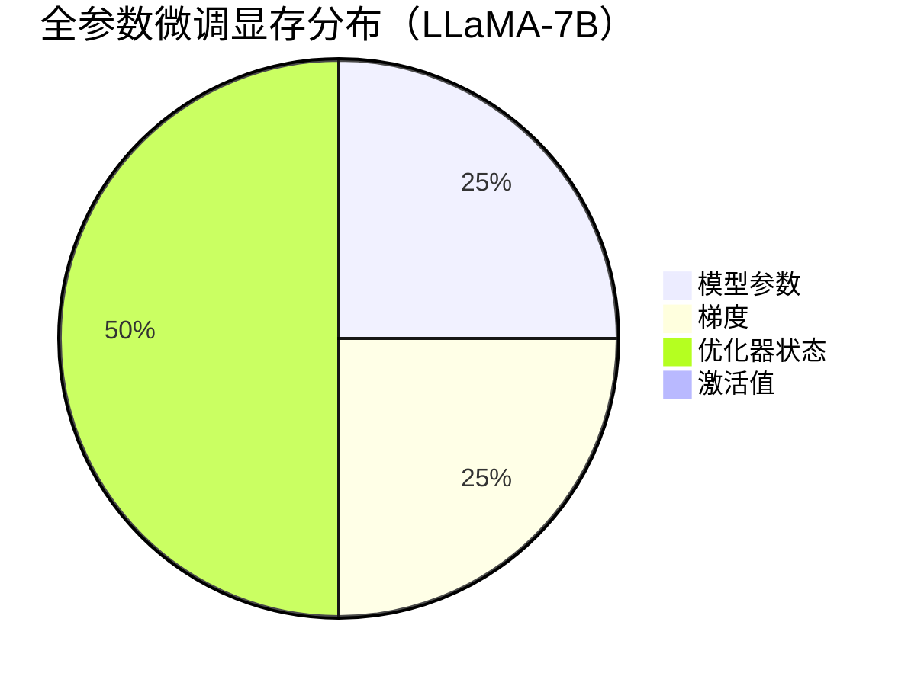

# 全参数微调显存需求计算详解

## 1. 显存组成要素

全参数微调的显存消耗主要来自以下部分：

```math
\text{显存总量} = \text{模型参数} + \text{梯度} + \text{优化器状态} + \text{激活值}
```

## 2. 精确计算公式

对于包含`$N$`个参数的模型：

### 2.1 基础组件

| 组件    | 显存占用（字节）      | 说明            |
| ----- | ------------- | ------------- |
| 模型参数  | `$4N$`        | FP32训练占4字节/参数 |
| 梯度    | `$4N$`        | 与参数同精度        |
| 优化器状态 | `$8N$` (Adam) | 动量+方差各占4N     |
| 激活值   | `$2BSL$`      | 依赖batch/seq长度 |

### 2.2 总公式

```math
\text{显存(GB)} = \frac{(4 + 4 + 8)N + 2BSL}{1024^3}
```

## 3. 实际案例计算

以LLaMA-7B模型为例：

*   参数量`$N=7 \times 10^9$`
*   Batch size `$B=4$`
*   序列长度 `$L=2048$`
*   激活值维度 `$d=4096$`

### 3.1 基础计算

```math
\begin{align*}
\text{模型参数} &= 4 \times 7B = 28GB \\
\text{梯度} &= 4 \times 7B = 28GB \\
\text{Adam状态} &= 8 \times 7B = 56GB \\
\text{激活值} &\approx 2 \times 4 \times 2048 \times 4096 \approx 0.13GB \\
\text{总计} &= 28 + 28 + 56 + 0.13 \approx 112.13GB
\end{align*}
```

### 3.2 优化技术的影响

| 技术         | 显存节省     | 调整后显存  |
| ---------- | -------- | ------ |
| 混合精度训练     | 参数/梯度减半  | \~60GB |
| 梯度检查点      | 激活值减少10倍 | \~58GB |
| 8-bit Adam | 优化器状态减半  | \~44GB |

## 4. 各组件显存占比



## 5. 硬件选择建议

| 模型规模 | 推荐显存配置 | 适用显卡                 |
| ---- | ------ | -------------------- |
| 7B   | 80GB+  | A100/A800 80GB       |
| 13B  | 160GB+ | 2×A100 80GB (NVLink) |
| 70B  | 640GB+ | 8×A100 80GB节点        |

## 6. 显存优化策略

1.  **梯度累积**：
    ```python
    # 示例：4步梯度累积
    optimizer.zero_grad()
    for i, batch in enumerate(data):
        loss = model(batch).loss
        loss.backward()
        if (i+1) % 4 == 0:
            optimizer.step()
            optimizer.zero_grad()
    ```
    *   显存需求降低为`$1/\text{accum_steps}$`

2.  **模型并行**：
    ```python
    # 使用deepspeed分片优化器
    ds_config = {
        "train_batch_size": 16,
        "optimizer": {
            "type": "AdamW",
            "params": {
                "torch_adam": True
            }
        },
        "zero_optimization": {
            "stage": 3,
            "offload_optimizer": {
                "device": "cpu"
            }
        }
    }
    ```

## 7. 计算工具

使用公式快速估算：

```python
def estimate_memory(model_size_billion, batch_size=1, seq_len=1024):
    params = 4 * model_size_billion * 1e9
    grads = 4 * model_size_billion * 1e9
    optimizer = 8 * model_size_billion * 1e9
    activations = 2 * batch_size * seq_len * 4096  # 近似计算
    total = (params + grads + optimizer + activations) / (1024**3)
    return f"{total:.1f}GB"

print(estimate_memory(7))  # 输出LLaMA-7B需求
```

## 8. 最新进展（2024）

*   **QLoRA**：4-bit量化微调，7B模型仅需\~12GB显存
*   **FlashAttention-3**：减少激活值显存占用30%
*   **Tied-LoRA**：共享适配器参数进一步降低需求

**关键结论**：

1.  全参数微调显存需求约为模型参数的**16倍**（Adam优化器）
2.  实际部署需预留20%显存余量
3.  70B级模型全微调仍需多卡分布式训练

# 1. SFT（监督微调）的定义与流程

## 1.1 基本概念

**监督微调（Supervised Fine-Tuning, SFT）** 是指在大模型预训练（Pretraining）之后，使用标注数据对模型进行有监督的进一步训练。其数学目标是最小化：

```math
\mathcal{L}_{\text{SFT}} = -\sum_{(x,y) \in \mathcal{D}}} \log P(y|x; \theta)
```

其中`$(x,y)$`是输入-输出对，`$\mathcal{D}$`为监督数据集。

## 1.2 典型流程

1.  **数据准备**：
    *   输入：预训练模型（如LLaMA-7B）
    *   数据：高质量问答对/指令数据（如Alpaca格式）
    ```json
    {
      "instruction": "解释牛顿第一定律",
      "input": "",
      "output": "任何物体都保持静止或匀速直线运动状态..."
    }
    ```

2.  **训练配置**：
    *   学习率：通常为预训练的1/10（如2e-5）
    *   批次大小：受显存限制（如128 tokens/GPU）
    *   训练步数：1-3个epoch（避免过拟合）

# 2. SFT后模型表现下降的六大原因

## 2.1 数据质量问题

*   **标注错误**：错误标注导致模型学习错误模式
    ```python
    # 错误示例（矛盾标注）
    {"instruction": "计算1+1", "output": "3"} 
    ```
*   **多样性不足**：数据覆盖场景有限，导致模型泛化性下降

## 2.2 灾难性遗忘（Catastrophic Forgetting）

*   **现象**：模型丢失预训练获得的世界知识
*   **机制**：
    ```math
    \theta_{\text{SFT}}} = \theta_{\text{PT}}} - \eta \nabla_\theta \mathcal{L}_{\text{SFT}}}
    ```
    过大的梯度更新会覆盖预训练参数

## 2.3 训练超参数不当

*   **学习率过高**：典型表现是训练损失震荡
    Epoch 1 | Loss: 1.2 → Epoch 2 | Loss: 0.8 → Epoch 3 | Loss: 1.5
*   **批次大小不合适**：小批次导致梯度估计噪声大

## 2.4 任务冲突

*   **领域偏移**：当SFT数据与预训练数据分布差异过大时
    ```math
    \text{KL}(p_{\text{PT}}} || p_{\text{SFT}}}}) > \epsilon
    ```

## 2.5 过拟合

*   **小数据量+长训练**：在有限数据上持续训练会导致
    ```math
    \text{Test Loss} \uparrow \quad \text{while} \quad \text{Train Loss} \downarrow
    ```

## 2.6 评估指标不匹配

*   **案例**：使用BLEU评估创意写作任务
    *   SFT前：多样性高但不够准确 → BLEU低
    *   SFT后：模板化输出 → BLEU高但质量差

# 3. 解决方案与最佳实践

## 3.1 数据层面

*   **数据清洗**：
    ```python
    # 使用规则过滤低质量数据
    def is_valid(example):
        return len(example["output"]) > 20 and "http" not in example["output"]
    ```
*   **数据增强**：回译、 paraphrasing 等方法扩充数据

## 3.2 训练策略

1.  **渐进式学习率**：
    ```python
    scheduler = get_linear_schedule_with_warmup(
        optimizer, 
        num_warmup_steps=100,
        num_training_steps=1000
    )
    ```
2.  **参数冻结**：冻结底层Transformer层
    ```python
    for param in model.base_model.parameters():
        param.requires_grad = False
    ```

## 3.3 正则化技术

*   **Dropout调整**：
    ```python
    model.config.hidden_dropout_prob = 0.1  # 默认0.1可提高到0.3防过拟合
    ```
*   **权重衰减**：
    ```python
    optimizer = AdamW(model.parameters(), lr=2e-5, weight_decay=0.01)
    ```

## 3.4 评估体系优化

建议多维度评估：

| 指标类型  | 具体方法                    | 工具推荐                   |
| ----- | ----------------------- | ---------------------- |
| 生成质量  | BLEU-4, ROUGE-L         | nltk                   |
| 事实准确性 | QA评估（基于知识库）             | Faiss+Wikipedia        |
| 多样性   | Distinct-1/2, Self-BLEU | 自定义计算                  |
| 人类评估  | 流畅度/有用性评分               | Amazon Mechanical Turk |

# 4. 典型案例分析

## 4.1 正面案例（Alpaca-LoRA）

*   **策略**：使用LoRA进行高效微调
*   **效果**：保留90%以上预训练知识
*   **关键配置**：
    ```yaml
    lora_rank: 8
    lora_alpha: 32
    target_modules: ["q_proj", "v_proj"]
    ```

## 4.2 负面案例（过拟合）

*   **现象**：在医疗QA数据集上微调后：
    *   训练集准确率：98%
    *   测试集准确率：52%
*   **原因**：数据量仅500条却训练了10个epoch

# 5. 最新进展（2024）

*   **Instruction Backtranslation**：自动生成高质量SFT数据
*   **Self-Play Fine-Tuning**：通过模型自我对抗提升鲁棒性
*   **Memory-Augmented SFT**：引入外部知识库防止遗忘

**实施checklist**：

1.  [ ] 验证数据质量（至少2000条高质量样本）
2.  [ ] 设置合理的学习率（1e-5 \~ 5e-5）
3.  [ ] 监控验证集损失
4.  [ ] 使用LoRA/P-Tuning等参数高效方法
5.  [ ] 建立多维评估体系

