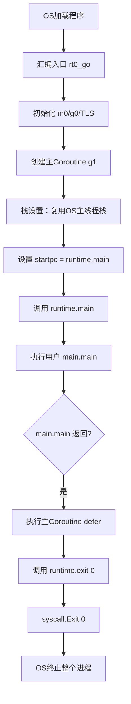
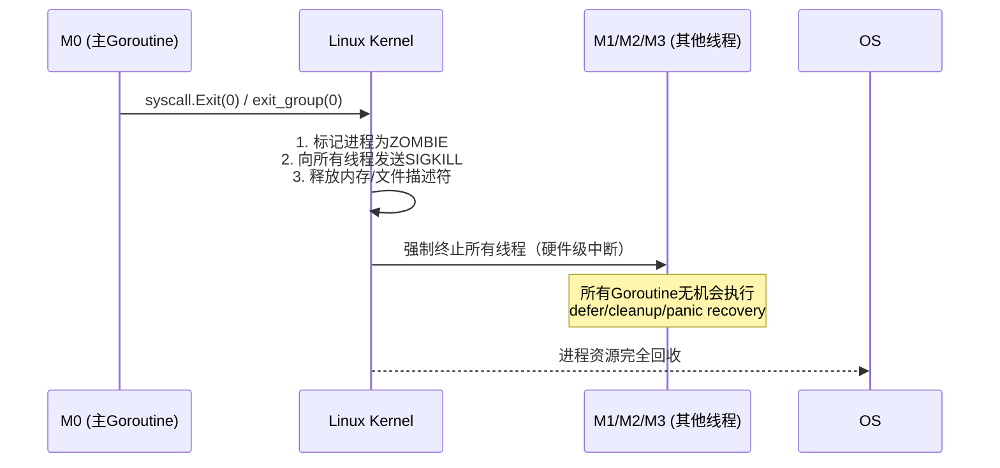

# Go语言：主Goroutine与普通Goroutine的本质区别与生命周期管理

> **标签**: `#Go` `#并发` `#Runtime` `#Goroutine` `#源码解析`  
> **适用版本**: Go 1.20+  
> **最后更新**: 2026-01-30  
> **Obsidian提示**: 本笔记含关键源码路径、执行流程图、对比表格，建议开启代码高亮与表格渲染

---

## 📌 核心结论（前置摘要）

|问题|本质答案|
|---|---|
|**调度器是否区分主/普通Goroutine？**|❌ **否**。调度器（`schedule()`）对所有G完全平等|
|**`g`结构体是否有"isMain"标记？**|❌ **否**。内存布局完全一致|
|**主Goroutine为何“特殊”？**|✅ **执行流起点**为`runtime.main`，且**栈复用OS主线程原始栈**|
|**退出时如何终止其他核Goroutine？**|✅ **非Go行为**：`syscall.Exit(0)` → OS强制终止整个进程（含所有线程）|
|**设计哲学**|显式生命周期管理 > 隐式等待；确定性退出 > 挂起风险|

---

## 🔍 问题1：主Goroutine与普通Goroutine的执行区别

### 本质区别总结

|维度|主Goroutine|普通Goroutine|是否本质区别|
|---|---|---|---|
|**调度逻辑**|调度器无特殊处理|调度器无特殊处理|❌ 否|
|**`g`结构体字段**|无`isMain`等标记|无特殊标记|❌ 否|
|**栈来源**|复用OS主线程原始栈（启动时栈）|runtime heap分配（初始2KB）|✅ 是|
|**执行起点**|`runtime.main`|用户指定函数|✅ 是（关键）|
|**退出副作用**|触发`exit(0)` → 进程终止|仅自身销毁|✅ 是（由执行流决定）|
|**生命周期作用**|决定程序存续|依赖主Goroutine存活|✅ 是|

> 💡 **关键认知**：  
> “主Goroutine”的特殊性**非调度器赋予**，而是**程序启动流程与执行流语义**决定的。调度器眼中所有G完全平等。

---

## 🔬 问题2 & 3：主Goroutine的识别机制与退出原理（源码级）

### 🌐 程序启动流程（关键路径）



### 📜 源码证据链

#### 1. `g`结构体无主标记（`runtime/runtime2.go`）

```go
type g struct {
    stack       stack      // 栈范围 [lo, hi)
    stackguard0 uintptr
    _panic      *_panic
    _defer      *_defer
    m           *m
    sched       gobuf
    gopc        uintptr    // go语句位置PC
    startpc     uintptr    // 入口函数PC ← 唯一可追溯差异点
    // ... 无 isMain/isRoot 字段
}
```

- **主Goroutine**: `startpc = funcPC(runtime.main)`
- **普通Goroutine**: `startpc = funcPC(用户函数)`

#### 2. `runtime.main`退出逻辑（`runtime/proc.go`）

```go
func main() {
    // ... 初始化GC/网络/定时器等
    // 启动系统Goroutine: bgsweep, bgscavenge, runfinq...
    
    main_main() // 调用用户 package main 的 main()
    
    // 执行主Goroutine的defer（仅当前G）
    if raceenabled { racefini() }
    
    // ⚠️ 无任何等待逻辑！直接退出
    exit(0) // → syscall.Exit(uintptr(code))
}
```

#### 3. `runtime.exit`实现（`runtime/proc.go`）

```go
func exit(code int) {
    if panicking != 0 {
        printpanics() // 仅打印未recover的panic
    }
    syscall.Exit(uintptr(code)) // Linux: _exit(2) 系统调用
}
```

✅ **关键验证**：

- 无循环检查`allg`（所有G列表）
- 无信号发送至其他M线程
- 无“等待活跃Goroutine"逻辑

#### 4. 启动时栈复用证据（`runtime/asm_amd64.s`）

```asm
// rt0_go 中关键片段
MOVQ    $runtime·g0(SB), DI
MOVQ    DI, g(CX)          // 设置g0
// ... 
// 主Goroutine (g1) 的栈指针直接指向当前OS线程栈
// 普通Goroutine通过 malg() 在heap分配新栈
```

---

## 💥 问题4：多核场景下程序终止机制

### 执行场景假设

|线程|CPU核心|运行内容|状态|
|---|---|---|---|
|M0|Core 0|主Goroutine（执行`runtime.main`）|执行`syscall.Exit(0)`|
|M1|Core 1|Worker Goroutine A|正在计算|
|M2|Core 2|Worker Goroutine B|阻塞在channel|
|M3|Core 3|GC Mark Worker|扫描堆内存|

### 终止过程（OS层介入）



### 🔍 验证命令（Linux）

```bash
# 观察系统调用
strace -e trace=exit_group ./your_program
# 输出示例: exit_group(0) = ?

# 验证多核Goroutine被强制终止
go run -race your_program  # 若有数据竞争，退出前可能打印，但Goroutine无机会清理
```

### ❌ 常见误解澄清

|误解|事实|
|---|---|
|“runtime广播信号通知其他Goroutine"|源码无此逻辑，`exit`前无跨M通信|
|“其他Goroutine的defer会被执行"|仅主Goroutine的defer在`exit`前执行|
|“channel关闭可安全通知所有G"|需显式设计+主Goroutine主动触发+等待|
|“Go会等待所有G完成"|与Java/C#根本不同，Go明确不等待|

---

## 🛡️ 正确实践：安全管理Goroutine生命周期

### ✅ 推荐模式：Context + WaitGroup（跨核安全）

```go
func main() {
    ctx, cancel := context.WithCancel(context.Background())
    defer cancel() // 确保退出时广播信号

    var wg sync.WaitGroup
    workerCount := runtime.GOMAXPROCS(0) // 匹配可用核心数

    // 启动Worker（可能分布于不同M线程）
    for i := 0; i < workerCount; i++ {
        wg.Add(1)
        go func(id int) {
            defer wg.Done()
            // Worker内部定期检查ctx.Done()
            for {
                select {
                case <-ctx.Done():
                    log.Printf("Worker %d: cleanup and exit", id)
                    return // 安全退出
                default:
                    // 执行任务
                    time.Sleep(100 * time.Millisecond)
                }
            }
        }(i)
    }

    // 模拟主逻辑
    time.Sleep(2 * time.Second)
    
    // 1. 广播退出信号（所有Worker感知）
    cancel()
    // 2. 等待所有Worker完成清理（跨M同步）
    wg.Wait() 
    // 3. 主Goroutine安全退出 → 进程终止
}
```

### 📌 关键原则

1. **显式同步**：必须用`WaitGroup`/channel等待后台任务
2. **可取消设计**：Worker需监听`context.Done()`或退出信号
3. **资源清理**：在Goroutine内部`defer`中释放资源（文件/连接）
4. **避免依赖runtime魔法**：Go不提供“自动等待所有G"机制

---

## 🌱 设计哲学与总结

### 为什么这样设计？

|设计选择|原因|对比其他语言|
|---|---|---|
|**主G退出即终止**|确定性：避免遗忘同步导致程序挂起|Java：非daemon线程阻止JVM退出|
|**无G计数器**|性能：零开销，无全局锁|C#：需手动管理Task.WaitAll|
|**栈复用主线程**|启动效率：避免额外内存分配|所有线程栈均由OS分配|
|**责任交还开发者**|显式优于隐式：强制思考生命周期|Python asyncio：需显式await|

### 💎 终极心法

> **“主Goroutine退出 = 进程死亡”是Go的契约**  
> Runtime不提供魔法，**并发安全退出逻辑必须由开发者显式实现**。  
> 这不是缺陷，而是Go将控制权明确交还给程序员的设计哲学——  
> **简单、确定、可控**。

---

## 🔗 参考与验证

### 源码路径（Go 1.20+）

|文件|关键函数/片段|作用|
|---|---|---|
|`runtime/proc.go`|`func main()`, `func exit(code int)`|程序启动与退出逻辑|
|`runtime/runtime2.go`|`type g struct`|Goroutine结构体定义|
|`runtime/asm_amd64.s`|`rt0_go`|汇编启动流程（栈设置）|
|`runtime/malloc.go`|`func malg(stacksize uintptr)`|普通G栈分配|

### 验证实验

```go
// 实验1：观察初始Goroutine数量
func main() {
    fmt.Println(runtime.NumGoroutine()) // 通常输出4（含系统G）
    // 1. 主G (runtime.main)
    // 2. bgsweep
    // 3. bgscavenge
    // 4. runfinq
}

// 实验2：验证defer仅主G执行
func main() {
    go func() {
        defer fmt.Println("普通G的defer") // 永远不会打印
        for {}
    }()
    defer fmt.Println("主G的defer") // 会打印
    time.Sleep(100 * time.Millisecond)
}
```

### 延伸阅读

- [[Go调度器GMP模型深度解析]]
- [[Context在并发控制中的最佳实践]]
- [[sync.WaitGroup源码与陷阱]]
- Go官方文档: [Concurrency](https://go.dev/doc/effective_go#concurrency)