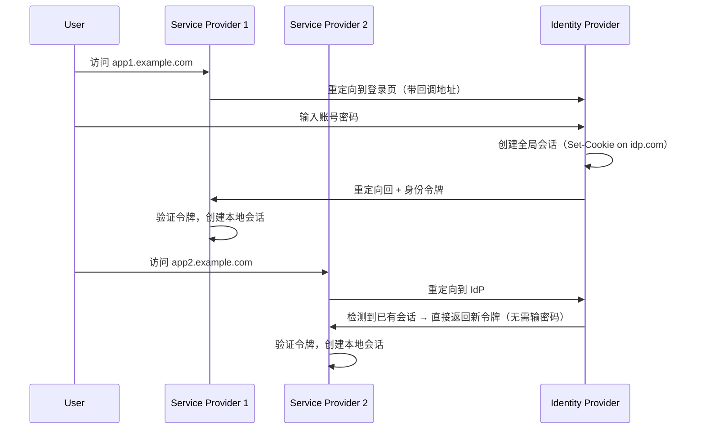

# 单点登录（SSO）、OAuth 2.0 与 OpenID Connect（OIDC）详解笔记

## 目录


## 一、核心概念总览

|概念|类型|核心目的|回答的问题|是否可独立实现用户登录|
|---|---|---|---|---|
|**SSO**|身份认证场景|单次登录，多系统通行|“你是谁？”|✅ 是（通过协议实现）|
|**OAuth 2.0**|授权框架|第三方访问用户资源|“你能代表我做什么？”|❌ 否（无身份标识）|
|**OpenID Connect (OIDC)**|身份认证协议|在 OAuth 2.0 上提供标准化身份认证|“你是谁？+ 你能做什么？”|✅ 是（现代 SSO 标准）|

> 🔑 **关键结论**：
> 
> - **SSO 是目标，OIDC 是实现方式之一**。
> - **OAuth 2.0 是基础，OIDC 是其扩展**。
> - 要实现安全、标准的 Web/移动 SSO，请使用 **OIDC**。

---

## 二、什么是单点登录（SSO）？

### 2.1 定义与价值

**单点登录（Single Sign-On, SSO）** 是一种身份验证机制，允许用户使用一组凭据（如用户名/密码）登录一次后，即可访问多个相互信任的应用系统，无需重复认证。

✅ **核心价值**：

- 提升用户体验（减少重复登录）
- 集中管理身份与权限
- 降低密码泄露风险（应用不存储密码）

### 2.2 SSO 的基本原理

SSO 依赖 **集中式身份认证中心（Identity Provider, IdP）**：

- 用户只在 IdP 处输入密码。
- 各业务系统（Service Provider, SP）信任 IdP 的认证结果。
- 通过 **安全令牌（Token）** 传递身份信息。

> 📌 **关键思想**：认证与业务解耦。

### 2.3 典型 SSO 流程（Web 场景）



✅ 第二次访问 SP2 时，用户**无需再次输入密码**。

我们以 **SAML** 或 **OAuth 2.0 + OpenID Connect** 为背景，描述通用流程。

#### 场景设定

- 用户访问 `app1.example.com`（SP1）
- 认证中心为 `sso.example.com`（IdP）
- 用户尚未登录

#### 步骤详解

|步骤|动作|说明|
|---|---|---|
|1|用户访问 SP1（`app1.example.com`）|SP1 检查本地是否已有会话（如 Cookie）|
|2|无有效会话 → 重定向到 IdP（`sso.example.com/login?redirect=app1...`）|携带目标地址作为回调参数|
|3|用户在 IdP 页面输入用户名/密码|IdP 验证凭证|
|4|IdP 创建全局会话（如设置 `sso.example.com` 的 Cookie）|表示用户已全局登录|
|5|IdP 生成身份令牌（如 SAML Assertion / ID Token）并重定向回 SP1|通常通过 POST 或重定向携带 token|
|6|SP1 验证令牌有效性（签名、有效期、受众等）|可能需调用 IdP 的公钥或元数据|
|7|SP1 创建本地会话（如设置 `app1.example.com` 的 Cookie）|用户现在可正常使用 SP1|
|8|用户访问 SP2（`app2.example.com`）|SP2 检查本地无会话|
|9|SP2 重定向到 IdP|IdP 检测到已有全局会话（Cookie 存在）|
|10|IdP 直接生成新令牌并重定向回 SP2|**无需再次输入密码！**|
|11|SP2 验证令牌并创建本地会话|用户无缝登录 SP2|

> ✅ **关键优势**：步骤 9–11 中用户**无需重新认证**，实现“单点登录”。


### 2.4 主流 SSO 协议对比

|协议|数据格式|适用场景|特点|
|---|---|---|---|
|**SAML**|XML|企业级 Web SSO（如 ADFS、Okta）|安全性强，配置复杂|
|**OpenID Connect (OIDC)**|JSON/JWT|现代 Web / 移动 / SPA|轻量、RESTful、开发者友好|
|**CAS**|自定义|高校、政府内部系统|开源、简单、Java 生态|

> 📌 **当前趋势**：OIDC 已成为互联网应用的主流选择。

### 2.5 SSO 安全性考虑

- 使用 HTTPS 传输所有通信
- 令牌必须签名（防篡改）并设置合理过期时间
- 实现 **单点登出（SLO）**：一处登出，处处登出
- 用户授权同意（Consent）机制
- 防 CSRF（使用 `state` 参数）、防重放（使用 `nonce`）

---

## 三、OAuth 2.0 是什么？与 SSO 有何区别？

### 3.1 OAuth 2.0 的本质：授权框架

OAuth 2.0（RFC 6749）是一个 **委托授权框架**，用于让第三方应用在用户授权下访问其受保护资源。

> ✅ **不是认证协议！**

### 3.2 认证 vs 授权：关键区分

|维度|认证（Authentication）|授权（Authorization）|
|---|---|---|
|目的|验证“你是谁”|决定“你能做什么”|
|输出|用户身份（如用户ID）|访问令牌（access token）|
|示例|登录系统|微信授权公众号读取你的昵称|

### 3.3 为什么 OAuth 2.0 不能单独实现 SSO？

- OAuth 2.0 **不提供用户身份标识**（如唯一用户ID）
- Access Token 仅用于访问资源，**无法证明用户是谁**
- 没有标准方式传递用户属性（如邮箱、姓名）

> 💡 虽然很多平台（如微信）在 OAuth 2.0 后提供 `/userinfo` 接口，但这属于**私有扩展**，非标准。

### 3.4 常见误区澄清

|误区|正确理解|
|---|---|
|“用微信登录 = OAuth 2.0 实现了 SSO”|实际是 **OAuth 2.0 + 私有身份接口**，非标准 OIDC|
|“OAuth 2.0 可用于用户登录”|不安全！应使用 **OIDC** 或其他认证协议|
|“Access Token 就是用户身份”|错！Access Token 是权限凭证，不是身份凭证|

---

## 四、OpenID Connect（OIDC）详解

### 4.1 OIDC 是什么？

> 引用 [OpenID Foundation](https://openid.net/developers/how-connect-works/)：
> 
> > _“OpenID Connect is an interoperable authentication protocol based on the OAuth 2.0 framework... to verify the identity of users and obtain user profile information.”_

✅ **OIDC = OAuth 2.0 + 身份认证层**

- 在 OAuth 2.0 授权流程中，**新增 ID Token** 传递用户身份
- 使用 **JWT（JSON Web Token）** 格式，轻量且可验证
- 支持 Web、移动、SPA、IoT 等多种客户端

### 4.2 OIDC 与 OAuth 2.0 的关系

```
OAuth 2.0（授权框架）
│
└── OpenID Connect（在其之上增加身份认证）
     ├── 新增 scope=openid
     ├── 返回 ID Token（JWT）
     ├── 标准化 UserInfo Endpoint
     └── 支持 Discovery、Session Management 等扩展
```

> 📌 **判断是否为 OIDC**：看请求中是否包含 `scope=openid`。

### 4.3 核心组件与角色

|角色|英文|说明|
|---|---|---|
|**Relying Party (RP)**|依赖方|你的应用（客户端），需要验证用户身份|
|**OpenID Provider (OP)**|提供者|身份服务器（如 Google、Auth0、Keycloak）|
|**End-User**|最终用户|使用系统的真人|
|**ID Token**|身份令牌|JWT，包含用户身份信息（必须验证！）|
|**UserInfo Endpoint**|用户信息端点|可选 API，返回更多用户属性|

### 4.4 OIDC 工作流程（含实例）

以 **Web 应用 + Authorization Code 模式**为例，我们使用 Google 实现 OIDC SSO。

#### 1. 注册应用（Google Cloud Console）

- 获取 `Client ID` 和 `Client Secret`
- 设置回调 URL：`https://myapp.com/auth/google/callback`

#### 2. 用户点击“用 Google 登录”

```http
GET https://accounts.google.com/o/oauth2/v2/auth?
  client_id=YOUR_CLIENT_ID&
  redirect_uri=https://myapp.com/auth/google/callback&
  response_type=code&
  scope=openid email profile&
  state=RANDOM_STRING
```

#### 3. 用户在 Google 登录（若未登录）

- Google 验证用户身份
- 用户授权 `myapp.com` 获取其信息

#### 4. Google 重定向回你的网站（带 code）

```http
https://myapp.com/auth/google/callback?code=AUTH_CODE&state=RANDOM_STRING
```

#### 5. 后端用 code 换取 ID Token

```http
POST https://oauth2.googleapis.com/token
Content-Type: application/x-www-form-urlencoded

grant_type=authorization_code&
code=AUTH_CODE&
redirect_uri=https://myapp.com/auth/google/callback&
client_id=YOUR_CLIENT_ID&
client_secret=YOUR_SECRET
```

响应包含：

```json
{
  "id_token": "eyJhbGciOiJSUzI1NiIs...",
  "access_token": "...",
  "token_type": "Bearer"
}
```

#### 6. 验证 ID Token（JWT）

- 解码 JWT（Header.Payload.Signature）
- 验证签名（使用 Google 公钥）
- 检查 `iss`（issuer）、`aud`（audience）、`exp`（过期时间）

Payload 示例：

```json
{
  "iss": "https://accounts.google.com",
  "aud": "YOUR_CLIENT_ID",
  "sub": "1234567890",        // 用户唯一ID
  "email": "user@gmail.com",
  "name": "John Doe",
  "exp": 1735689600
}
```

#### 7. 创建本地会话

- 用 `sub` 作为用户唯一标识
- 设置 `myapp.com` 的登录 Cookie
- 用户成功登录！

> ✅ 此后用户访问 `myapp.com` 的其他页面无需再登录。

### 4.5 ID Token 详解（JWT 结构）

ID Token 是一个 **JWT**，由三部分组成：Header.Payload.Signature

**Payload 示例**：

```json
{
  "iss": "https://accounts.google.com",
  "sub": "110123456789012345678",
  "aud": "myapp-client-id",
  "exp": 1735689600,
  "iat": 1735686000,
  "auth_time": 1735685900,
  "nonce": "n-0S6_WzA2Mj",
  "email": "user@gmail.com",
  "email_verified": true
}
```

- `sub`：用户的**全局唯一标识**（永不变更）
- `iss`：签发者（必须是你信任的 OP）
- `aud`：受众（必须等于你的 client_id）
- `nonce`：防重放攻击（需与登录请求中的 nonce 一致）

> ⚠️ **必须验证 ID Token**！否则可能被伪造登录。

### 4.6 UserInfo Endpoint

- URL 通常通过 OP 的 Discovery 文档获取（如 `/.well-known/openid-configuration`）
- 请求方式：
    
```http
    GET /oauth2/v3/userinfo
    Authorization: Bearer ya29.a0AfB...
```
    
- 响应：
    
    ```json
    {
      "sub": "110123456789012345678",
      "name": "John Doe",
      "given_name": "John",
      "family_name": "Doe",
      "picture": "https://...",
      "email": "user@gmail.com"
    }
    ```
    

### 4.7 为什么 OIDC 比 OpenID 2.0 更好？

|方面|OpenID 2.0|OIDC|
|---|---|---|
|数据格式|XML|JSON（更轻量）|
|签名|自定义 XML Signature|标准 JWT（JWS）|
|传输|HTTP Redirect + Form|RESTful + HTTPS|
|开发体验|复杂，互操作性差|简单，广泛支持|
|移动支持|弱|原生支持（Android/iOS）|

> 官方评价：_“OIDC is dramatically easier for developers to implement.”_

### 4.8 应用场景与平台支持

✅ **支持场景**：

- Web 应用（传统 + SPA）
- 原生移动/桌面应用（通过系统浏览器）
- 企业身份联邦
- IoT 设备登录（Device Flow）

✅ **主流 IdP**：

- 公有云：Google、Microsoft Entra ID、Apple ID、AWS Cognito
- 开源：Keycloak、ORY Kratos、Dex

### 4.9 安全与隐私设计

- **用户授权同意**：明确提示“是否允许共享邮箱？”
- **最小权限原则**：通过 scope 控制信息范围（`openid email` vs `openid profile`）
- **令牌安全**：ID Token 必须签名，可选加密（JWE）
- **会话管理**：支持前端登出（RP-Initiated Logout）和后端登出（Back-Channel）

> 官方强调：_“Users can consent (or deny) the sharing of this information.”_

---

## 五、三者关系总结

### 5.1 概念层级图

```
身份认证目标（SSO）
│
├── 实现协议
│   ├── SAML（企业级，XML）
│   └── OpenID Connect（现代，JSON/JWT） ← 推荐
│
└── 技术基础
    └── OAuth 2.0（授权框架） ← OIDC 构建其上
```

### 5.2 如何选择？

|你的需求|推荐方案|
|---|---|
|实现用户“用 Google/微信登录”|**OpenID Connect**（或平台提供的登录 SDK）|
|让第三方 App 访问用户数据（无登录需求）|**OAuth 2.0**|
|企业内网统一登录（对接 AD/LDAP）|**SAML** 或 **OIDC**（Keycloak）|
|仅需 API 授权（机器对机器）|**OAuth 2.0 Client Credentials**|

> ✅ **最佳实践**：
> 
> - 新项目一律使用 **OIDC** 实现 SSO
> - 不要试图用纯 OAuth 2.0 做登录！

---

## 六、延伸学习资源

- 📘 [OpenID Connect 官方文档](https://openid.net/connect/)
- 📗 [OAuth 2.0 RFC 6749](https://datatracker.ietf.org/doc/html/rfc6749)
- 🧪 [JWT.io](https://jwt.io/)（在线解码 ID Token）
- 🛠️ 开源 IdP：
    - [Keycloak](https://www.keycloak.org/)
    - [ORY Kratos + Hydra](https://www.ory.sh/)
    - [Authelia](https://www.authelia.com/)
- 🎥 视频教程：OAuth 2.0 & OIDC in 10 Minutes（YouTube）
