# Golang pprof 性能分析全指南
## 总体使用指南
### 代码中启用 pprof
```go
package main

import (
    "net/http"
    _ "net/http/pprof" // 匿名导入，注册 pprof 的 handler
    "os"
    "runtime"
    "time"

    "github.com/wolfogre/go-pprof-practice/animal"
)

func main() {
    runtime.GOMAXPROCS(1)
    // 启用 mutex 性能分析（入参为采样频率，1 为始终采样）
    runtime.SetMutexProfileFraction(1)
    // 启用 block 性能分析（入参控制采样频率，1 为始终采样）
    runtime.SetBlockProfileRate(1)

    go func() {
        // 启动 http server，挂载 pprof 页面
        if err := http.ListenAndServe(":6060", nil); err != nil {
            log.Fatal(err)
        }
        os.Exit(0)
    }()

    // 运行程序
}

```

### 打开界面
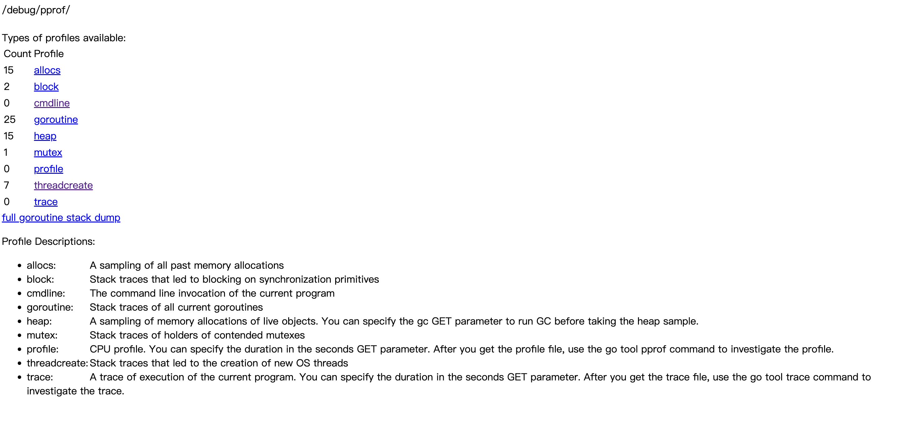

### 方法一：直接浏览器查看
比如block，mutex 这些指标可以直接点击然后，默认已排序，从上到下找就行


### 方法二：导出文件
- 在浏览器中点击 heap,profile 会默认采样30s 的数据，然后下载成一个文件
- 使用 `go tool pprof [filename]` 进入交互式页面
- 使用 top 或 top -cum 找到最高的几项
- 使用 list [funcName] 找具体位置 
操作步骤如下
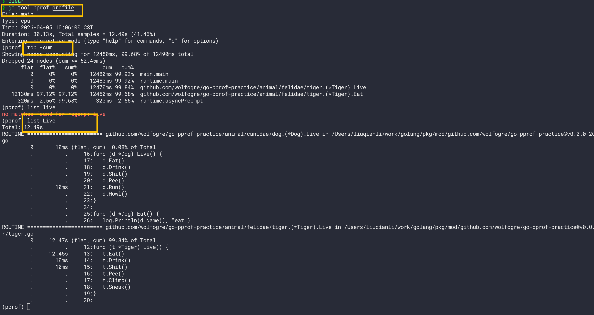

### 方法三：打开特定项到浏览器
```
go tool pprof -http=:8080 http://localhost:6060/debug/pprof/mutex
```
然后就会在本地打开8080端口，里面有各种选项
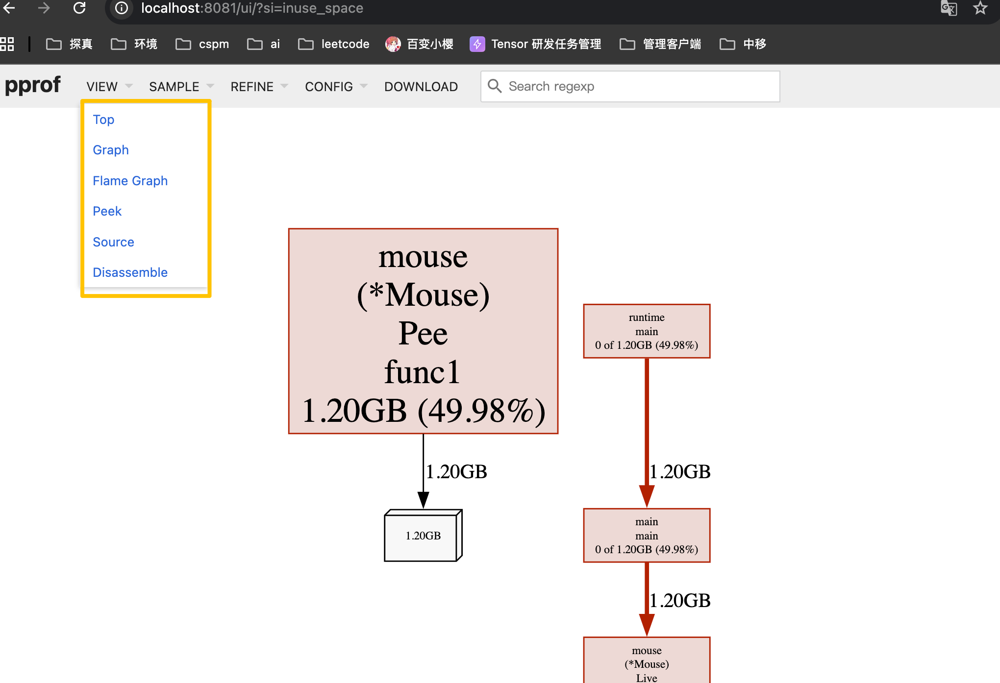

## 0. 前言

pprof 是 golang 中最常用的性能分析工具，主要可以分析 CPU、内存的使用情况、阻塞情况、Goroutine 的堆栈信息以及锁争用情况等性能问题。Go 在语言层面就内置了 profile 采样工具，这涉及到 `runtime/pprof` 与 `net/http/pprof` 这两个包。

本文涉及一定的源码导读环节，使用的 golang 版本是 go1.21.4，操作系统是 linux。

## 1. 原理剖析

### 1.1 pprof 是如何注册上线的

只需要匿名导入 `net/http/pprof` 包即可启用 pprof 功能：

```go
import (
    _ "net/http/pprof"
)
```

这背后的原理是 pprof 包通过 `init()` 初始化函数，向 `net/http` 的默认 `ServerMux`（`DefaultServeMux`）中注册了一系列路径及对应 handler：

```go
// net/http/pprof/pprof.go
func init() {
    // 目录索引页
    http.HandleFunc("/debug/pprof/", Index)
    // CPU 采样
    http.HandleFunc("/debug/pprof/profile", Profile)
    // ... 其他端点
}
```

当请求 `/debug/pprof/` 路径时，请求会由 `Index` handler 处理，根据 URL 路径中的指标名称（如 `heap`、`block`、`mutex` 等）分发给对应的 profile 模块。

### 1.2 CPU 采样的工作原理

CPU 分析的流程涉及**定时器 + 信号机制**的协作：

```
┌─────────────┐      SIGPROF       ┌─────────────┐
│   定时器     │ ──────────────────→│  Go 进程     │
│  (timer)    │    每秒 100 次       │ (信号处理)   │
└─────────────┘                     └─────────────┘
                                            │
                                            ▼
                                   记录当前函数栈信息
                                            │
                                            ▼
                                    ┌───────────────┐
                                    │ profileWriter │
                                    │ goroutine     │
                                    └───────────────┘
```

**采样流程源码解析：**

1. **启动采样**（`StartCPUProfile`）：
   ```go
   func StartCPUProfile(w io.Writer) error {
       const hz = 100  // 每秒采样 100 次
       cpu.Lock()
       cpu.profiling = true
       runtime.SetCPUProfileRate(hz)  // 创建定时器
       go profileWriter(w)            // 启动异步写入 goroutine
       return nil
   }
   ```

2. **定时器创建**（`setThreadCPUProfiler`）：
   - 使用 `timer_create` 创建基于 `CLOCK_THREAD_CPUTIME_ID` 的定时器
   - 使用 `timer_settime` 设置定时器，每隔 `1e9/hz` 纳秒（即 10ms）发送一次 `SIGPROF` 信号

3. **信号处理**（`sighandler`）：
   ```go
   func sighandler(sig uint32, info *siginfo, ctxt unsafe.Pointer, gp *g) {
       if sig == _SIGPROF {
           if validSIGPROF(mp, c) {
               sigprof(c.sigpc(), c.sigsp(), c.siglr(), gp, mp)  // 采集函数栈
           }
           return
       }
   }
   ```

4. **异步写入**（`profileWriter`）：
   ```go
   func profileWriter(w io.Writer) {
       b := newProfileBuilder(w)
       for {
           time.Sleep(100 * time.Millisecond)
           data, tags, eof := readProfile()  // 从 runtime 读取采样数据
           b.addCPUData(data, tags)           // 写入 profile 文件
           if eof { break }
       }
       b.build()
   }
   ```

### 1.3 heap、block、mutex 的存储结构

heap、block、mutex 三类指标的采样数据都存储在 **bucket** 数据结构中，并通过全局链表管理：

```go
type bucket struct {
    allnext *bucket    // 链表指针，指向下一个 bucket
    typ     bucketType // bucket 类型：memProfile、blockProfile、mutexProfile
    size    uintptr    // 内存大小（仅 heap 类型使用）
    nstk    uintptr    // 堆栈信息数组大小
    // 隐藏字段：stk[] + memRecord/blockRecord（通过地址偏移访问）
}
```

**关键数据结构关系：**

```
┌─────────────────────────────────────────────────────┐
│                      bucket                          │
├─────────────────────────────────────────────────────┤
│ allnext ──────────┐                                  │
│ typ = memProfile  │                                  │
│ size = 1024       │                                  │
│ nstk = 3          │                                  │
├───────────────────┼─────────────────────────────────┤
│ stk[0] = pc1      │◄── 堆栈信息数组（大小为 nstk）     │
│ stk[1] = pc2      │                                  │
│ stk[2] = pc3      │                                  │
├───────────────────┴─────────────────────────────────┤
│ memRecord / blockRecord │◄── 隐藏字段，通过偏移量访问  │
│  - allocs/frees         │                           │
│  - alloc_bytes/free_bytes│                           │
└─────────────────────────┘                            │
```

**内存采样的 3 阶段轮换机制：**

由于内存分配是实时的，但释放要等到 GC 完成后才记录，pprof 使用 `future[3]` 环缓冲来平滑数据：

```go
type memRecord struct {
    active  memRecordCycle  // 当前已发布的快照
    future  [3]memRecordCycle  // 轮换使用：C、C+1、C+2
}
```

- **Mallocs** 计入 `C+2` 周期
- **显式 frees** 计入 `C+2` 周期
- **GC frees**（sweep 阶段）计入 `C+1` 周期

只有当 GC 标记终止完成后，才将对应周期的数据发布到 `active` 中供采样输出。

### 1.4 生产环境的影响评估

| 指标类型 | 采集机制 | 对性能的影响 | 生产环境建议 |
|---------|---------|-------------|-------------|
| **CPU (profile)** | 定时器每 10ms 发送 SIGPROF 信号 | ⭐⭐ 中等：采样频率 100Hz，每次信号处理约微秒级 | ✅ 可用，但避免长时间采样（>30s）|
| **堆内存 (heap)** | 运行时定期采样（约每 1MB 分配) | ⭐ 极低：只是读取已记录的数据 | ✅ 安全，可常态化开启 |
| **协程 (goroutine)** | 遍历所有 goroutine 栈 | ⭐ 低：STW 期间短暂暂停 | ✅ 安全，可用于排查泄漏 |
| **阻塞 (block)** | gopark 事件采样 | ⭐ 极低：仅记录事件元数据 | ✅ 安全 |
| **互斥锁 (mutex)** | Mutex 持有/释放钩子 | ⭐ 极低：仅记录争用统计 | ✅ 安全 |
| **信号量抢占** | 基于信号的抢占机制 | ⭐ 低：仅在超时时触发 | ✅ 安全，Go 运行时自带 |

**关键结论：**

1. **CPU profile** 是对生产环境性能影响最大的操作，因为信号处理和栈采集有开销。建议：
   - 采样时间控制在 10-30 秒
   - 高并发场景避免在业务高峰期采样
   - 可通过降低 `hz` 值（`runtime.SetCPUProfileRate`）减少采样频率

2. **heap、block、mutex、goroutine** 的采样开销极低，因为它们是**被动记录**而非主动探测 —— 数据在程序运行时已经记录好了，pprof 只是读取和格式化输出。

3. **goroutine 采样**虽然涉及遍历，但如果开启 `debug=2` 会返回所有 goroutine 的完整栈，这会增加瞬时内存压力和响应时间。

4. **开启 pprof 端点**（监听 HTTP 端口）本身几乎无开销，只是注册了几个 HTTP handler。

### 1.5 采集数据的安全性

pprof 采样的数据包含：

- **函数名和文件路径**：会暴露代码结构
- **行号**：精确定位代码位置
- **内存地址**：理论上可用于进一步攻击

**生产环境建议：**

```go
// 生产环境：不直接暴露 pprof 端口
// 方案1：通过内网代理访问
// 方案2：添加认证中间件
// 方案3：仅在需要时开启，用完即关

import (
    "net/http"
    "net/http/pprof"
    "crypto/subtle"
)

func pprofHandler(next http.Handler) http.Handler {
    return http.HandlerFunc(func(w http.ResponseWriter, r *http.Request) {
        if subtle.ConstantTimeCompare([]byte(r.Header.Get("X-Pprof-Key")), []byte("your-secret-key")) != 1 {
            http.Error(w, "Unauthorized", 401)
            return
        }
        next.ServeHTTP(w, r)
    })
}
```

## 2. 环境搭建与前置准备

### 2.1 图形化依赖安装

pprof 默认提供命令行的方式来查看各项数据，但为了更直观地通过 UI 或火焰图展示堆栈信息，需要提前安装 `graphviz` 依赖：

| 系统 | 安装命令 |
| --- | --- |
| macOS | `brew install graphviz` |
| Ubuntu | `sudo apt install graphviz` |
| CentOS | `yum install graphviz` |

### 2.2 代码中启用 pprof

在项目中启用 pprof，需要在代码中匿名导入了 `net/http/pprof` 包（会注册 pprof 的 handler），同时可以在需要时显式开启 mutex 和 block 的性能分析（这两项默认关闭）：

```go
package main

import (
    "log"
    "net/http"
    _ "net/http/pprof" // 匿名导入，注册 pprof 的 handler
    "os"
    "runtime"
    "time"

    "github.com/wolfogre/go-pprof-practice/animal"
)

func main() {
    runtime.GOMAXPROCS(1)
    // 启用 mutex 性能分析（入参为采样频率，1 为始终采样）
    runtime.SetMutexProfileFraction(1)
    // 启用 block 性能分析（入参控制采样频率，1 为始终采样）
    runtime.SetBlockProfileRate(1)

    go func() {
        // 启动 http server，挂载 pprof 页面
        if err := http.ListenAndServe(":6060", nil); err != nil {
            log.Fatal(err)
        }
        os.Exit(0)
    }()

    // 运行各项动物的活动（埋设了性能炸弹）
    for {
        for _, v := range animal.AllAnimals {
            v.Live()
        }
        time.Sleep(time.Second)
    }
}
```

### 2.3 启动项目

```shell
go run main.go
```

### 2.4 经典实战项目

可以使用 GitHub 上的经典 pprof 学习案例进行实战演练（预埋了多种性能炸弹）：

- `https://github.com/wolfogre/go-pprof-practice`
- `https://github.com/FarmerChillax/go-pprof-practice`

## 3. pprof 面板指标总览

进入 pprof 页面（端口与启动的 http server 一致）：

```
http://localhost:6060/debug/pprof/
```


页面上展示了程序运行采样数据，分别有：

| 端点名称 | 中文说明 |
| :--- | :--- |
| allocs | 历史内存分配采样<br>记录了过去所有内存分配的采样数据。 |
| block | 阻塞堆栈跟踪<br>显示导致同步原语（如锁、通道）阻塞的堆栈跟踪信息。 |
| cmdline | 命令行调用信息<br>显示当前程序的命令行调用指令。 |
| goroutine | 协程堆栈跟踪<br>显示所有当前协程的堆栈跟踪。可以使用 `debug=2` 作为查询参数，以与未恢复的 panic 相同的格式导出。 |
| heap | 实时对象内存分配采样<br>显示当前存活对象的内存分配采样。你可以指定 `gc` GET 参数，在获取堆采样前先运行垃圾回收。 |
| mutex | 互斥锁持有者堆栈跟踪<br>显示持有争用互斥锁的堆栈跟踪信息。 |
| profile | CPU 性能分析<br>你可以使用 `seconds` GET 参数指定持续时间。获取 profile 文件后，使用 `go tool pprof` 命令进行分析。 |
| symbol | 程序计数器映射<br>将给定的程序计数器映射到函数名称。计数器可以在 GET 原始查询或 POST 正文中指定，多个计数器用 `+` 分隔。 |
| threadcreate | 线程创建堆栈跟踪<br>显示导致创建新操作系统线程的堆栈跟踪信息。 |
| trace | 程序执行跟踪<br>记录当前程序的执行跟踪。你可以使用 `seconds` GET 参数指定持续时间。获取 trace 文件后，使用 `go tool trace` 命令进行分析。 |

heap 关注的是“内存空间”（占用了多少内存），而 block 关注的是“时间延迟”（浪费了多长时间）。
block 关注的是 “等待者”，记录的是 Goroutine 在获取锁之前等待了多久。
mutex 关注的是 “持有者”，记录的是 Goroutine 持有锁的时间有多长。

| 特性 | block (阻塞分析) | mutex (互斥锁分析) |
| :--- | :--- | :--- |
| 关注视角 | 等待者 (The Waiter) | 持有者 (The Holder) |
| 记录时机 | 当 Goroutine 尝试获取锁但失败，开始等待时记录。 | 当 Goroutine 成功获取并释放锁后，回溯记录这次持有过程。 |
| 衡量指标 | 等待时间 (Delay)：在队列里排队排了多久。 | 持有时间 (Hold Time)：拿着锁干活干了多久。 |
| 覆盖范围 | 更广。不仅记录 `sync.Mutex`，还记录 `channel`、`select`、`WaitGroup` 等导致的阻塞。 | 专一。只记录 `sync.Mutex` 和 `sync.RWMutex` 的争用情况。 |
| 排查目标 | 解决“为什么我的程序卡在这里不动了？”（响应延迟） | 解决“哪把锁成为了系统的瓶颈？”（并发热点） |


由于直接阅读采样信息缺乏直观性，我们需要借助 `go tool pprof` 命令来排查问题，这个命令是 Go 原生自带的，不用额外安装。

在页面的 URL 中能看到 `debug` 参数：

- `?debug=1`：将数据以纯文本形式直接在页面上呈现
- `?debug=0`（或不加）：将数据以二进制文件的形式下载，支持通过交互式指令或图形化界面对文件内容进行呈现

## 4. CPU 占用分析 (profile)

CPU 分析是在一段时间内进行打点采样，通过查看采样点在各个函数栈中的分布比例，以此来反映各函数对 CPU 的占用情况。

### 3.1 排查命令

采集 CPU 数据并进入交互式终端：

```shell
go tool pprof "http://localhost:6060/debug/pprof/profile?seconds=10"
```

> 可以通过 `seconds` 参数来调节采样时间的长短（单位为秒），默认停留 30 秒后下载 profile 文件

或者直接启动 Web UI 查看（推荐，会生成拓扑图或火焰图）：

```shell
go tool pprof -http=:8080 "http://localhost:6060/debug/pprof/profile?seconds=10"
```

### 3.2 交互式终端常用命令

- `top`：查看 CPU 占用较高的调用,可以使用更精细化的 `top -cum`
- `list <函数名>`：查看具体函数内的代码行耗时情况
- `web`：生成 `.svg` 并在系统默认图片查看器中打开拓扑图

### 3.3 top 命令输出解析

在交互式终端中输入 `top` 后，可以看到类似如下输出：

```
Showing nodes accounting for 13510ms, 99.48% of 13580ms total
Dropped 30 nodes (cum <= 67.90ms)
      flat  flat%   sum%        cum   cum%
   13020ms 95.88% 95.88%    13510ms 99.48%  github.com/wolfogre/go-pprof-practice/animal/felidae/tiger.(*Tiger).Eat
     490ms  3.61% 99.48%      490ms  3.61%  runtime.asyncPreempt
         0     0% 99.48%    13520ms 99.56%  github.com/wolfogre/go-pprof-practice/animal/felidae/tiger.(*Tiger).Live
         0     0% 99.48%    13540ms 99.71%  main.main
         0     0% 99.48%    13540ms 99.71%  runtime.main
```

| 列名    | 含义             | 计算公式/说明                       |
| :---- | :------------- | :---------------------------- |
| flat  | 函数自身占用的 CPU 时间 | 仅计算该函数内部代码消耗的时间，不包括调用其他函数的时间。 |
| flat% | 函数自身时间占比       | `flat / 总采样时间`                |
| sum%  | 累计占比           | 从列表顶部累加到当前行的 `flat%` 总和。      |
| cum   | 累计时间（包含子函数）    | `flat` + 该函数调用的所有其他函数消耗的时间。   |
| cum%  | 累计时间占比         | `cum / 总采样时间`                 |

### 3.4 图形化界面

安装 graphviz 后，可以通过 `web` 命令生成可视化的拓扑图（.svg 文件）：

```shell
go tool pprof -http=:8082 {YOUR PROFILE_PATH}
```

在拓扑图中：
- **方块越大**：该函数的 CPU 占用越高
- **箭头越粗**：表示该调用路径的耗时占比越大

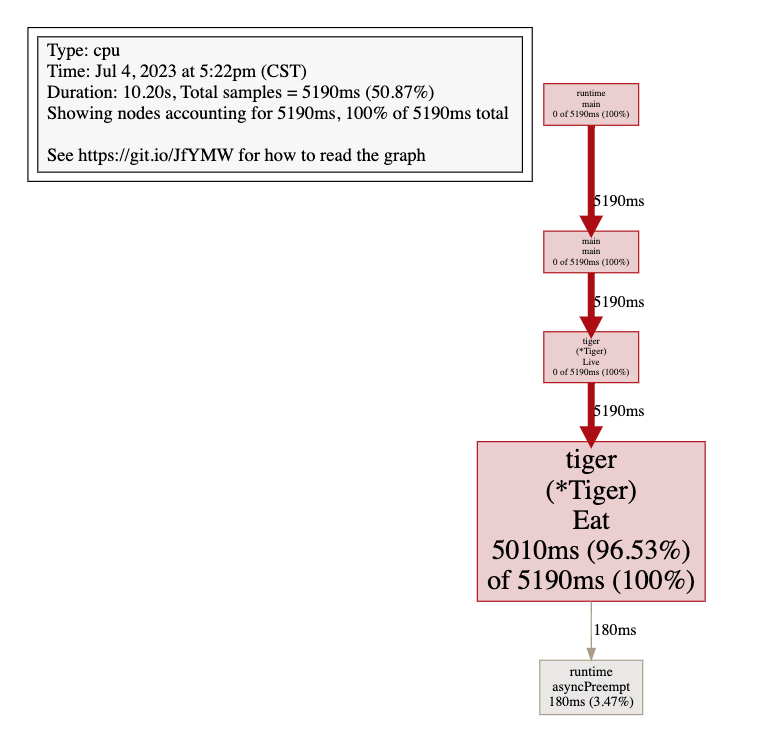

此外也可以在 Web UI 中切换到火焰图格式：点击 `VIEW -> Flame Graph`。

### 3.5 定位问题代码

通过 CPU 分析，可以定位到问题症结产生于 `Tiger.Eat` 函数：

```
func (t *Tiger) Eat() {
    log.Println(t.Name(), "eat")
    loop := 10000000000
    for i := 0; i < loop; i++ {
        // do nothing
    }
}
```

这里通过 for 循环大量空转打满 CPU。

### 3.6 runtime.asyncPreempt 原理

值得注意的是，在 CPU profile 中可能会看到 `runtime.asyncPreempt` 这个子函数耗时，这并非业务代码直接调用，而是 Go 1.14+ 引入的**基于信号量的非协作式抢占机制**所注入的让渡执行权函数：

- **监控线程**：Go 进程启动时会启动一个 monitor 线程，作为第三方观察者角色不断轮询探测各 goroutine 的执行情况，对执行时间过长的 goroutine 出手干预。
- **协作式抢占**：当 goroutine 在运行过程中发生栈扩张时（通常由函数调用引起），会触发预留的检查点逻辑，查看自己是否因执行过长被 monitor 标记，若是则主动让渡出 m 的执行权。在 Tiger.Eat 方法中，由于只是简单的 for 循环空转无法走到检查点，因此协作式抢占无法生效。
- **非协作式抢占**：Monitor 探测到 goroutine 超时会发送抢占信号，goroutine 所属 m 收到信号后，会修改 goroutine 的栈程序计数器 pc 和栈顶指针 sp，为其注入 `asyncPreempt` 函数。这样 goroutine 会调用该函数完成 m 执行权的让渡。

## 5. 内存占用分析 (heap)

### 4.1 排查命令

```shell
go tool pprof -http=:8080 "http://localhost:6060/debug/pprof/heap"
```

### 4.2 SAMPLE 选项说明

在 Web UI 的 `VIEW -> SAMPLE` 菜单中有几个关键选项：

| 类型            | 描述          |
| ------------- | ----------- |
| alloc_objects | 程序累计申请的对象数  |
| alloc_space   | 程序累计申请的内存大小 |
| inuse_objects | 程序当前持有的对象数  |
| inuse_space   | 程序当前占用的内存大小 |

### 4.3 文本信息解析

访问 `http://localhost:6060/debug/pprof/heap?debug=1` 可以看到纯文本格式的数据：

```
heap profile: 1: 1291845632 [21: 3371171968] @ heap/1048576
1: 1291845632 [1: 1291845632] @ 0x104303b48 0x1043033b8 0x104303cc0 0x10410938c 0x10413ca24
#        0x104303b47        github.com/wolfogre/go-pprof-practice/animal/muridae/mouse.(*Mouse).Steal+0xf7        /Users/bytedance/projects/go-pprof-practice/animal/muridae/mouse/mouse.go:60
#        0x1043033b7        github.com/wolfogre/go-pprof-practice/animal/muridae/mouse.(*Mouse).Live+0x47        /Users/bytedance/projects/go-pprof-practice/animal/muridae/mouse/mouse.go:25
#        0x104303cbf        main.main+0xbf                                                                        /Users/bytedance/projects/go-pprof-practice/main.go:31
#        0x10410938b        runtime.main+0x2bb
```

**第一行整体信息：**

| 字段 | 含义 |
| --- | --- |
| `1` | 活跃对象个数 |
| `1291845632` | 活跃对象大小（单位 byte，约 1.2 GB） |
| `21` | 历史至今所有对象个数 |
| `3371171968` | 历史至今所有对象总计大小（byte） |
| `1048576` | 内存采样频率（约每 1 MB 采样一次） |

### 4.4 图形化界面

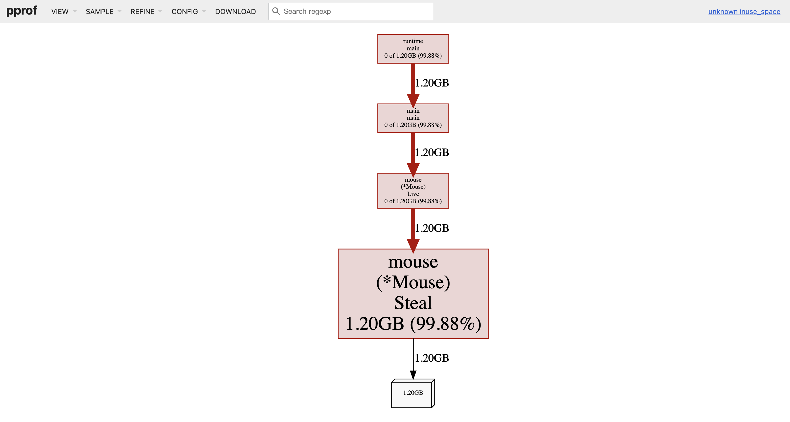

从图中可以看出 `Mouse` 的 `Steal` 方法占用的内存最多。点击 `VIEW -> SOURCE` 可以查看到具体的代码文件及行数：

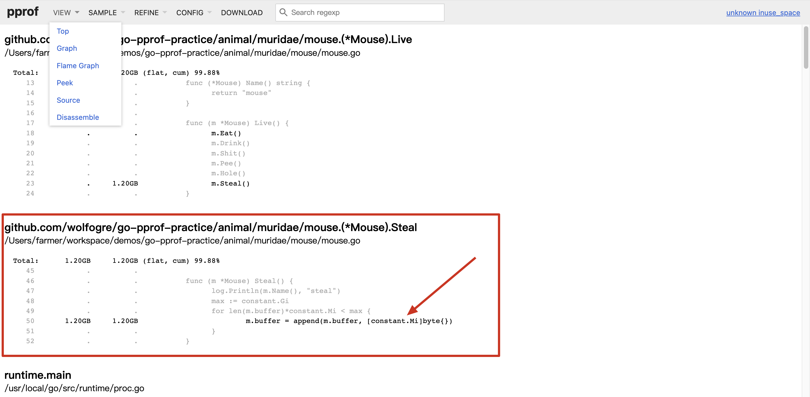

### 4.5 定位问题代码

内存占用过高的原因是 `Mouse.Steal` 方法不断向 buffer 追加 1 MiB 的数组，直到总容量到达 1 GiB：

```go
func (m *Mouse) Steal() {
    log.Println(m.Name(), "steal")
    max := constant.Gi
    for len(m.buffer)*constant.Mi < max {
        m.buffer = append(m.buffer, [constant.Mi]byte{})
    }
}
```

## 6. 协程泄漏分析 (goroutine)

虽然 Go 是带 GC 的，一般不会发生内存泄漏，但 `goroutine` 泄露也会导致内存泄漏。如果程序中 goroutine 数量异常升高且持续增长，说明存在泄漏。

### 5.1 排查命令

```shell
go tool pprof -http=:8080 "http://localhost:6060/debug/pprof/goroutine"
```

### 5.2 图形化界面

在 Web UI 中可以切换到 `VIEW -> Flame Graph`（火焰图）查看，`Graph` 和火焰图的关系与 CPU 分析中相同：

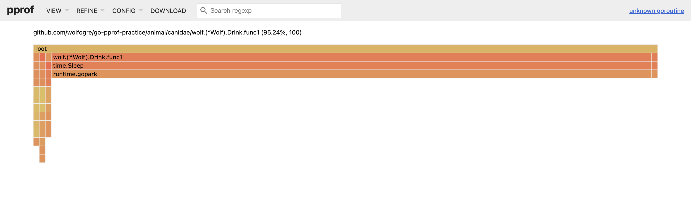

### 5.3 定位问题代码

从火焰图中可以看到 `wolf.(*Wolf).Drink.func1` 占了总 goroutine 数量的 95%，点击 `VIEW -> SOURCE` 查看具体代码位置：

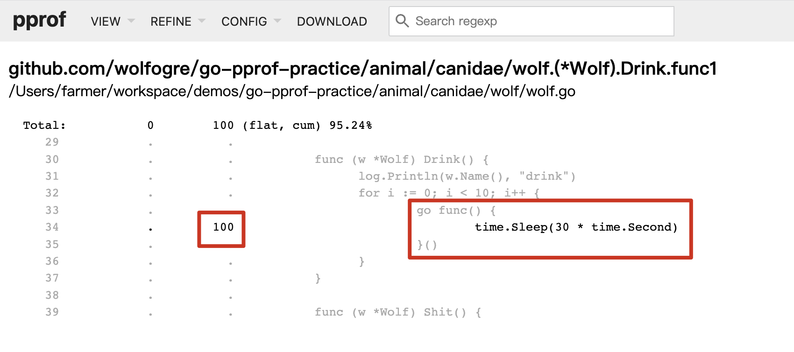

问题原因是 `Drink` 方法每次会起 10 个协程，每个协程 sleep 30 秒再退出，而 `Drink` 函数又被反复调用，导致大量协程泄漏：

```go
func (w *Wolf) Drink() {
    log.Println(w.Name(), "drink")
    for i := 0; i < 10; i++ {
        go func() {
            time.Sleep(30 * time.Second)
        }()
    }
}
```

修复后协程数量会降低到个位数水平。

## 7. 锁竞争分析 (mutex)

mutex 分析看的是某个 goroutine 持有锁的时长（`mutex.Lock` 到 `mutex.Unlock` 之间），且只有在存在**锁竞争关系**时才会上报这部分数据。

### 6.1 排查命令

```shell
go tool pprof -http=:8080 http://localhost:6060/debug/pprof/mutex
```

### 6.2 图形化界面

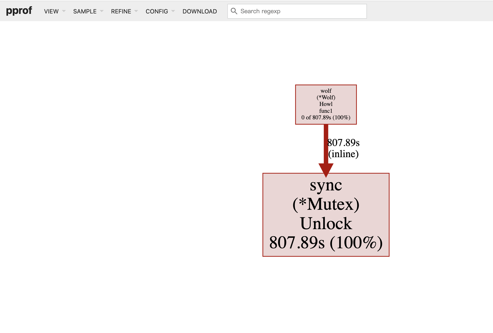

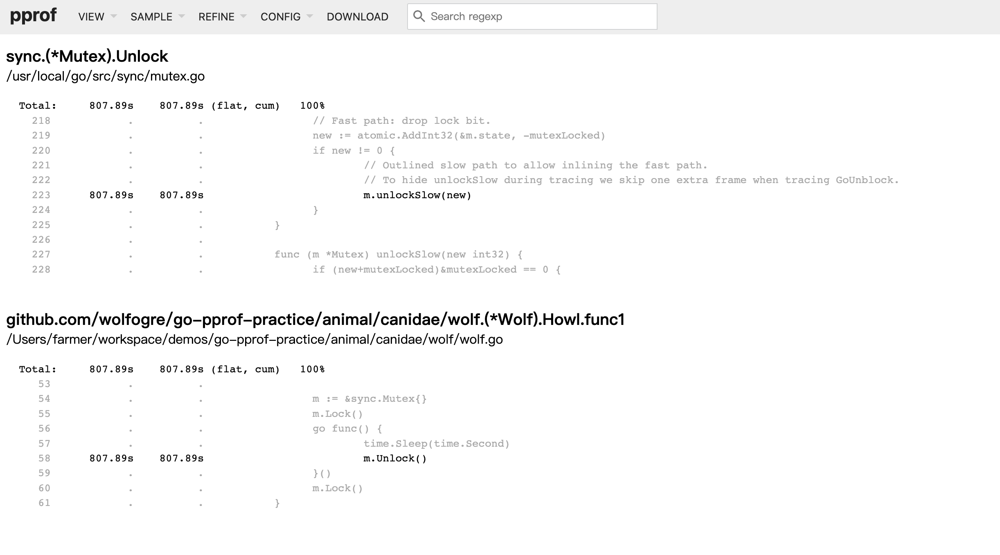

### 6.3 文本信息解析

访问 `http://localhost:6060/debug/pprof/mutex?debug=1` 可以看到纯文本数据：

```
--- mutex:
cycles/second=1000002767
sampling period=1
4007486874 4 @ 0x1024e24d4 0x1024e2495 0x10231ca24
#        0x1024e24d3        sync.(*Mutex).Unlock+0x73    /usr/local/go/src/sync/mutex.go:223
#        0x1024e2494        github.com/wolfogre/go-pprof-practice/animal/canidae/wolf.(*Wolf).Howl.func1+0x34    /Users/bytedance/projects/go-pprof-practice/animal/canidae/wolf/wolf.go:58
```

- `1000002767`：每秒的 CPU cycle 数
- `4007486874`：持有锁的 cycle 总数
- `4`：采样了 4 次

### 6.4 定位问题代码

锁由主协程 Lock，并启动子协程去 Unlock，主协程阻塞在第二次 Lock 等待子协程完成任务，但子协程足足睡眠了一秒：

```go
func (w *Wolf) Howl() {
    log.Println(w.Name(), "howl")
    m := &sync.Mutex{}
    m.Lock()
    go func() {
        time.Sleep(time.Second)
        m.Unlock()
    }()
    m.Lock()
}
```

## 8. 阻塞分析 (block)

block 分析查看 goroutine 陷入 waiting 状态（被动阻塞，通常因 `gopark` 操作触发，如加锁、读写 channel 条件不满足而陷入阻塞）的触发次数和持续时长。

### 7.1 排查命令

```shell
go tool pprof -http=:8080 http://localhost:6060/debug/pprof/block
```

### 7.2 图形化界面

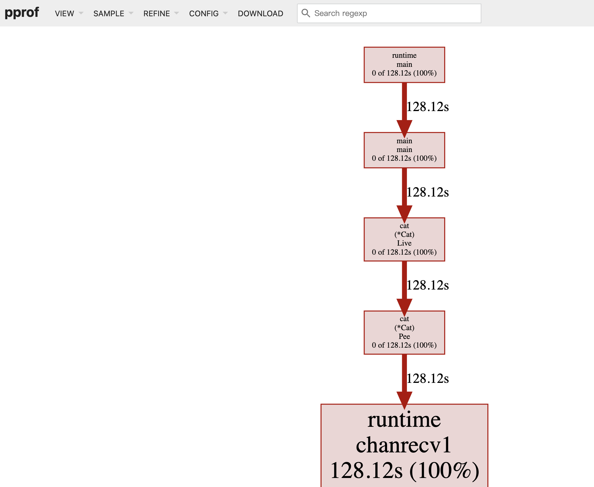

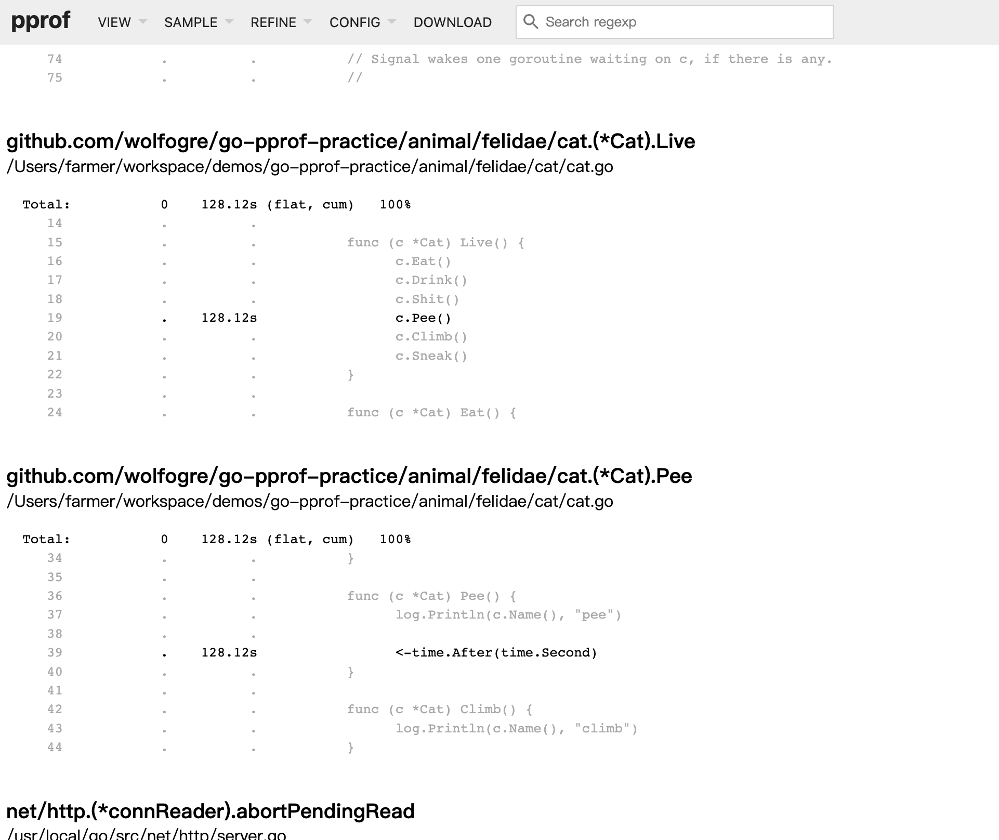

### 7.3 文本信息解析

访问 `http://localhost:6060/debug/pprof/block?debug=1` 可以看到纯文本数据：

```
--- contention:
cycles/second=1000002977
3002910915 3 @ 0x100052224 0x10027e9e4 0x10027e5d8 0x10027fb00 0x10008538c 0x1000b8a24
#        0x100052223        runtime.chanrecv1+0x13    /usr/local/go/src/runtime/chan.go:442
#        0x10027e9e3        github.com/wolfogre/go-pprof-practice/animal/felidae/cat.(*Cat).Pee+0xa3    /Users/bytedance/projects/go-pprof-practice/animal/felidae/cat/cat.go:39
```

- `cycles/second=1000002977`：每秒的 CPU cycle 数，pprof 在反映 block 时长时以 cycle 为单位
- `3002910915`：阻塞的 cycle 数，可换算为秒：`3002910915 / 1000002977 ≈ 3S`
- `3`：发生的阻塞次数

### 7.4 定位问题代码

问题代码是 `Cat.Pee`，每次调用时会通过 channel 读数据等待 1 秒，从而陷入阻塞：

```go
func (c *Cat) Pee() {
    log.Println(c.Name(), "pee")
    <-time.After(time.Second)
}
```

> 注意：阻塞不一定是有问题的。例如程序提供了 HTTP 的 pprof 服务，阻塞在对 HTTP 端口的监听上是正常的。

## 9. 高级技巧：基准比对 (Base 模式)

对于低频、偶发性或极其缓慢的内存泄漏（如接口每被调用一次泄漏 1 MiB），直接查看单次 heap 很难发现问题。此时可以通过 `-base` 选项比对两个时间点的采样数据，从而查看到指标的变化。

### 8.1 使用场景

假设一个低频调用的接口存在内存泄漏：
- 每次调用泄漏 1 MiB
- 每天被调用 10 次
- 服务分配了 100 MiB 空余内存
- 约每十天会 OOM

在排查时，由于内存增长缓慢，直接通过 pprof 采样单个文件几乎无法发现泄漏点。而 `-base` 选项通过比对两个时间点的采样增量数据，能够精准定位。

### 8.2 操作步骤

**第一步：获取基准样本（Base）。** 在服务启动后采集并保存：

```shell
curl -o heap-base http://localhost:6060/debug/pprof/heap
```

**第二步：获取目标样本（Target）。** 在程序运行一段时间（如数小时/数天）后再次采集：

```shell
curl -o heap-target http://localhost:6060/debug/pprof/heap
```

**第三步：比对样本。**

```shell
go tool pprof -http=:8080 -base heap-base heap-target
```

在 Web UI 中，页面上展示的即为增量数据：
- **绿色框**：代表该部分内存使用量减少
- **红色框/正向增长数值**：精准定位到发生缓慢泄漏的代码位置

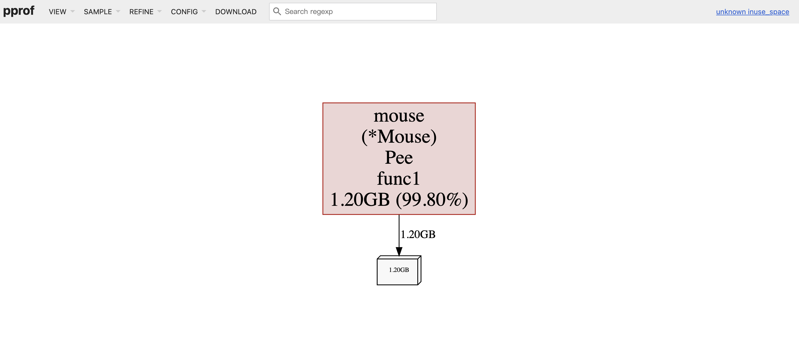

通过比对发现，`mouse` 的 `Pee` 方法增长了 1.20 GB，这就是内存泄漏点：

```go
func (m *Mouse) Pee() {
    log.Println(m.Name(), "pee")
    go func() {
        time.Sleep(time.Second * 30)
        max := constant.Gi
        for len(m.slowBuffer)*constant.Mi < max {
            m.slowBuffer = append(m.slowBuffer, [constant.Mi]byte{})
            time.Sleep(time.Millisecond * 500)
        }
    }()
}
```

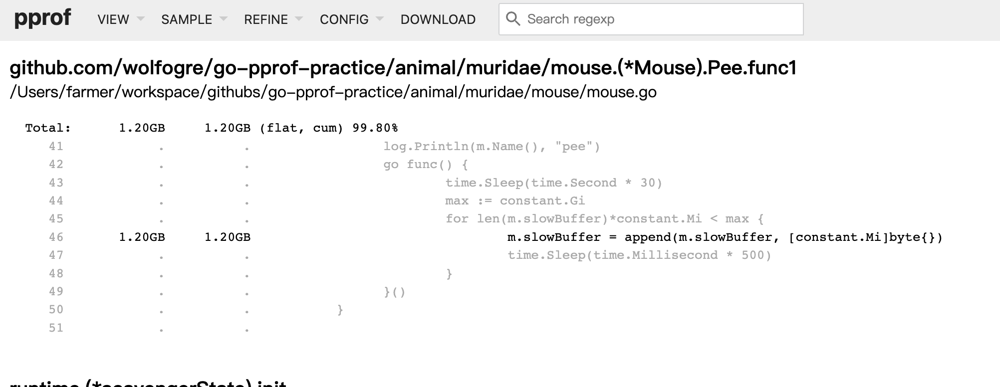

## 10. 总结

pprof 提供了极其丰富的多维度性能数据，是 Golang 性能分析的利器。实战中，推荐使用 `go tool pprof -http=:8080` 的 Web UI 方式，结合拓扑图（Graph）和火焰图（Flame Graph），并在 `View -> Source` 下定位具体的代码行，从而高效解决以下常见性能问题：

| 问题类型 | 使用工具 | 典型场景 |
| --- | --- | --- |
| CPU 空转 | `profile` | for 循环大量空转、密集计算 |
| 内存泄漏 | `heap` + `-base` 对比 | 对象不断追加未释放、goroutine 泄漏 |
| 协程堆积 | `goroutine` | goroutine 永久阻塞无法退出 |
| 锁竞争 | `mutex` | 锁持有时间过长、粒度过粗 |
| 阻塞等待 | `block` | channel 读写条件不满足、timer 等待 |

掌握以上排查流程和工具使用，能够帮助我们快速定位 Golang 程序中的各类性能瓶颈。
