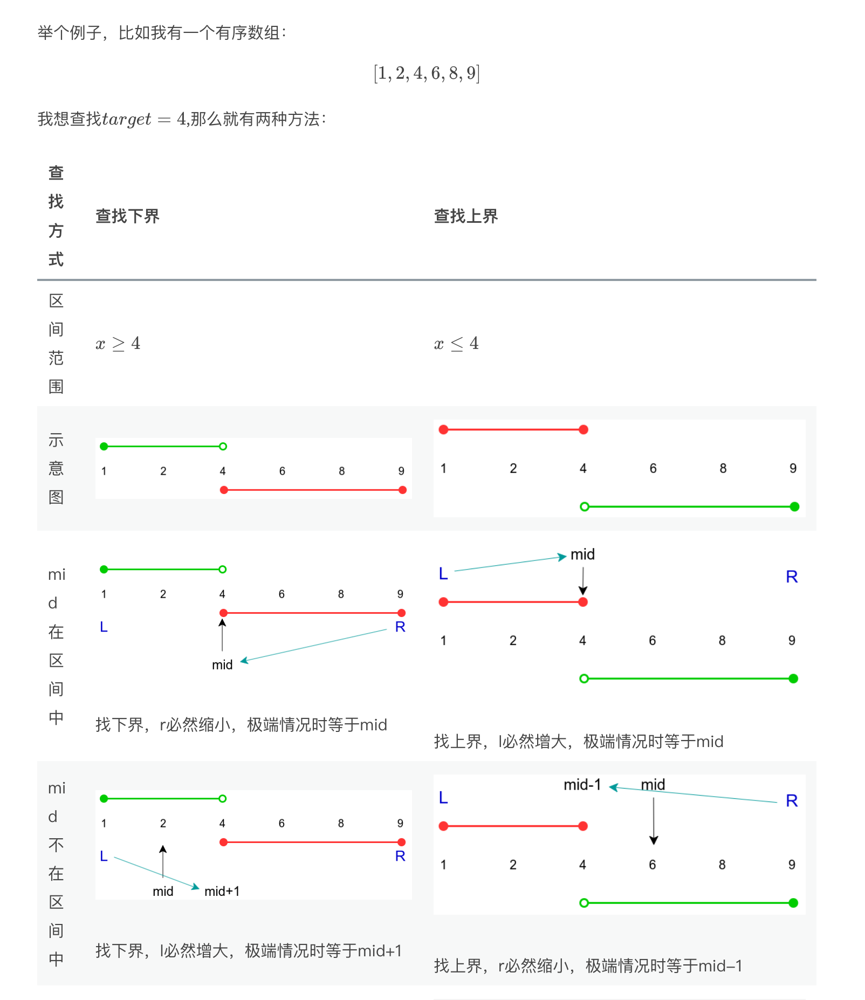

# 深入理解二分查找：本质与模板

## 1. 二分的本质：两段性而非单调性

很多人对二分查找的误解在于认为“数组必须是有序的（单调性）才能使用二分”。
实际上，**「二分」的本质是两段性**。

只要一段区间能够根据某个条件被划分为两部分：
- 一部分**满足**该条件
- 另一部分**不满足**该条件

我们就可以利用这个条件，通过二分查找快速缩小目标所在的区间。这就是所谓“两段性”的威力。

我们可以用以下图示直观地理解“两段性”：



*注：二分的核心任务就是找到这段分界线两边的“极值点”（上界或下界）。*

---

## 2. 统一模板：查找下界与查找上界

在实际应用中，二分查找通常分为两种情况：**查找满足条件的下界**（第一个满足条件的元素）和**查找满足条件的上界**（最后一个满足条件的元素）。为了降低心智负担，这里提供两套核心模板，循环结束时 `l == r`，直接返回 `l` 即可。

### 2.1 查找下界（左边界）
**场景**：寻找满足条件 `check(x) == true` 的**第一个**元素（例如：在一个有序数组中寻找第一个大于等于 `target` 的位置）。

```go
func searchLowerBound(l, r int) int {
    for l < r {
        mid := l + (r - l) >> 1
        if check(mid) {
            r = mid // mid 满足条件，答案可能是 mid 或在 mid 左边
        } else {
            l = mid + 1 // mid 不满足条件，答案一定在 mid 右边
        }
    }
    return l
}
```

### 2.2 查找上界（右边界）
**场景**：寻找满足条件 `check(x) == true` 的**最后一个**元素（例如：在一个有序数组中寻找最后一个小于等于 `target` 的位置）。

**图解上界查找**：
```go
func searchUpperBound(l, r int) int {
    for l < r {
        mid := l + (r - l + 1) >> 1 // 注意：这里需要 +1 向上取整，避免死循环
        if check(mid) {
            l = mid // mid 满足条件，答案可能是 mid 或在 mid 右边
        } else {
            r = mid - 1 // mid 不满足条件，答案一定在 mid 左边
        }
    }
    return l
}
```

**⚠️ 避坑指南：**
- **向上取整 vs 向下取整**：当使用 `l = mid` 时，`mid` 计算必须向上取整 `mid = l + (r - l + 1) >> 1`，否则在区间只剩两个元素（如 `[0, 1]`）时会陷入死循环。当使用 `r = mid` 时，向下取整即可。
- **防溢出**：使用 `l + (r - l) >> 1` 代替 `(l + r) >> 1` 可以防止大整数相加溢出。

---

## 3. 经典题型实战解析

### 3.1 寻找 x 的平方根（查找上界）
[LeetCode 69. x 的平方根](https://leetcode-cn.com/problems/sqrtx/)

**分析**：我们需要找到满足 `mid * mid <= x` 的**最大**整数，即寻找上界。这题完美契合模板二。
**代码**：
```go
func mySqrt(x int) int {
    l, r := 0, x
    for l < r {
        mid := l + (r - l + 1) >> 1
        // 为了防止 mid * mid 溢出，使用除法代替乘法
        if mid <= x / mid { 
            l = mid // 满足条件，尝试寻找更大的
        } else {
            r = mid - 1 // 不满足条件，必须缩小
        }
    }
    return l
}
```

### 3.2 第一个错误的版本（查找下界）
[LeetCode 278. 第一个错误的版本](https://leetcode-cn.com/problems/first-bad-version/)

**分析**：版本序列中，一旦某个版本出错，后面的全错。呈现 `[false, false, true, true]` 的两段性。我们需要找**第一个** `true`，即寻找下界，套用模板一。
**代码**：
```go
// 假设这是外部提供的 API
func isBadVersion(version int) bool

func firstBadVersion(n int) int {
    l, r := 1, n
    for l < r {
        mid := l + (r - l) >> 1
        if isBadVersion(mid) {
            r = mid // 是错误版本，可能是第一个，也可能在左边
        } else {
            l = mid + 1 // 不是错误版本，第一个错误版本必定在右边
        }
    }
    return l
}
```

### 3.3 寻找旋转排序数组中的最小值
[LeetCode 153. 寻找旋转排序数组中的最小值](https://leetcode-cn.com/problems/find-minimum-in-rotated-sorted-array/)

**分析**：数组被旋转后，变成了两段递增的区间。如果我们将所有元素与最后一个元素 `nums[r]` 比较，会发现：最小值右侧的元素都 `< nums[r]`（如果无旋转则是 `<= nums[r]`），而最小值左侧的元素都 `> nums[r]`。这就构成了两段性。我们要找的是满足 `<= nums[r]` 的第一个元素（下界）。
**代码**：
```go
func findMin(nums []int) int {
    l, r := 0, len(nums)-1
    for l < r {
        mid := l + (r - l) >> 1
        if nums[mid] <= nums[r] {
            r = mid // mid 落在右侧递增区间，最小值在左侧或就是 mid
        } else {
            l = mid + 1 // mid 落在左侧递增区间，最小值必然在右侧
        }
    }
    return nums[l]
}
```

### 3.4 寻找峰值
[LeetCode 162. 寻找峰值](https://leetcode-cn.com/problems/find-peak-element/description/)

**分析**：峰值元素是指其值严格大于左右相邻值的元素。我们只需比较 `nums[mid]` 和 `nums[mid+1]`：
- 如果 `nums[mid] > nums[mid+1]`，说明处于下降趋势，峰值必定在左侧（包含 `mid`）。
- 如果 `nums[mid] < nums[mid+1]`，说明处于上升趋势，峰值必定在右侧。

这也是一种巧妙的两段性！我们要找的是下降趋势的第一个点（下界）。
**代码**：
```go
func findPeakElement(nums []int) int {
    l, r := 0, len(nums)-1
    for l < r {
        mid := l + (r - l) >> 1
        if nums[mid] > nums[mid+1] {
            r = mid // 处于下降趋势，峰值在左侧或就是 mid
        } else {
            l = mid + 1 // 处于上升趋势，峰值在右侧
        }
    }
    return l
}
```

---

## 4. 总结

1. **破除单调性迷信**：做二分题的核心是寻找**两段性**，只要能找到一个条件将搜索空间分为“满足”和“不满足”两半，就可以二分。
2. **三步走策略**：
   - 确定要查找的是**第一个满足条件的值（下界）**还是**最后一个满足条件的值（上界）**。
   - 构造 `check(mid)` 函数。
   - 根据查找目标套用对应的模板（注意 `mid` 的计算是否需要 `+1`）。
3. **闭区间优势**：这套模板中 `l` 和 `r` 始终是有效值，循环结束时 `l == r`，不需要纠结最后返回 `l` 还是 `r`，极大地降低了心智负担。

## 5.几点说明

- 初始right 一定是边界的下一个值，也就是一个到不了的值
- for 循环一定是 left<right，不然就会死循环
- if mid < len(nums) && mid >= 0 && nums[mid] >= target 可以理解是 inRange()方法，也就是在区间中，这里最好对 mid的边界做一下判断，不然会有越界风险
- 退出循环时 left等于right，所以返回left 和 right 是一样的
- 查右边因为上面做了越界检测，所以 left的返回值不会越界，但是 nums[left]可能不等 target，所以做一步检测是最保险的
- 查左边，最后一步时，left可能等于mid+1,就可能越界，所以最好，所有的都一齐检测
- 查左边是向下取整数，查右边是向上取整，这是难点
- 很多题目是计算个数，这时就需要知道返回的 left 的范围，查左边是：left 是[0:N],也就是右边可能越界，所以要检查，查右边left是 [0:N-1],左右都不会越界，但是可能不是正确的值，所以最好都检测
