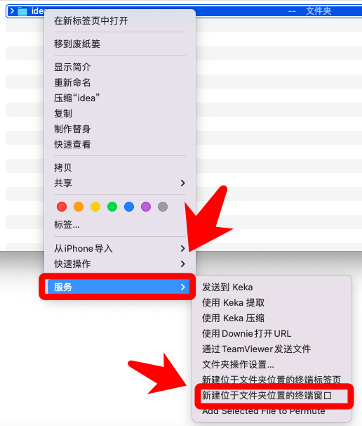

# 开发工具与环境

## 目录

- [7.1 idea_激活](#71-idea_激活)
- [7.2 ideavimrc](#72-ideavimrc)
- [7.3 iTerm2的Profiles免输入密码](#73-iTerm2的Profiles免输入密码)
- [7.4 jfrog安装](#74-jfrog安装)
- [7.5 vagrant_root_登录虚拟机](#75-vagrant_root_登录虚拟机)

---

## 7.1 idea_激活

# idea 激活
2、右键【idea】，选择【服务】，然后选择【新建位于文件夹位置的终端窗口】3、 输入【bash idea.sh】，然后回车
4、 显示【success! Activate idea to 2099】,关闭终端ps：如果显示无权限，再输入【sudo bash idea.sh】，可以找客服确认
idea.zip
### 73.09KB

### 相关图片


---

---

## 7.2 ideavimrc

set scrolloff=5

" Don't use Ex mode, use Q for formatting.
map Q gq

" --- Enable IdeaVim plugins https://jb.gg/ideavim-plugins

" Vim 的默认寄存器和系统剪贴板共享set clipboard+=unnamed
set history=100000

" select模式下复制if has("clipboard")
vnoremap <C-C> "+yendif

" 不用方向键进行移动nnoremap <Up> <Nop>
nnoremap <Down> <Nop>nnoremap <Left> <Nop>
nnoremap <Right> <Nop>let mapleader=' '

" ==================================================" Show all the provided actions via `:actionlist`
" ==================================================" project search

nnoremap <Leader>fg :action SearchEverywhere<CR>nnoremap <Leader>ff :action ReformatCode<CR>
nnoremap <Leader>fi :action CollapseAllRegions<CR>nnoremap <Leader>fo :action ExpandAllRegions<CR>
nnoremap <Leader>fn :action Generate<CR>nnoremap <Leader>fb :action GotoImplementation<CR>
nnoremap <Leader>fc :action CommentByLineComment<CR>nnoremap <Leader>fr :action RecentFiles<CR>
nnoremap <Leader>fj :action FindInPath<CR>nnoremap <Leader>fk :action ShowUsages<CR>

nnoremap <Leader>wn :action Back<CR>nnoremap <Leader>wg :action HideAllWindows<CR>
nnoremap <Leader>wh :action SelectInProjectView<CR>nnoremap <Leader>wt :action ActivateTerminalToolWindow<CR>
nnoremap <Leader>wi :action EditorLineStart<CR>nnoremap <Leader>wo :action EditorLineEnd<CR>
nnoremap <Leader>wb :action GotoDeclaration<CR>

---

## 7.3 iTerm2的Profiles免输入密码

找一个目录创建一个普通文件，例：vim 192.168.110.120_test编辑一下内容，把自己的信息填写上去。
打开 iterm2 -> preferences -> Profiles点击下面 “+” 号，新建一个 profile。
选择 Command 在输入框中输入expect + 刚才建的文件路径
#!/usr/bin/expect
- set PORT 22
- set HOST ***.**.12.20
- set USER root
- set PASSWORD ************
- spawn ssh -p $PORT $USER@$HOST
- expect {
- "yes/no" {send "yes\r";exp_continue;}
- "*password:*" { send "$PASSWORD\r" }
- }
- interact

---

---

## 7.4 jfrog安装

jfrog apihttps://jfrog.com/xray/install/
https://www.jfrog.com/confluence/display/JFROG/Artifactory+REST+API#ArtifactoryRESTAPI-ListDockerTags

---

---

## 7.5 vagrant_root_登录虚拟机

# vagrant root 登录虚拟机
第一步，新建root用户第二步，切换到root用户
### 第三步改配置
### 经过上面步之后，就可以使用root登录，但是每次都还是要输入密码，不方便
每四步，加公钥，这一步要注意，一定是在rpwdoot用户的家目录下加sudo passwd root
- // 然后输入密码
- su root
- // 输入密码
```bash
sudo apt install openssh-client
```
```bash
sudo apt install openssh-server
```
- vim /etc/ssh/sshd_config
# PermitRootLogin prohibit-password
- PermitRootLogin yes             # 允许 root 身份登录
# PasswordAuthentication on
### PasswordAuthentication yes      # 可以使用密码登录
- 重启ssh服务
- service sshd restart
- /etc/init.d/ssh restart // ubuntu
```bash
systemctl restart ssh.service // ubuntu
```

---
之后就可以退出vagrant，然后编辑Vagrantfile，加入如下内容，之后就默认以root登录，且不需要输入密码了
vagrant打包当前虚拟机一，进入虚拟机目录
二，打包其中 --output 表示打包的文件名
三，加入到box,liuqianli/k8scent 表法box名字，liuqianli/ubuntu2021.box 表示box文件的地址，这里是当前路径下
- vim ~/.ssh/authorized_keys
- // 然后加入自己的公钥，（~/.ssh/is_rsa.pub里的内容）
- config.vm.network :private_network, ip: "192.168.199.105"
- config.ssh.username = "root"
### # 如果不加公钥的话每次都还是要输入密码，也就是说这里的配置不起作用，vagrant默认是秘钥登录
- config.ssh.password = "root"
- config.ssh.private_key_path = "/Users/liuqianli/.ssh/id_rsa"
- cd ~/environment/vagrant/k8s/node1
- vagrant package  --output liuqianli/ubuntu2021.box
- vagrant box add liuqianli/k8scent liuqianli/ubuntu2021.box

---
### 四，然后就可以在Vagrantfile里使用

---

---
