# 系统监控与性能分析

## 目录

- [1.1 iostat的用法](#11-iostat的用法)
- [1.2 lsof用法](#12-lsof用法)
- [1.3 top_htop_iotop的简单使用](#13-top_htop_iotop的简单使用)
- [1.4 vmstat_pidstat_dstat_mpstat的用法](#14-vmstat_pidstat_dstat_mpstat的用法)

---

## 1.1 iostat的用法

## 工具简介

iostat工具将对系统的磁盘操作活动进行监视。它的特点是汇报磁盘活动统计情况，同时也会汇报出CPU使用情况。同vmstat一样，iostat也有一个弱点，就是它不能对某个进程进行深入分析，仅对系统的整体情况进行分析。

## 基本用法

```bash
iostat [参数] [时间] [次数]
```

## 常用参数选项

- `-c` 显示CPU使用情况
- `-d` 显示磁盘使用情况
- `-k` 以K为单位显示
- `-m` 以M为单位显示
- `-N` 显示磁盘阵列(LVM) 信息
- `-n` 显示NFS使用情况
- `-p` 可以报告出每块磁盘的每个分区的使用情况
- `-t` 显示终端和CPU的信息
- `-x` 显示详细信息

## 常用命令示例

### 显示详细I/O性能指标
```bash
iostat -x -d 1
```
`-d` 表示显示I/O性能指标，`-x` 表示显示扩展统计（即所有I/O指标），`1` 表示每秒刷新一次。

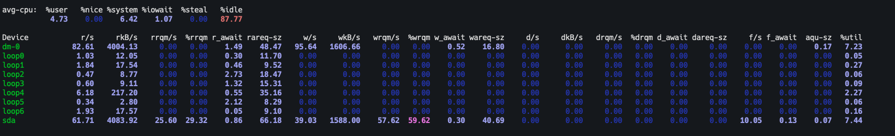

## 输出内容详解

### CPU相关指标
- `%user`：CPU处在用户模式下的时间百分比
- `%nice`：CPU处在带NICE值的用户模式下的时间百分比
- `%system`：CPU处在系统模式下的时间百分比
- `%iowait`：CPU等待输入输出完成时间的百分比
- `%steal`：管理程序维护另一个虚拟处理器时，虚拟CPU的无意识等待时间百分比
- `%idle`：CPU空闲时间百分比

### 磁盘I/O相关指标

## 当然了，iostat命令的重点不是用来看CPU的，重点是用来监测磁盘性能的。

- `Device`：设备名称
- `rrqm/s`：每秒合并到设备的读取请求数
- `wrqm/s`：每秒合并到设备的写请求数
- `r/s`：每秒向磁盘发起的读操作数
- `w/s`：每秒向磁盘发起的写操作数
- `rkB/s`：每秒读K字节数
- `wkB/s`：每秒写K字节数
- `avgrq-sz`：平均每次设备I/O操作的数据大小
- `avgqu-sz`：平均I/O队列长度
- `await`：平均每次设备I/O操作的等待时间 (毫秒)，一般地，系统I/O响应时间应该低于5ms，如果大于10ms就比较大了
- `r_await`：每个读操作平均所需的时间；不仅包括硬盘设备读操作的时间，还包括了在kernel队列中等待的时间
- `w_await`：每个写操作平均所需的时间；不仅包括硬盘设备写操作的时间，还包括了在kernel队列中等待的时间
- `svctm`：平均每次设备I/O操作的服务时间 (毫秒)（这个数据不可信！）
- `%util`：一秒中有百分之多少的时间用于I/O操作，即被IO消耗的CPU百分比，一般地，如果该参数是100%表示设备已经接近满负荷运行了

### 监控示例
```bash
iostat 2 3
```

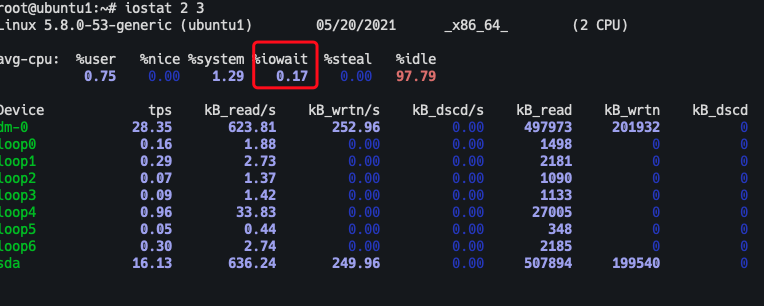

主要关注sda这一行，因为我的机器是在虚拟机中，所以有loop这些行。

## 重点关注的指标

- **%iowait**：如果该值较高，表示磁盘存在I/O瓶颈
- **await**：一般地，系统I/O响应时间应该低于5ms，如果大于10ms就比较大了
- **avgqu-sz**：如果I/O请求压力持续超出磁盘处理能力，该值将增加。如果单块磁盘的队列长度持续超过2，一般认为该磁盘存在I/O性能问题。需要注意的是，如果该磁盘为磁盘阵列虚拟的逻辑驱动器，需要再将该值除以组成这个逻辑驱动器的实际物理磁盘数目，以获得平均单块硬盘的I/O等待队列长度
- **%util**：一般地，如果该参数是100%表示设备已经接近满负荷运行了

## 业务分析建议

## 除了关注指标外，我们更需要结合部署的业务进行分析：

- **磁盘随机读写频繁的业务**：比如图片存取、数据库、邮件服务器等，此类业务中，TPS才是关键点
- **顺序读写频繁的业务**：需要传输大块数据的，如视频点播、文件同步，关注的是磁盘的吞吐量

---

## 1.2 lsof用法

```bash

## lsof可以查看打开的文件虽然lsof命令有着N多的选项，但是常用的只有以下几个：

```

## 常用法命令：lsof abc.txt

## 说明：显示开启文件abc.txt的进程命令：lsof -i :80

## 说明：列出80端口目前打开的文件列表命令：lsof -i

## 说明：列出所有的网络连接命令：lsof -i tcp

### 说明：列出所有的TCP网络连接信息

## 命令：lsof -i udp

### 说明：列出所有的UDP网络连接信息

## 命令：lsof -i tcp:80

### 说明：列出80端口TCP协议的所有连接信息

## 命令：lsof -i udp:25

### 说明：列出25端口UDP协议的所有连接信息
### -a：使用AND逻辑，合并选项输出内容
-c：列出名称以指定名称开头的进程打开的文件
-d：列出打开指定文件描述的进程
- +d：列出目录下被打开的文件
### +D：递归列出目录下被打开的文件
### -n：列出使用NFS的文件
-u：列出指定用户打开的文件
-p：列出指定进程号所打开的文件
-i：列出打开的套接字

---

## 命令：lsof -c ngin说明：列出以ngin开头的进程打开的文件列表

## 命令：lsof -p 20711说明：列出指定进程打开的文件列表

## 命令：lsof -u uasp说明：列出指定用户打开的文件列表、

## 命令：lsof -u uasp -i tcp

### 说明：将所有的TCP网络连接信息和指定用户打开的文件列表信息一起输出，或的关系

## 命令：lsof -a -u uasp -i tcp

### 说明：将指定用户打开的文件列表信息，同时是TCP网络连接信息的一起输出；注意和上一条命令进

## 行对比，且的关系命令：lsof +d /usr/local/

## 说明：列出目录下被进程打开的文件列表命令：lsof +D /usr/local/

说明：递归搜索目录下被进程打开的文件列表命令：lsof -i @peida.linux:20,21,22,25,53,80 -r 3
说明：列出目前连接到主机peida.linux上端口为20，21，22，25，53，80相关的所有文件信息，且每隔3秒不断的执行lsof指令

---

---

## 1.3 top_htop_iotop的简单使用

# top htop iotop的简单使用
一，top下图是mac的top，信息比liunx全的多
解析:

### 相关图片
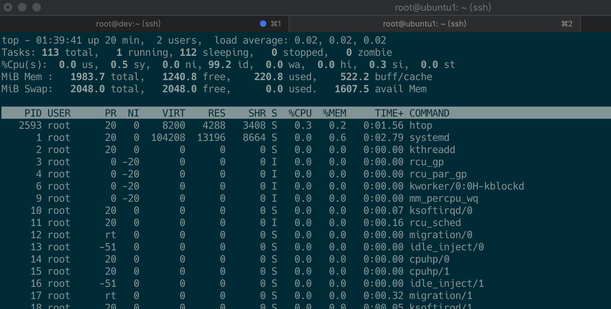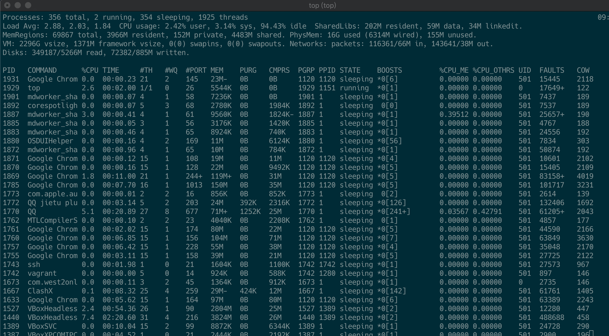

---

## 其他交互命令二，htop

### htop不是系统自带的，需要安装
指标所表示的信息和top是一样的，只是htop提供了一个交互式的页面，可以直接用鼠标点击，然后就
### 可以排序，当然htop还有其他很多高级功能，这些高级功能不需要研究，因为使用麻烦，还可以用其

## 他的命令代替

### PID：进程的ID
### USER：进程所有者
### PR：进程的优先级别，越小越优先被执行
- NI: nice值
### VIRT：进程占用的虚拟内存
### RES：进程占用的物理内存
### SHR：进程使用的共享内存
### S：进程的状态。S表示休眠，R表示正在运行，Z表示僵死状态，N表示该进程优先值为负数
### %CPU：进程占用CPU的使用率
### %MEM：进程使用的物理内存和总内存的百分比
### TIME+：该进程启动后占用的总的CPU时间，即占用CPU使用时间的累加值。
### COMMAND：进程启动命令名称
- ＜空格＞：立刻刷新。
### P：根据CPU使用大小进行排序
### T：根据时间、累计时间排序。
- q：退出top命令。
- m：切换显示内存信息。
- t：切换显示进程和CPU状态信息。
- c：切换显示命令名称和完整命令行。
### M：根据使用内存大小进行排序。
### W：将当前设置写入~/.toprc文件中。这是写top配置文件的推荐方法。
```bash
sudo apt-get install htop
```

---
三，iotop查看Io的情况根据io的大于对进程排序查看
各个指标的意义也很明显以下是几个常用的用法，iotop的快捷键

### 相关图片
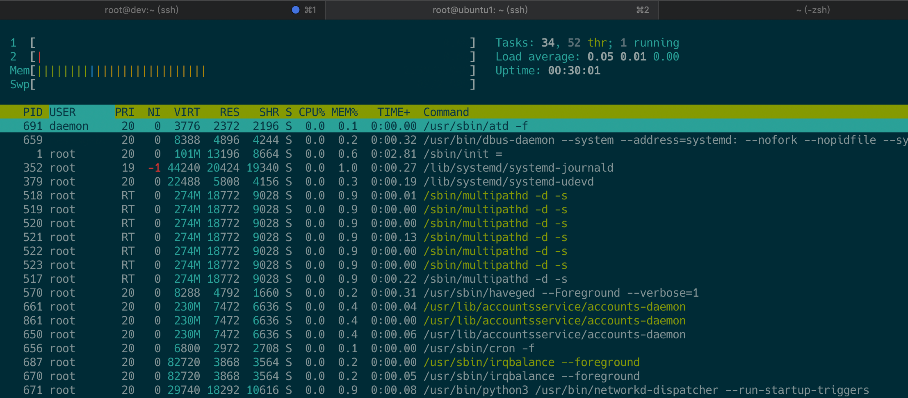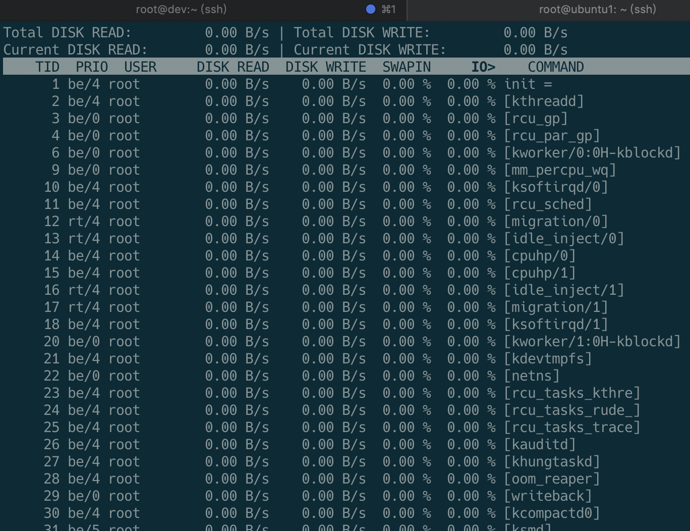

---
两个常用的交互式用法
### 1：只显示正在产生I/O的进程

## 2：借助iotop命令找到消耗I/O最高的进程r：反向排序，

- o：切换至选项--only，也就是说查找当前正在产生IO的进程，并按IO大小排序好，
- p：切换至--processes选项，
- a：切换至--accumulated选项
- q：退出
- i：改变线程的优先级
- iotop -o
- iotop -op

---

---

## 1.4 vmstat_pidstat_dstat_mpstat的用法

# vmstat pidstat dstat mpstat的用法
一，vmstatvmstat是Virtual Meomory Statistics（虚拟内存统计）的缩写，可对操作系统的虚拟内存、进程、
### CPU活动进行监控。它是对系统的整体情况进行统计，不足之处是无法对某个进程进行深入分析。
```bash
vmstat工具提供了一种低开销的系统性能观察方式。因为vmstat本身就是低开销工具，在非常高负荷
```
### 的服务器上，你需要查看并监控系统的健康情况，在控制窗口还是能够使用vmstat输出结果
用法:

## 常用选项不加参数时

## 字段说明：

- vmstat [options] [delay [count]]
### // 最常使用的用法就是使用默认值
- vmstat 3 3
-a：显示活跃和非活跃内存
-f：显示从系统启动至今的fork数量 。
-m：显示slabinfo
-n：只在开始时显示一次各字段名称。
-s：显示内存相关统计信息及多种系统活动数量。
- delay：刷新时间间隔。如果不指定，只显示一条结果。
- count：刷新次数。如果不指定刷新次数，但指定了刷新时间间隔，这时刷新次数为无穷。
-d：显示磁盘相关统计信息。
-p：显示指定磁盘分区统计信息
### -S：使用指定单位显示。参数有 k 、K 、m 、M，分别代表1000、1024、1000000、1048576字节
- （byte）。默认单位为K（1024 bytes）
-V：显示vmstat版本信息。

### 相关图片
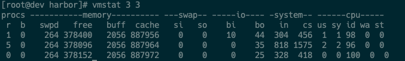

---
1、 procs（进程）r：当前运行队列中线程的数目，代表线程处于可运行状态，但CPU还未能执行.，这个值可以作为判
断CPU是否繁忙的一个指标；当这个值超过了CPU数目(原则上一核的cpu,数值不要超过2,整个系统的运行队列不能超过系统的2倍)，就会出现CPU瓶颈了；这个我们可以结合top命令的负载值同步评估系
统性能；

## b：等待IO的进程数量；如果该值一直都很大，说明IO比较繁忙，处理较慢；

2，memory（内存）
### swpd：虚拟内存已使用的大小；如果swpd的值不为0，但是si，so的值长期为0，这种情况不会影
响系统性能；
free：空闲的物理内存的大小；
buff：用作缓冲的内存大小；
cache：用作缓存的内存大小；如果cache的值大的时候，说明cache处的文件数多，如果频繁访问到的文件都能被cache处，那么磁盘的读IO bi会非常小；
3、swap（交换空间，单位：KB）
### 内存够用的时候，这2个值都是0，如果这2个值长期大于0时，系统性能会受到影响，磁盘IO和CPU资
源都会被消耗。有时我们看到空闲内存（free）很少的或接近于0时，就认为内存不够用了，不能光看这一点，还要结合si和so，如果free很少，但是si和so也很少（大多时候是0），那么不用担心，系统
性能这时不会受到影响的；
si：每秒从交换区写到内存的大小；
so：每秒写入交换区的内存大小；

## 4、io（单位：块/秒），注意，这里的单位是块/秒bi：每秒读取的块数；

bo：每秒写入的块数；随机磁盘读写的时候，这2个值越大，能看到CPU在IO等待的值也会越大；
5、system（系统）；这2个值越大，会看到由内核消耗的CPU时间会越大；
in：每秒中断数，包括时钟中断；
cs：每秒上下文切换数；
6、cpu（以百分比表示）us：用户进程执行时间(user time)；
sy：系统进程执行时间(system time)；如果us+sy大于80说明cup不足id：空闲时间(包括IO等待时间)；
wa：等待IO时间；wa的值高时，说明IO等待比较严重，这可能由于磁盘大量作随机访问造成，也有可能磁盘出现瓶颈。

---
二、pidstatpidstat是sysstat工具的一个命令，用于监控全部或指定进程的cpu、内存、线程、设备IO等系统资源
的占用情况。pidstat首次运行时显示自系统启动开始的各项统计信息，之后运行pidstat将显示自上次运行该命令以后的统计信息。用户可以通过指定统计的次数和时间来获得所需的统计信息。
### 1、pidstat 安装
pidstat 是sysstat软件套件的一部分，sysstat包含很多监控linux系统状态的工具，它能够从大多数linux发行版的软件源中获得。

## 常用选项

### 示例一：查看所有进程的  CPU 使用情况（ -u -p ALL）
```bash
apt-get install sysstat
```
```bash
yum install sysstat
```
- 常用的参数：
### -u：默认的参数，显示各个进程的cpu使用统计
### -r：显示各个进程的内存使用统计
### -d：显示各个进程的IO使用情况
-p：指定进程号
-w：显示每个进程的上下文切换情况
-t：显示选择任务的线程的统计信息外的额外信息
### -T { TASK | CHILD | ALL }
这个选项指定了pidstat监控的。TASK表示报告独立的task，CHILD关键字表示报告进程下所有线程统计信息。ALL表示报告独立的task和task下面的所有线程。
注意：task和子线程的全局的统计信息和pidstat选项无关。这些统计信息不会对应到当前的统计间隔，这些统计信息只有在子线程kill或者完成的时候才会被收集。
### -V：版本号
-h：在一行上显示了所有活动，这样其他程序可以容易解析。
### -I：在SMP环境，表示任务的CPU使用率/内核数量
-l：显示命令名和所有参数

---
### 示例三： 内存使用情况统计(-r)
- pidstat 3 1
- // 上面命令和 pidstat -u -p ALL 是等效的。
- 详细说明
### PID：进程ID
- %usr：进程在用户空间占用cpu的百分比
- %system：进程在内核空间占用cpu的百分比
- %guest：进程在虚拟机占用cpu的百分比
- %CPU：进程占用cpu的百分比
- CPU：处理进程的cpu编号
- Command：当前进程对应的命令
- pidstat -r

### 相关图片
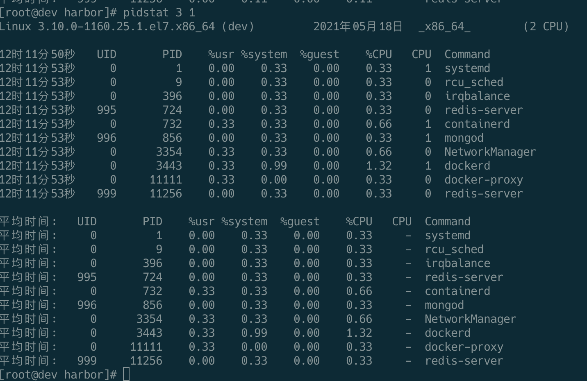

---

## 各参数的意义

### 示例四：显示各个进程的IO使用情况（-d）
### PID：进程标识符
- Minflt/s:任务每秒发生的次要错误，不需要从磁盘中加载页
- Majflt/s:任务每秒发生的主要错误，需要从磁盘中加载页
### VSZ：虚拟地址大小，虚拟内存的使用KB
### RSS：常驻集合大小，非交换区里内存使用KB
- Command：task命令名
- pidstat -d

### 相关图片
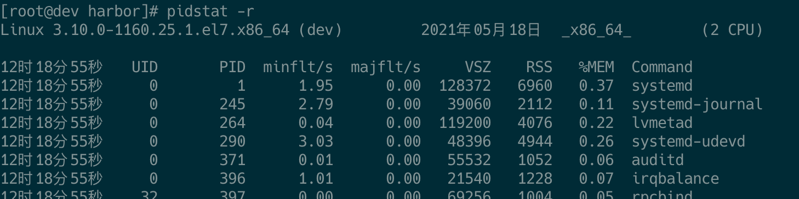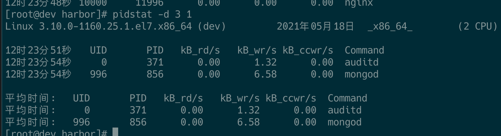

---

## 示例五：显示每个进程的上下文切换情况（-w）PID：进程id

- kB_rd/s：每秒从磁盘读取的KB
- kB_wr/s：每秒写入磁盘KB
- kB_ccwr/s：任务取消的写入磁盘的KB。当任务截断脏的pagecache的时候会发生。
- COMMAND:task的命令名
- pidstat -w 3 1
- PID:进程id
- Cswch/s:每秒主动任务上下文切换数量
- Nvcswch/s:每秒被动任务上下文切换数量
- Command:命令名

### 相关图片
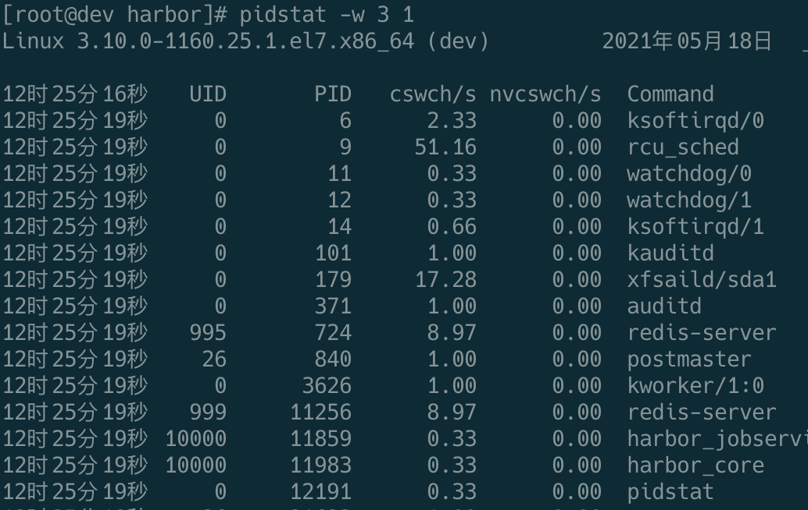

---
示例六：显示选择任务的线程的统计信息外的额外信息 (-t)，也就是进程在各个状态所占用的cpu时间百分比
三，dstatdstat命令是一个用来替换vmstat、iostat、netstat、nfsstat和ifstat这些命令的工具，是一个全能系统
信息统计工具。与sysstat相比，dstat拥有一个彩色的界面，在手动观察性能状况时，数据比较显眼容易观察；而且dstat支持即时刷新，譬如输入dstat 3即每三秒收集一次，但最新的数据都会每秒刷新显
### 示。和sysstat相同的是，dstat也可以收集指定的性能资源，譬如dstat -c即显示CPU的使用情况
### 安装
- pidstat -t 3 1
### TGID:主线程的表示
- TID:线程id
- %usr：进程在用户空间占用cpu的百分比
- %system：进程在内核空间占用cpu的百分比
- %guest：进程在虚拟机占用cpu的百分比
- %CPU：进程占用cpu的百分比
- CPU：处理进程的cpu编号
- Command：当前进程对应的命令
```bash
yum install -y dstat
```

### 相关图片
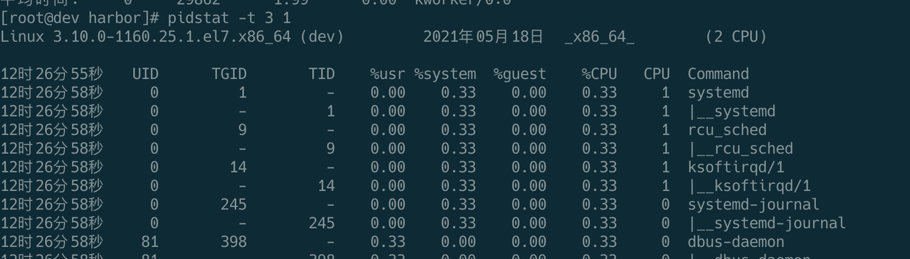

---
用法：
### 直接使用dstat，默认使用的是-cdngy参数，分别显示cpu、disk、net、page、system信息，默认是
1s显示一条信息。可以在最后指定显示一条信息的时间间隔，如dstat 5是没5s显示一条，dstat 5 10表示没5s显示一条，一共显示10条。
其中：
cpu：hiq、siq分别为硬中断和软中断次数。
system：int、csw分别为系统的中断次数（interrupt）和上下文切换（context switch）常用参数
- dstat [-afv] [options..] [delay [count]]

### 相关图片
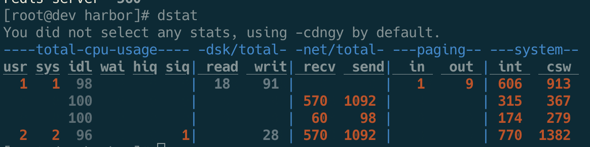

---
其他一些常见用法四，mpstat
-c：显示CPU系统占用，用户占用，空闲，等待，中断，软件中断等信息。
-C：当有多个CPU时候，此参数可按需分别显示cpu状态，例：-C 0,1 是显示cpu0和cpu1的信息。
-d：显示磁盘读写数据大小。
-D hda,total：include hda and total。
-n：显示网络状态。
-N eth1,total：有多块网卡时，指定要显示的网卡。
-l：显示系统负载情况。
### -m：显示内存使用情况。
### -g：显示页面使用情况。
-p：显示进程状态。
### -s：显示交换分区使用情况。
### -S：类似D/N。
-r：I/O请求情况。
-y：系统状态。
--ipc：显示ipc消息队列，信号等信息。
--socket：用来显示tcp udp端口状态。
-a：此为默认选项，等同于-cdngy。
-v：等同于 -pmgdsc -D total。
--output 文件：此选项也比较有用，可以把状态信息以csv的格式重定向到指定的文件中，
- 以便日后查看。例：dstat --output /root/dstat.csv &
- 此时让程序默默的在后台运行并把结果输出到/root/dstat.csv文件中。
- dstat --socket  // 监控socket
- dstat --top-cpu: 显示最消耗CPU的进程
- dstat --top-cuptime：最消耗CPU时间的进程，以毫秒为单位
- dstat --top-io：显示消耗io最多的进程
- dstat --top-latency：显示哪个进程有最大的延迟
- dstat --top-mem:显示用内存最多的线程
### dstat --top-mem  --top-cpu:俩个一起使用也是OK的
- dstat --fs  // 监控文件系统，有多少个文件，多少个inodes

---
Report processors related statistics
### 多核CPU的平均使用情况查询，和vmstat的输出类类似，平时可能不会用到这个命令
常用法mpstat -P ALL 3 3

### 相关图片
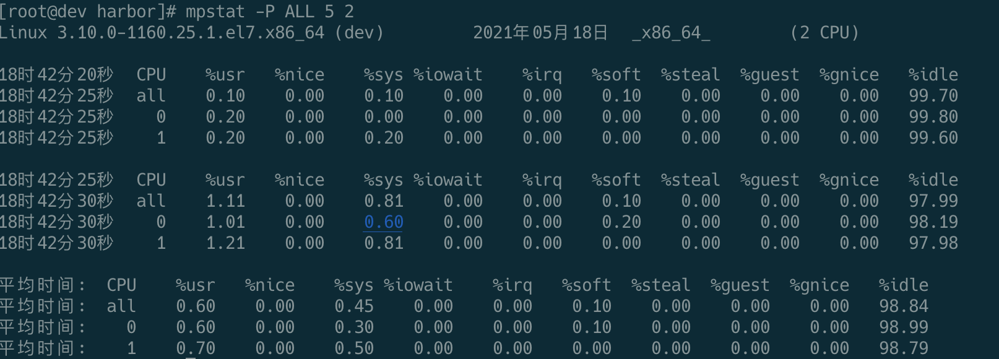

---

---
