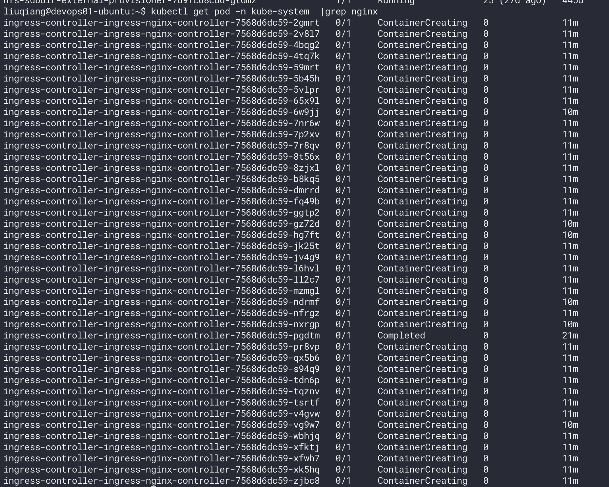

# 脚本与自动化

## 目录

- [9.1 except](#91-except)
- [9.2 登录服务器时自动输入验证码](#92-登录服务器时自动输入验证码)
- [9.3 常用脚本](#93-常用脚本)

---

## 9.1 except
ssh 登录时自动输入图像验证码，而不需要每次都手动输入

```shell
#!/usr/bin/expect
spawn ssh sit

expect "Code" {
set code [exec oathtool --totp -b IVU5RW7IPIWJ7QXN ]
puts "code is $code"
}
send "$code\r"

interactsh
```


『IVU5RW7IPIWJ7QXN』 是图像验证嘛的code

---

## 9.2 登录服务器时自动输入验证码

## 需要在 .ssh/config 文件中增加配置

```shell
HOST sit
HostName 116.63.177.238
Port 32222
User liuqiang@liuqiang@172.21.0.72
IdentityFile ~/.ssh/id_rsa
ServerAliveInterval 30

```

## 编写脚本，放到任一一个可执行目录下

```shell
#!/usr/bin/expect

set timeout 30

spawn ssh sit

expect  {
"Code"  {
set code [exec oathtool --totp -b 跳板机图像验证码的值 ]
puts "code is $code"
# send "$code\r"
}
}
send "$code\r"
interact

```

## 另外需要一个

brew install expect oath-toolkit

---

## 9.3 常用脚本

当我们的服务器，需要在命令行批量操作一些数时可用比如，执行以下命令后，需要把这些pod 都删除，如果一个一个的删除，那就太慢了，
### 可以使用以下用法

## xarges 会默认把参数传在最后面，如果需要在中间传参，xarges的用法

```bash
kubectl get pod -n kube-system  |grep nginx | awk '{print $1}' |xargs kubectl -
```
- n kube-system delete pod
```bash
kubectl get pod -n kube-system  |grep nginx
```

### 相关图片


---

---
