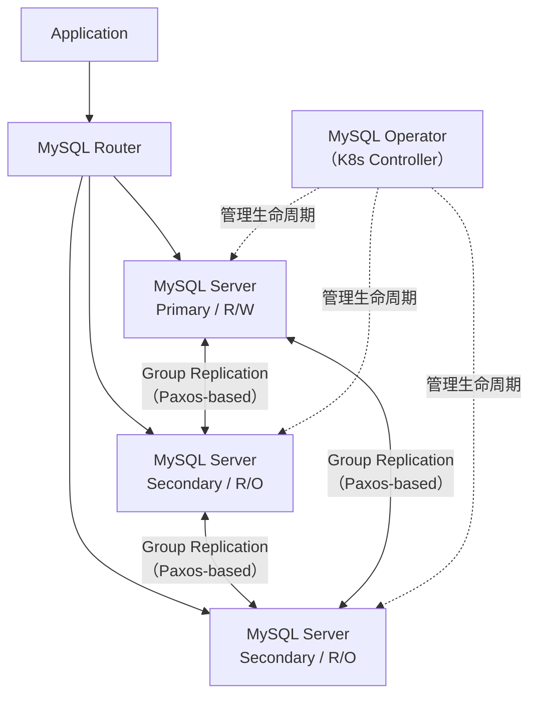

# MySQL InnoDB Cluster 学习笔记

## 1. 这篇笔记解决什么问题

这篇笔记聚焦以下四个问题：

- `InnoDB Cluster` 到底是什么
- 它和 `MGR`、`Group Replication`、`Router`、`Operator` 分别是什么关系
- 它和传统 MySQL `1主1从`、`主备` 的本质区别
- 放入 K8s 后整体架构如何理解

> **注意**：这篇笔记不是安装步骤。安装步骤请参考：
> - [[k8s安装mysql1主1从-详细安装步骤]]
> - [[k8s安装mysql1主1从-实操安装手册]]

## 2. 最短定义

**一句话**：`InnoDB Cluster` 是 MySQL 官方提供的高可用数据库集群方案——核心复制能力来自 `Group Replication`，访问入口通过 `MySQL Router`，在 K8s 中由 `MySQL Operator` 负责自动化管理。

`InnoDB Cluster` 不是单一软件包，而是一整套高可用方案，同时涵盖数据库复制、路由转发、节点管理和故障恢复。

## 3. 组件拆解

### 3.1 MySQL Server

数据库实例本身——实际存储数据、执行 SQL、提供事务能力的节点。InnoDB Cluster 中每个成员都是一个 MySQL Server 实例。

### 3.2 Group Replication（MGR）

`Group Replication` 是 MySQL 官方的复制机制，简称 **MGR**。注意：`MGR`、`MySQL Group Replication`、`Group Replication` 三者是同一概念。

与传统异步主从（主库写 binlog → 从库拉取回放）不同，MGR 让多个 MySQL 节点组成一个**复制组**，具有以下关键特征：

- 节点之间是对等的组成员关系，而非单向主从链
- 组内基于 Paxos 变体协议维护成员视图和一致性规则
- 支持两种模式：
  - **单主模式**（Single-Primary）：仅一个节点可写，其余只读，InnoDB Cluster 默认模式
  - **多主模式**（Multi-Primary）：所有节点均可写，冲突检测由组内协商解决
- 成员状态变化（加入/退出/故障）会影响整个组的可用性判断
- 依赖 GTID（全局事务标识）追踪事务在所有节点上的应用状态

**类比**：传统主从是"一个老师带一群学生"；MGR 是"一个委员会，成员之间平等协商"。

### 3.3 MySQL Router

访问层组件，**不存数据**。职责：

- 接收应用连接
- 感知集群拓扑（哪个节点是 Primary、哪些是 Secondary）
- 将读写流量路由到合适的节点

**类比**：数据库集群的"智能前台"，知道当前应该把请求交给谁。

### 3.4 MySQL Shell

官方管理工具，常用于：

- 通过 `dba.createReplicaSet()` / `dba.createCluster()` 初始化集群
- 将节点加入/移出集群
- 执行集群状态检查和管理命令（`cluster.status()` 等）

`MySQL Shell` 是操作 InnoDB Cluster 的主要管理界面，通常不直接参与运行时数据流。

### 3.5 InnoDB Cluster

完整定义：

> **InnoDB Cluster = MySQL Server × N + Group Replication + MySQL Router + MySQL Shell（管理面）**

各组件分工：

- `Group Replication`：节点间如何组成复制组，保证数据一致性
- `MySQL Router`：应用如何接入，流量如何路由
- `MySQL Shell`：集群如何初始化和管理
- `InnoDB Cluster`：把上述能力组织为一套完整的高可用方案

### 3.6 MySQL Operator（K8s 场景）

`MySQL Operator` 不是数据库集群能力本身，而是 **K8s 中的自动化控制器**。职责：

- 监听 InnoDBCluster CR（自定义资源）
- 自动创建底层 Pod、StatefulSet、Service、Secret、PVC
- 处理扩容、重建、升级、恢复等运维动作

**关系**：`InnoDB Cluster` 解决 MySQL 集群本身的问题；`Operator` 解决在 K8s 中如何声明式管理这套集群的问题。Operator 不改变集群本质，只是将其纳入 K8s 控制循环。

## 4. 架构与关系

### 4.1 组件关系图



要点：

- 应用不直连 MySQL 节点，统一通过 Router 接入
- 节点之间通过 MGR 组成对等复制组（双箭头表示双向通信，而非主从链）
- Operator 虚线表示管理面（控制 Pod/Service/PVC 的生命周期，不参与数据流）

### 4.2 分层视角

| 层级 | 组件 | 职责 |
|---|---|---|
| 访问层 | MySQL Router | 统一入口、流量路由 |
| 集群层 | InnoDB Cluster | 高可用方案编排 |
| 复制层 | Group Replication / MGR | 数据同步、成员管理、故障检测 |
| 实例层 | MySQL Server × N | 存储与执行 |
| 管理层 | MySQL Shell | 集群初始化与管理操作 |
| K8s 控制层 | MySQL Operator | 声明式自动化运维 |

### 4.3 常见混淆点

| 概念 | 本质 | 是否等于 InnoDB Cluster |
|---|---|---|
| MGR / Group Replication | 复制机制 | ❌ 是核心组件，不是全部 |
| MySQL Router | 流量入口 | ❌ 是访问层组件 |
| MySQL Operator | K8s 控制器 | ❌ 是 K8s 场景的管理者 |
| InnoDB Cluster | **完整的高可用集群方案** | ✅ |

## 5. 与传统 1主1从 的本质差异

### 5.1 传统 1主1从

```
Application ──Write──▶ Primary ──binlog──▶ Replica
                Read ──────────────────────▶ Replica
```

- 主库是唯一写入源，从库拉取 binlog 回放
- 复制链路**单向**（Primary → Replica）
- 复制模式：异步（async）或半同步（semi-sync）
- 故障切换：**外部决策**，通常需要人工或额外工具介入（如 MHA、Orchestrator）
- 没有内建统一入口，应用需要感知主从拓扑变化

### 5.2 InnoDB Cluster

```
Application ──▶ MySQL Router ──R/W──▶ Primary
                               ──R/O──▶ Secondary × 2
               三个节点之间 ←→ Group Replication
```

- 节点之间是**对等复制组**（Paxos 协议），非单向链
- 默认单主模式：Router 自动识别 Primary 并路由写流量
- 故障切换：**组内自动选举**新 Primary，Router 感知拓扑变化后自动切换流量
- 内建统一入口（Router），应用无需关心后端节点变化
- 通常 3 节点起步（满足多数派仲裁要求）

### 5.3 直观对比

| 维度 | 传统 1主1从 | InnoDB Cluster |
|---|---|---|
| 复制拓扑 | 单向链式 | 对等组成员 |
| 故障切换 | 人工/外部工具 | 组内自动选举 |
| 访问入口 | 直连节点 | MySQL Router 统一入口 |
| 推荐节点数 | 2 | ≥ 3（多数派） |
| 复制协议 | binlog 异步/半同步 | Paxos 变体（组通讯 + 事务认证） |
| 写可用性 | 主库单点 | 单主模式同样单点写；多主模式全节点可写 |

### 5.4 类比

- **传统主从** = 老师讲课，学生记笔记。老师倒了，学生能否代课取决于你额外做了什么安排。
- **InnoDB Cluster** = 委员会制，成员之间持续同步状态，有成员缺席时自动协商谁来主持。外面还有一个接待台（Router），始终知道该把访客引向谁。

## 6. 与"主备"的区别

"主备"是运维层的口语描述（一个主、一个备、希望主挂了备顶上），不说明底层复制机制。主备方案底层可能是异步复制、半同步复制甚至共享存储。

**InnoDB Cluster** 是官方定义的产品化集群方案：底层是 MGR（Paxos 协议，组内自动选举），上层是 Router（统一入口），管理者是 Shell/Operator。虽然默认单主模式对外表现类似"一写多读"，但内部机制和传统口语"主备"完全不同。

## 7. 为什么是 3 节点（集群多数派原理）

MGR 底层依赖 Paxos 变体协议做成员协商，需要**多数派（quorum）**才能做出决策。2 节点的问题：

- 任一节点故障或网络分区，剩余节点无法形成多数（1/2 < 半数）
- 集群进入不可用状态，无法自动故障切换

因此生产部署推荐 **3 节点起**（3 节点容忍 1 个故障，5 节点容忍 2 个故障）。这也是官方 `InnoDBCluster` CR 默认 `serverInstances: 3` 的原因。

## 8. K8s + Operator 带来的变化

| | 无 Operator | 有 Operator |
|---|---|---|
| 部署方式 | 手动编写 StatefulSet / Service / PVC / Secret / 初始化脚本 | 声明一个 InnoDBCluster CR |
| 扩容 | 手动调整 StatefulSet 副本 + 手动执行 `cluster.addInstance()` | 改 CR 中 `serverInstances` 即可 |
| 故障恢复 | 人工排查 + 手动重建 Pod | Operator 自动重建并重新加入集群 |
| 升级 | 逐节点手动操作 | Operator 按策略滚动更新 |

核心结论：**Operator 不改变 InnoDB Cluster 的架构本质，只是把它纳入 K8s 声明式管理模型。**

## 9. 学习路径建议

| 目标 | 先学 | 再学 |
|---|---|---|
| 理解 MySQL 复制原理 | binlog、replication user、source/replica 关系、GTID | — |
| 掌握官方高可用体系 | 传统主从复制 | Group Replication → Router → InnoDB Cluster → Operator |

前者是基础复制概念，后者是完整高可用集群体系——两者不是替代关系，而是递进关系。

## 10. 总结

如果把传统 `1主1从` 理解为"复制架构"，`InnoDB Cluster` 更应该理解为"**官方高可用数据库集群架构**"。差异不只是节点数量，而是：

- **设计目标不同**：传统主从解决读写分离和备份；InnoDB Cluster 解决高可用和自动故障切换
- **复制机制不同**：binlog 拉取 vs Paxos 组通讯 + 事务认证
- **访问方式不同**：直连节点 vs Router 统一入口
- **运维方式不同**：人工切换 vs 组内自动选举 + K8s Operator

## 11. 关联笔记

- [[k8s安装mysql1主1从方案设计]]
- [[k8s安装mysql1主1从-详细安装步骤]]
- [[k8s安装mysql1主1从-实操安装手册]]
