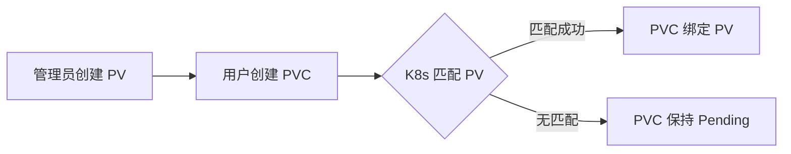
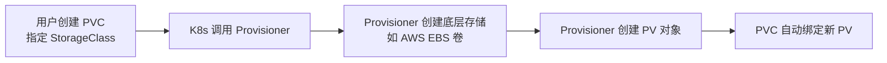

# Kubernetes 持久化存储详解：PV、PVC 与 StorageClass

> **目标**：深入理解 Kubernetes 中持久化存储的核心机制，掌握 PV / PVC / StorageClass 的原理、使用方式、实操命令及最佳实践。

---

## 一、引言：为什么需要持久化存储？

Kubernetes 中的 **Pod 是临时性（ephemeral）的**：

- Pod 被删除、调度到其他节点、或所在节点故障时，其内部容器文件系统会**完全丢失**。
- 对于数据库（MySQL、PostgreSQL）、文件服务（MinIO）、日志收集等**有状态应用**，数据持久化是刚需。

### 🎯 Kubernetes 的解决方案：抽象存储层

K8s 通过三层抽象解耦“存储供给”与“存储消费”：

- **PersistentVolume (PV)**：集群中的存储资源（由管理员或自动提供）
- **PersistentVolumeClaim (PVC)**：用户对存储的请求（类似“存储的 Pod”）
- **StorageClass (SC)**：定义存储类型的模板，支持动态供给

> ✅ **设计哲学**：开发者只需声明“我需要多少存储”，无需关心底层是 SSD、NFS 还是云盘。

---

## 二、核心概念详解

### 1. PersistentVolume (PV)

**定义**：集群中的一块**网络存储**，生命周期独立于 Pod。

#### 关键属性

|字段|说明|
|---|---|
|`capacity`|存储容量（如 `storage: 10Gi`）|
|`accessModes`|访问模式（见下表）|
|`persistentVolumeReclaimPolicy`|回收策略：`Retain` / `Delete`|
|`storageClassName`|所属的 StorageClass（动态供给时自动设置）|
|`volumeMode`|`Filesystem`（默认）或 `Block`（裸块设备）|

#### Access Modes（访问模式）

|模式|全称|说明|常见后端|
|---|---|---|---|
|`ReadWriteOnce` (RWO)|单节点读写|同一时间仅一个节点可读写|AWS EBS, GCE PD, hostPath|
|`ReadOnlyMany` (ROX)|多节点只读|多个节点可同时只读|NFS, CephFS|
|`ReadWriteMany` (RWX)|多节点读写|多个节点可同时读写|NFS, CephFS, Azure Files|

> ⚠️ 注意：**不是所有存储都支持所有模式**。例如 AWS EBS 仅支持 RWO。

#### 静态 vs 动态供给

- **静态供给（Static Provisioning）**：管理员预先创建 PV，用户通过 PVC 绑定。
- **动态供给（Dynamic Provisioning）**：用户创建 PVC 时，系统自动创建 PV（需 StorageClass）。

---

### 2. PersistentVolumeClaim (PVC)

**定义**：用户对存储资源的**声明式请求**，命名空间作用域（Namespace-scoped）。

#### 关键字段

```yaml
spec:
  accessModes: ["ReadWriteOnce"]
  resources:
    requests:
      storage: 10Gi
  storageClassName: "fast-ssd"  # 可选
  volumeName: "pv-name"         # 静态供给时指定 PV 名（不推荐）
```

#### 生命周期状态

|状态|说明|
|---|---|
|`Pending`|尚未绑定到 PV（可能无匹配 PV 或 StorageClass 不存在）|
|`Bound`|已成功绑定到 PV|
|`Lost`|绑定的 PV 被删除，但 PVC 仍存在（异常状态）|

> 💡 **类比**：
> 
> - Node : Pod = PV : PVC
> - PVC 是“存储的 Pod”，PV 是“存储的 Node”

---

### 3. StorageClass (SC)

**定义**：描述“存储类”的模板，用于**动态供给 PV**。

#### 核心字段

```yaml
apiVersion: storage.k8s.io/v1
kind: StorageClass
metadata:
  name: fast-ssd
provisioner: kubernetes.io/aws-ebs        # 必填：指定 provisioner
parameters:                               # 可选：传递给 provisioner 的参数
  type: gp3
  fsType: ext4
reclaimPolicy: Delete                     # 默认 Delete
allowVolumeExpansion: true                # 是否允许 PVC 扩容
volumeBindingMode: WaitForFirstConsumer   # 绑定时机
```

#### 关键特性

|特性|说明|
|---|---|
|`provisioner`|决定谁来创建底层存储（如 `ebs.csi.aws.com` 表示 AWS EBS CSI 驱动）|
|`allowVolumeExpansion`|设为 `true` 后，可通过编辑 PVC 实现扩容|
|`volumeBindingMode`|`Immediate`（立即绑定）或 `WaitForFirstConsumer`（延迟绑定，解决拓扑问题）|
|**默认 StorageClass**|集群中可标记一个 SC 为默认（`storageclass.kubernetes.io/is-default-class: "true"`），PVC 不指定 `storageClassName` 时自动使用|

> 🌐 **主流 Provisioner**：
> 
> - 云厂商：`ebs.csi.aws.com`, `pd.csi.storage.gke.io`, `disk.csi.azure.com`
> - 开源：`cephfs.csi.ceph.com`, `nfs.csi.k8s.io`, `driver.longhorn.io`

---

## 三、工作机制与流程

### 1. 静态供给流程（Static Provisioning）



- **适用场景**：本地测试、NFS 共享存储、无动态供给能力的环境
- **缺点**：需人工干预，无法弹性扩展

---

### 2. 动态供给流程（Dynamic Provisioning）



- **前提**：集群已安装对应 CSI 驱动，且存在匹配的 StorageClass
- **优势**：完全自动化，按需分配，适合云环境

---

### 3. PVC 与 PV 绑定规则

PVC 能绑定到 PV，必须满足：

1. **容量**：`PV.capacity >= PVC.requests.storage`
2. **AccessMode**：PV 的模式必须包含 PVC 请求的模式  
    （例如 PVC 要 RWO，PV 支持 RWO+ROX → ✅；PV 仅支持 ROX → ❌）
3. **StorageClass**：
    - 若 PVC 指定了 `storageClassName`，PV 必须有相同值
    - 若 PVC 设置 `storageClassName: ""`，则只匹配无 StorageClass 的 PV（静态供给）
4. **VolumeMode**：必须一致（Filesystem / Block）

> 🔍 **绑定是独占的**：一个 PV 只能被一个 PVC 绑定。

---

### 4. 回收策略（Reclaim Policy）

|策略|行为|适用场景|
|---|---|---|
|`Retain`|删除 PVC 后，PV 变为 `Released`，数据保留，需手动清理|需要备份或迁移数据|
|`Delete`|删除 PVC 后，自动删除 PV **和底层存储**（如云盘）|云环境，自动清理|
|`Recycle`|**已废弃**（v1.24+ 移除），旧版会执行 `rm -rf /thevolume/*`|—|

> ⚠️ **重要**：`Delete` 策略会**永久删除数据**！生产环境务必确认。

---

## 四、实操指南（含完整 YAML 和命令）

> 💡 **实验环境建议**：使用 Minikube（支持 hostPath 动态供给）或 Kind + local-path-provisioner。

### 1. 查看当前集群的 StorageClass

```bash
kubectl get storageclass
# NAME                 PROVISIONER             RECLAIMPOLICY
# standard (default)    k8s.io/host-path        Delete
```

标记默认 SC（如无）：

```bash
kubectl patch storageclass standard -p '{"metadata": {"annotations":{"storageclass.kubernetes.io/is-default-class":"true"}}}'
```

---

### 2. 静态供给示例（hostPath，仅限单节点测试）

#### (1) 创建 PV

```yaml
# pv.yaml
apiVersion: v1
kind: PersistentVolume
metadata:
  name: task-pv-volume
spec:
  capacity:
    storage: 10Gi
  accessModes:
    - ReadWriteOnce
  persistentVolumeReclaimPolicy: Retain
  hostPath:
    path: "/mnt/data"
```

```bash
kubectl apply -f pv.yaml
```

#### (2) 创建 PVC

```yaml
# pvc.yaml
apiVersion: v1
kind: PersistentVolumeClaim
metadata:
  name: task-pv-claim
spec:
  accessModes:
    - ReadWriteOnce
  resources:
    requests:
      storage: 5Gi  # <= PV 的 10Gi
```

```bash
kubectl apply -f pvc.yaml
kubectl get pvc  # STATUS 应为 Bound
```

#### (3) 创建使用 PVC 的 Pod

```yaml
# pod.yaml
apiVersion: v1
kind: Pod
metadata:
  name: task-pv-pod
spec:
  volumes:
    - name: task-pv-storage
      persistentVolumeClaim:
        claimName: task-pv-claim
  containers:
    - name: nginx
      image: nginx
      volumeMounts:
        - mountPath: "/usr/share/nginx/html"
          name: task-pv-storage
```

```bash
kubectl apply -f pod.yaml
```

#### (4) 验证持久性

```bash
# 写入数据
kubectl exec task-pv-pod -- sh -c "echo 'Hello PV!' > /usr/share/nginx/html/index.html"

# 删除 Pod（PV/PVC 保留）
kubectl delete pod task-pv-pod

# 重建 Pod
kubectl apply -f pod.yaml

# 验证数据仍在
kubectl exec task-pv-pod -- cat /usr/share/nginx/html/index.html
# 输出：Hello PV!
```

---

### 3. 动态供给示例（使用默认 StorageClass）

#### (1) 创建 PVC（不指定 PV）

```yaml
# dynamic-pvc.yaml
apiVersion: v1
kind: PersistentVolumeClaim
metadata:
  name: dynamic-claim
spec:
  accessModes:
    - ReadWriteOnce
  resources:
    requests:
      storage: 5Gi
  # storageClassName: standard  # 可省略，默认使用 default SC
```

```bash
kubectl apply -f dynamic-pvc.yaml
kubectl get pvc,pv  # 观察自动创建的 PV
```

#### (2) 挂载到 Pod（同上，只需改 claimName）

---

### 4. 扩容 PVC（需 SC 支持）

#### (1) 确认 StorageClass 允许扩容

```bash
kubectl get storageclass standard -o jsonpath='{.allowVolumeExpansion}'
# true
```

#### (2) 编辑 PVC，增大容量

```bash
kubectl edit pvc dynamic-claim
```

修改：

```yaml
spec:
  resources:
    requests:
      storage: 10Gi  # 从 5Gi 扩到 10Gi
```

#### (3) 观察扩容状态

```bash
kubectl describe pvc dynamic-claim
# Events: Resizing volume
```

> 💡 **注意**：扩容后，**文件系统可能需手动 resize**（取决于 CSI 驱动）：
> 
> ```bash
> # 对于 ext4
> kubectl exec <pod> -- resize2fs /dev/xxx
> ```

---

### 5. RWX 示例（NFS 场景，需提前部署 NFS Server）

```yaml
# nfs-pv.yaml
apiVersion: v1
kind: PersistentVolume
metadata:
  name: nfs-pv
spec:
  capacity:
    storage: 10Gi
  accessModes:
    - ReadWriteMany
  nfs:
    server: nfs-server.default.svc.cluster.local
    path: "/exports/data"
---
# nfs-pvc.yaml
apiVersion: v1
kind: PersistentVolumeClaim
metadata:
  name: nfs-claim
spec:
  accessModes:
    - ReadWriteMany
  resources:
    requests:
      storage: 5Gi
```

> ✅ 此时多个 Pod 可同时挂载 `nfs-claim` 并读写同一目录。

---

## 五、高级话题与最佳实践

### 1. VolumeBindingMode：解决拓扑约束

在多可用区云环境中，若 Pod 被调度到 zone-1，但 PV 在 zone-2，则挂载失败。

**解决方案**：使用 `WaitForFirstConsumer`

```yaml
apiVersion: storage.k8s.io/v1
kind: StorageClass
metadata:
  name: ssd-delayed
provisioner: ebs.csi.aws.com
volumeBindingMode: WaitForFirstConsumer  # 延迟绑定，直到 Pod 被调度
```

> ✅ **效果**：PV 在 Pod 调度后才创建，确保存储与 Pod 在同一拓扑域。

---

### 2. StorageClass 参数调优（AWS EBS 示例）

```yaml
apiVersion: storage.k8s.io/v1
kind: StorageClass
metadata:
  name: gp3-optimized
provisioner: ebs.csi.aws.com
parameters:
  type: gp3
  fsType: ext4
  iops: "3000"       # IOPS
  throughput: "125"  # MB/s
allowVolumeExpansion: true
volumeBindingMode: WaitForFirstConsumer
```

---

### 3. CSI（Container Storage Interface）简介

- **目的**：替代旧版 in-tree 插件（如 `kubernetes.io/aws-ebs`），实现插件化存储驱动。
- **架构**：
    - **CSI Controller**：运行在控制平面，处理 Create/Delete Volume
    - **CSI Node**：运行在每个节点，处理 Publish/Unpublish（挂载/卸载）
- **优势**：社区驱动、更新快、安全性高（驱动不在 K8s 核心代码中）

> 📌 **现状**：所有主流云厂商和开源存储均已迁移到 CSI。

---

### 4. 安全与权限

- **限制 PVC 配额**（防止用户滥用存储）：
    
    ```yaml
    # resource-quota.yaml
    apiVersion: v1
    kind: ResourceQuota
    metadata:
      name: storage-quota
    spec:
      hard:
        requests.storage: 100Gi
        persistentvolumeclaims: "10"
    ```
    
    应用到命名空间：
    
    ```bash
    kubectl create namespace dev
    kubectl apply -f resource-quota.yaml -n dev
    ```
    
- **禁止动态供给**：PVC 中显式设置 `storageClassName: ""`
    

---

### 5. 故障排查技巧

|问题|排查命令|常见原因|
|---|---|---|
|PVC 卡在 `Pending`|`kubectl describe pvc <name>`|1. 无匹配 PV  <br>2. StorageClass 不存在  <br>3. 容量/AccessMode 不匹配|
|Pod 无法启动（挂载失败）|`kubectl describe pod <name>`|1. PV/PVC 不在同一命名空间  <br>2. AccessMode 不支持多挂载  <br>3. 节点无 CSI 驱动|
|扩容不生效|`kubectl describe pvc` + `kubectl get pv`|1. StorageClass 未开启 `allowVolumeExpansion`  <br>2. 文件系统未 resize|

---

## 六、常见误区与避坑指南

|误区|正确认知|
|---|---|
|“PVC 是一个目录”|PVC 是**存储请求对象**，实际存储由 PV 提供|
|“删除 Pod 会删数据”|数据是否保留取决于 **PV 的 reclaimPolicy**，与 Pod 无关|
|“PVC 可跨命名空间使用”|❌ PVC 是命名空间作用域，PV 是集群作用域|
|“所有存储都支持 RWX”|❌ 大多数块存储（EBS、PD）仅支持 RWO|
|“动态供给不需要 PV”|动态供给会**自动创建 PV**，只是用户无需手动管理|

---

## 七、总结：设计思想与演进

Kubernetes 持久化存储体系体现了云原生核心理念：

- **解耦**：开发者（PVC）与基础设施管理员（PV/SC）职责分离
- **抽象**：统一接口屏蔽底层差异（本地盘 / 云盘 / 分布式存储）
- **自动化**：通过 StorageClass + CSI 实现“存储即服务”
- **弹性**：按需供给、在线扩容、智能调度（拓扑感知）

> 🌟 **最佳实践**：
> 
> 1. **永远使用 PVC**，不要直接挂载 hostPath 到 Pod
> 2. **优先使用动态供给**（配置好 StorageClass）
> 3. **关键数据使用 `reclaimPolicy: Retain`**
> 4. **云环境务必设置 `volumeBindingMode: WaitForFirstConsumer`**

掌握 PV / PVC / StorageClass，就掌握了 Kubernetes 有状态应用的基石。