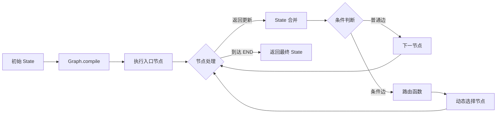
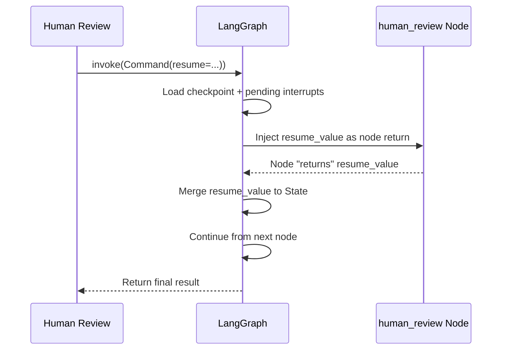
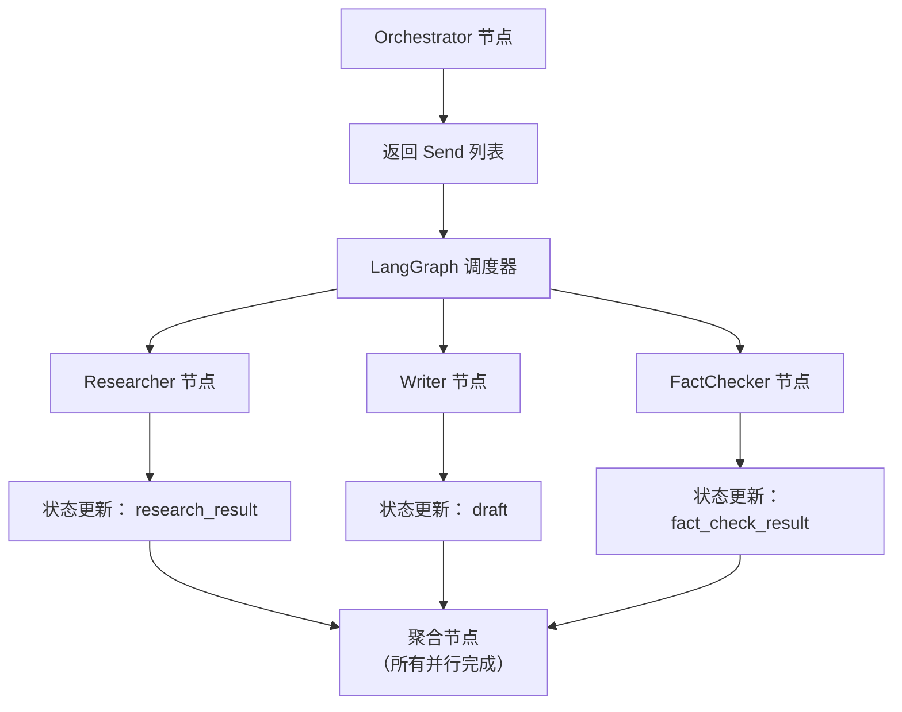

## 1️⃣ 请解释 LangGraph 中 State、Node、Edge 和 Graph 的核心作用，并说明它们如何协同工作构建工作流？

**核心作用：**

- **State（状态）**：全局共享的字典结构，承载工作流所有数据。所有节点通过读写 State 实现数据传递，是工作流的“单一数据源”。
- **Node（节点）**：执行具体逻辑的函数/方法。接收 State 作为输入，返回需更新的 State 子集（增量更新），不直接修改原 State。
- **Edge（边）**：定义节点间流转规则。分为：
    - 普通边：`add_edge("A", "B")` → 固定顺序执行
    - 条件边：`add_conditional_edges("A", router_func, mapping)` → 动态路由
- **Graph（图）**：由节点和边组成的有向图结构，通过 `StateGraph` 构建，经 `compile()` 编译为可执行工作流。

**协同工作流程：**



1. 工作流启动时传入初始 State
2. Graph 按边定义调度节点执行
3. 节点处理后返回增量更新，LangGraph 自动合并到全局 State
4. 条件边通过路由函数动态决定下一节点
5. 循环执行直至到达 `END` 节点
6. 返回最终 State（含完整执行轨迹）

**关键设计哲学**：状态不可变（Immutable State）+ 增量更新（Delta Updates）→ 保证可追溯性与调试能力。

---

## 2️⃣ LangGraph 与传统 LangChain 链（Chain）相比，在处理复杂工作流时有哪些关键优势？

|维度|LangChain Chain|LangGraph|优势体现|
|---|---|---|---|
|**控制流**|线性执行（顺序/简单分支）|有向图（循环/条件/并行）|支持复杂决策流（如：审核不通过→返回修改）|
|**状态管理**|隐式传递（易丢失上下文）|显式全局 State（TypedDict）|多轮对话中精准维护上下文|
|**人机交互**|难以中断（需自定义回调）|原生 `interrupt()` + Checkpointer|审批流中暂停等待人工决策|
|**调试能力**|黑盒执行（难追溯中间状态）|检查点 + `get_state_history()`|精确回溯任意历史状态|
|**模块化**|链嵌套复杂度高|子图（Subgraph）封装复用|大型系统拆分为可维护模块|
|**流式支持**|基础流式（token级）|事件流（`astream_events`）|实时反馈节点级进度|

**典型场景对比：**

- **内容审批流**：
    - Chain：需硬编码“审核不通过→重新生成”逻辑，难以扩展
    - LangGraph：通过条件边 + 中断机制，天然支持“人工驳回→循环回溯”
- **多Agent协作**：
    - Chain：需手动管理Agent间状态传递，易出错
    - LangGraph：通过 `Send` API 并行调度，State 自动聚合结果

**本质差异**：Chain 是“管道”，LangGraph 是“操作系统”——提供状态管理、调度、持久化等基础设施。

---

## 3️⃣ 为什么 LangGraph 使用 `TypedDict` 定义状态？`Annotated` 和 `add_messages` 的作用？

**`TypedDict` 的核心价值：**

1. **类型安全**：IDE 自动补全 + 静态类型检查（mypy），避免字段名拼写错误
2. **文档化**：清晰定义 State 结构，降低团队协作成本
3. **序列化友好**：JSON 兼容结构，便于检查点存储/恢复
4. **增量更新基础**：明确哪些字段可被节点修改

**`Annotated` + `add_messages`**：

```python
from typing import Annotated
from langgraph.graph.message import add_messages

class State(TypedDict):
    messages: Annotated[list, add_messages]
```

- **`Annotated`**：Python 3.9+ 类型注解扩展，附加元数据
- **`add_messages`**：reducer 函数，新消息追加到列表末尾（而非覆盖）

**对比陷阱**：

```python
# Wrong: overwrites entire messages list
messages: list

# Correct: auto-appends new messages
messages: Annotated[list, add_messages]
```

**最佳实践**：所有需累积的数据（消息、日志、审核记录）均应使用 `Annotated[类型, reducer]`。

---

## 4️⃣ 如何实现条件边？工作原理及必须使用场景？

**实现步骤**：

```python
from typing import Literal
from langgraph.graph import StateGraph

# 1. Define router function (returns Literal)
def route_after_review(state) -> Literal["approve", "reject", "request_changes"]:
    decision = state.get("human_decision")
    if decision == "approve":
        return "approve"
    elif decision == "reject":
        return "reject"
    return "request_changes"

# 2. Add conditional edges
builder.add_conditional_edges(
    "review_node",
    route_after_review,
    {
        "approve": "publish",
        "reject": "notify_reject",
        "request_changes": "generate"
    }
)
```

**工作原理**：

1. 源节点执行完成后，调用路由函数
2. 路由函数读取 State，返回预定义字符串（Literal 限定）
3. LangGraph 查找映射表，跳转到对应目标节点

**必须使用条件边的场景**：动态路由（如审核决策）、循环回溯（如"修改后返回生成"）、多分支处理

---

## 5️⃣ 多轮对话系统状态设计关键字段？

**State 结构**：

```python
from typing import TypedDict, Annotated, Optional
from langgraph.graph.message import add_messages

class ConversationState(TypedDict):
    messages: Annotated[list, add_messages]  # cumulative chat history
    user_id: str
    session_id: str
    turn_count: int
    tool_calls: list  # completed tool calls
    pending_tool_calls: list  # for interrupt recovery
    requires_human_intervention: bool
```

**设计要点**：
- 必须用 `Annotated[list, add_messages]` 保证消息追加
- `session_id` 隔离多用户并发会话
- `pending_tool_calls` 支持中断恢复

---

## 6️⃣ `interrupt()` 和 `interrupt_before` 的区别与 Checkpointer 依赖？

|特性|`interrupt()`|`interrupt_before`|
|---|---|---|
|**调用时机**|节点函数内部（运行时）|`compile()` 参数（编译时）|
|**触发条件**|代码显式调用|到达指定节点前自动暂停|
|**灵活性**|可条件触发（如：仅高风险内容中断）|固定节点中断|
|**使用场景**|节点内动态决策是否中断|标准化审核节点（如：所有内容需人工审核）|
|**代码示例**|`decision = interrupt({...})`|`graph = builder.compile(interrupt_before=["review"])`|

**为什么必须配合 Checkpointer？**

```python
# Wrong: no checkpointer configured
graph = builder.compile()
graph.invoke(inputs)  # throws error at interrupt()

# Correct
from langgraph.checkpoint.memory import MemorySaver
graph = builder.compile(checkpointer=MemorySaver())
```

**根本原因**：中断时需持久化 State，恢复时加载中断点状态，`Command(resume=...)` 依赖检查点机制传递恢复数据

**Checkpointer 选型**：

```python
# Dev: MemorySaver (lost on restart)
checkpointer = MemorySaver()

# Production: SqliteSaver or PostgresSaver
from langgraph.checkpoint.sqlite import SqliteSaver
checkpointer = SqliteSaver(conn=sqlite3.connect("checkpoints.db"))
```

---

## 7️⃣ 通过 `Command(resume=...)` 恢复执行的机制？

**完整恢复流程：**

```python
from langgraph.types import Command

# 1. 中断后获取配置（含 thread_id）
config = {"configurable": {"thread_id": "user_123"}}

# 2. 构造恢复命令（关键！）
resume_value = {
    "decision": "approve",
    "comments": "内容符合规范",
    "reviewer": "admin"
}

# 3. 调用 invoke 传入 Command
result = graph.invoke(
    Command(resume=resume_value),  # ← 核心：resume 值将注入中断节点
    config=config
)
```

**数据流向**：



**关键机制**：

1. `resume_value` 直接替代中断节点的返回值
2. 从中断节点的**下一个节点**开始执行（非重新执行中断节点）
3. 恢复前用 `graph.get_state(config)` 验证当前中断状态

---

## 8️⃣ 审批流中"请求修改后返回生成节点"的循环设计？

**核心设计**：状态标记 + 条件路由（返回 `"generate"`）+ 状态重置

**代码实现**：

```python
class State(TypedDict):
    review_status: str
    revision_count: int  # prevent infinite loop
    human_decision: Optional[str]

def process_decision(state: State) -> dict:
    if state["human_decision"] == "request_changes":
        return {
            "review_status": "needs_revision",
            "revision_count": state.get("revision_count", 0) + 1,
            "current_version": None  # clear for regeneration
        }

def route_after_decision(state: State) -> Literal["publish", "generate", "end"]:
    if state["human_decision"] == "approve":
        return "publish"
    elif state["human_decision"] == "request_changes":
        if state.get("revision_count", 0) >= 3:
            return "end"  # max revisions reached
        return "generate"
    return "end"

builder.add_conditional_edges(
    "process_decision",
    route_after_decision,
    {"publish": "publish_node", "generate": "generate_node", "end": END}
)
```

**循环安全**：用 `revision_count` 计数器限制最大修改次数

---

## 9️⃣ 三种 Checkpointer 选型与生产考量？

|存储|适用场景|选型建议|
|---|---|---|
|**MemorySaver**|开发/测试|❌ 禁用于生产|
|**SqliteSaver**|单机/小型应用|用户量 < 1000|
|**PostgresSaver**|生产环境|高并发/多实例部署|

**决策树**：需要持久化？→ 否 → MemorySaver → 是 → 单机？→ 是 → SqliteSaver → 否 → PostgresSaver

---

## 🔟 通过检查点实现"暂停数小时后恢复执行"？

**实现步骤**：

```python
from langgraph.checkpoint.sqlite import SqliteSaver
from langgraph.types import Command

checkpointer = SqliteSaver(conn=sqlite3.connect("workflows.db"))
graph = workflow.compile(checkpointer=checkpointer, interrupt_before=["human_review"])

config = {"configurable": {"thread_id": "content_789"}}
graph.invoke(initial_input, config)

# Hours later - resume with same thread_id
result = graph.invoke(Command(resume={"decision": "approve"}), config=config)
```

**关键点**：相同的 `thread_id` + 相同的 Checkpointer 实例

---

## 1️⃣1️⃣ `astream_events(version="v2")` 事件流字段解析与进度反馈？

**关键字段详解（v2 版本）：**

```python
async for event in graph.astream_events(inputs, version="v2"):
    print({
        "event": event["event"],
        "name": event["name"],
        "type": event["type"],
        "data": event["data"],
        "tags": event["tags"],
        "metadata": event["metadata"],
        "timestamp": event["timestamp"]
    })
```

**核心事件类型**：

|event|触发时机|data 字段|前端用途|
|---|---|---|---|
|`on_chain_start`|节点开始|`input`|显示"处理中..."|
|`on_chain_stream`|节点流式|`chunk`|实时追加内容|
|`on_chain_end`|节点完成|`output`|更新进度|
|`on_llm_start`|LLM 开始|`prompts`|显示"思考中..."|
|`on_llm_stream`|LLM token|`chunk`|打字机效果|
|`on_tool_start/end`|工具调用|`input`/`output`|显示工具状态|

**进度反馈示例**：

```python
async def stream_with_progress(graph, inputs, thread_id: str):
    config = {"configurable": {"thread_id": thread_id}}

    async for event in graph.astream_events(
        inputs, config=config, version="v2",
        include_names=["generate", "review", "publish"]
    ):
        if event["event"] not in ["on_chain_start", "on_chain_end"]:
            continue

        yield {
            "type": "progress",
            "node": event["name"],
            "status": "started" if "start" in event["event"] else "completed",
            "data": event["data"].get("input" if "start" in event["event"] else "output")
        }
```

---

## 1️⃣2️⃣ 使用 `get_state_history()` 和 `update_state()` 实现“时间旅行”？

**完整操作流程：**

```python
from langgraph.checkpoint.sqlite import SqliteSaver
from datetime import datetime

# 1. 初始化（使用相同 Checkpointer）
graph = workflow.compile(checkpointer=SqliteSaver.from_conn_string("workflows.db"))
config = {"configurable": {"thread_id": "content_789"}}

# Get state history (newest first), rollback to target checkpoint
history = list(graph.get_state_history(config))
target = history[2]

graph.update_state(config=config, values=target.values,
    as_node=target.next[0] if target.next else None)

# Modify state and continue execution
modified = target.values.copy()
modified["human_decision"] = "approve"
graph.update_state(config=config, values=modified, as_node="process_decision")
result = graph.invoke(None, config)
```

**关键参数**：`values`=状态快照；`as_node`=`None`=已完成，节点名=从该节点重新执行

**典型场景**：调试复现、人工修正、A/B测试

---

## 1️⃣3️⃣ 子图（Subgraph）的核心价值与封装时机？

**何时封装为子图**：重复逻辑、复杂内部流、需独立中断、第三方集成

**何时不封装**：简单单节点、强状态耦合（子图需频繁读写主图特有字段）

**封装示例**：

```python
def create_review_subgraph():
    builder = StateGraph(ContentState)
    builder.add_node("auto_check", auto_moderation)
    builder.add_node("human_review", human_review_node)
    builder.add_node("decision", process_decision)
    builder.add_edge("auto_check", "human_review")
    builder.add_edge("human_review", "decision")
    builder.set_entry_point("auto_check")
    builder.add_edge("decision", END)
    return builder.compile(interrupt_before=["human_review"], checkpointer=MemorySaver())

# Integrate as single node in main graph
builder.add_node("content_review", create_review_subgraph())
builder.add_edge("generate", "content_review")
builder.add_edge("content_review", "publish")
```

**优势**：模块化、复用性、独立中断、测试隔离

---

## 1️⃣4️⃣ 利用 `Send` API 实现并行调用与状态冲突避免？

**`Send` API 核心机制：**

```python
from langgraph.graph import StateGraph, SEND

# 1. 定义并行调度节点
def route_to_agents(state) -> list:
    """返回多个 Send 对象，触发并行执行"""
    return [
        Send("researcher", {"query": "LangGraph最新特性"}),  # 发送给researcher节点
        Send("writer", {"topic": "AI工作流"}),                # 同时发送给writer节点
        Send("fact_checker", {"claims": ["..."]})
    ]

# 2. 添加条件边（返回 Send 列表）
builder.add_conditional_edges(
    "orchestrator",
    route_to_agents,  # 返回 Send 对象列表
    ["researcher", "writer", "fact_checker"]  # 声明可能的目标节点
)

# 3. 各Agent节点独立处理
def researcher(state):
    # 仅处理发给自己的消息
    result = search_web(state["query"])
    return {"research_result": result}

# 4. 聚合节点（等待所有并行结果）
def aggregate_results(state):
    # 所有并行节点完成后自动触发
    return {
        "final_content": f"{state['research_result']} + {state['draft']}",
        "verified": state.get("fact_check_result", True)
    }
```

**并行执行流程：**



**避免状态冲突的三大策略：**

|冲突类型|风险|解决方案|
|---|---|---|
|**字段覆盖**|多节点同时写同一字段|✅ **约定专属字段**：  <br>- researcher → `research_result`  <br>- writer → `draft`  <br>- fact_checker → `fact_check_result`|
|**执行顺序依赖**|聚合节点读取未完成数据|✅ **LangGraph 自动保障**：  <br>聚合节点仅在所有并行节点完成后触发|
|**资源竞争**|多节点调用同一外部API|✅ **外部层控制**：  <br>- API 客户端加锁  <br>- 使用连接池限流  <br>- 节点内实现重试退避|

**最佳实践：**

1. **字段命名规范**：`{agent_name}_{purpose}`（如：`researcher_sources`）
2. **空值安全**：聚合节点使用 `.get("field", default)` 避免 KeyError
3. **超时控制**：为慢节点设置超时（结合 asyncio.wait_for）
4. **错误隔离**：单个节点失败不应阻塞其他节点（需自定义错误处理边）
5. **调试技巧**：在聚合节点打印 `state.keys()` 验证所有结果已就绪

**高级模式：动态并行数量**

```python
def dynamic_routing(state):
    # 根据输入动态决定并行Agent数量
    agents = []
    if state["needs_research"]:
        agents.append(Send("researcher", {"query": state["topic"]}))
    if state["needs_fact_check"]:
        agents.append(Send("fact_checker", {"text": state["content"]}))
    return agents or [Send("default_processor", {})]  # 至少返回1个
```

---

## 1️⃣5️⃣ 节点API失败时的重试机制与降级策略？

**四层防御体系：**

### 🛡️ 第一层：节点内重试（基础防护）

```python
import asyncio
from functools import wraps

def retry_with_backoff(max_retries=3, base_delay=1.0):
    def decorator(func):
        @wraps(func)
        async def wrapper(*args, **kwargs):
            for attempt in range(max_retries):
                try:
                    return await func(*args, **kwargs)
                except (ConnectionError, TimeoutError) as e:
                    if attempt == max_retries - 1:
                        raise
                    delay = base_delay * (2 ** attempt)
                    await asyncio.sleep(delay)
                    logger.warning(f"Retry {attempt+1}/{max_retries} failed: {e}")
            return None
        return wrapper
    return decorator

@retry_with_backoff(max_retries=3)
async def call_external_api(state):
    async with aiohttp.ClientSession() as session:
        async with session.post(API_URL, json=payload, timeout=10) as resp:
            return await resp.json()
```

## 1️⃣5️⃣ 节点API失败时的重试机制与降级策略？

**四层防御**：

1. **节点内重试**：装饰器实现指数退避
```python
def retry_with_backoff(max_retries=3, base_delay=1.0):
    def decorator(func):
        async def wrapper(*args, **kwargs):
            for attempt in range(max_retries):
                try:
                    return await func(*args, **kwargs)
                except (ConnectionError, TimeoutError) as e:
                    if attempt == max_retries - 1:
                        raise
                    await asyncio.sleep(base_delay * (2 ** attempt))
            return None
        return wrapper
    return decorator
```

2. **降级路由**：失败后走 fallback 路径
```python
def route_after_api_call(state) -> Literal["continue", "fallback"]:
    return "fallback" if state.get("api_failed") else "continue"
```

3. **熔断器**：防止雪崩（生产环境建议用 pybreaker 库）

4. **监控告警**：埋点记录成功率、延迟指标

**生产 Checklist**：
- 外部调用封装重试逻辑
- 关键节点配置降级路径
- 熔断机制防雪崩
- 错误日志含完整上下文（thread_id, state 快照）
- 监控面板展示成功率、P99 延迟

---

## 💎 总结：LangGraph 面试核心能力模型

|能力维度|关键问题|专家级体现|
|---|---|---|
|**基础架构**|Q1, Q3|理解 State 不可变性与 reducer 机制|
|**控制流设计**|Q4, Q8, Q13|条件边+循环+子图的组合应用能力|
|**HITL 深度**|Q6, Q7, Q10|中断/恢复/持久化三位一体理解|
|**调试运维**|Q11, Q12|事件流分析 + 时间旅行实战经验|
|**系统韧性**|Q14, Q15|并行控制 + 错误处理体系化思维|
|**生产思维**|Q9, Q15|存储选型 + 监控告警 + 混沌工程|
